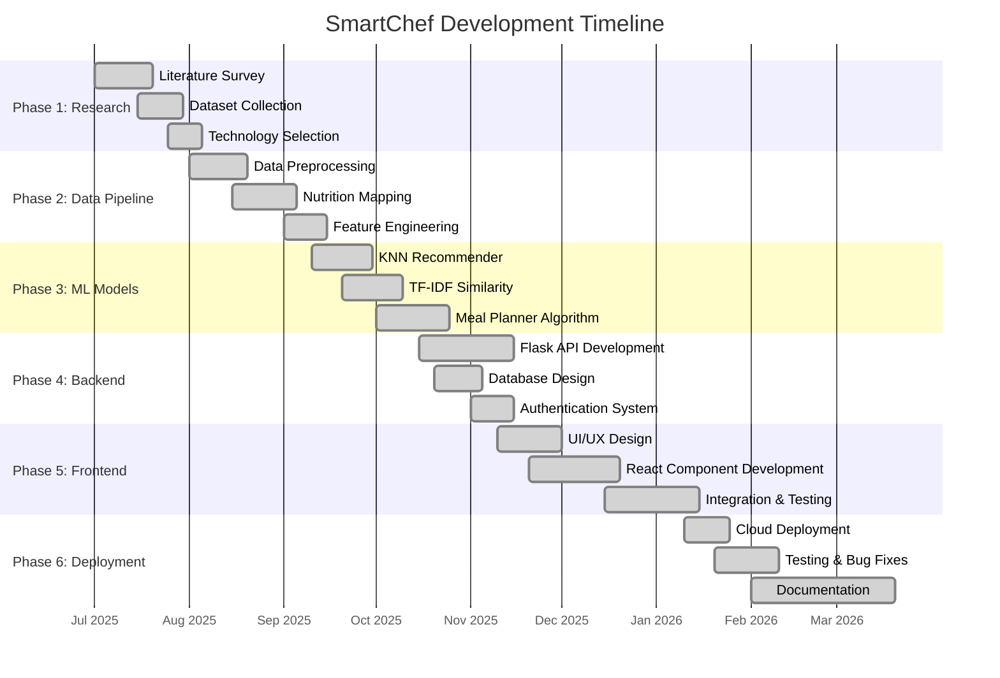
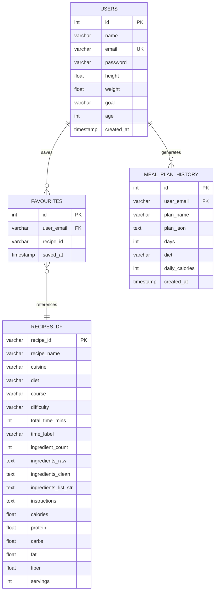
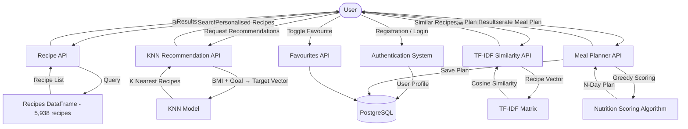
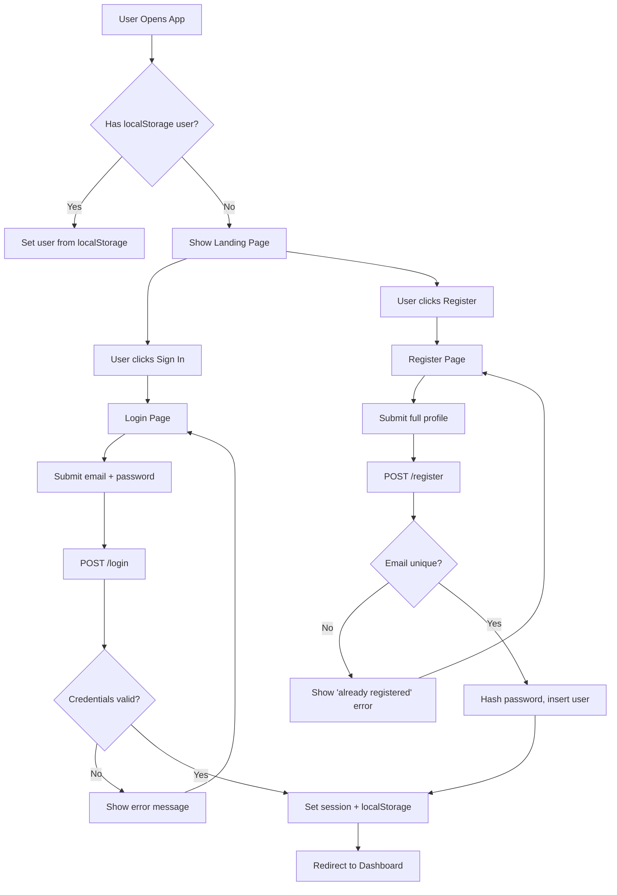
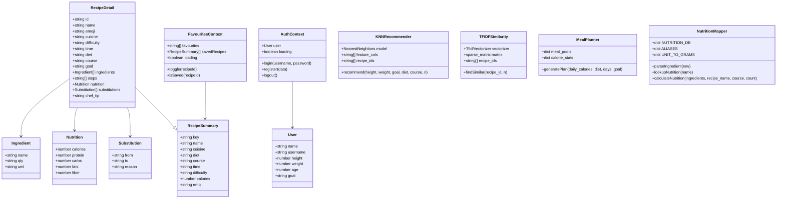
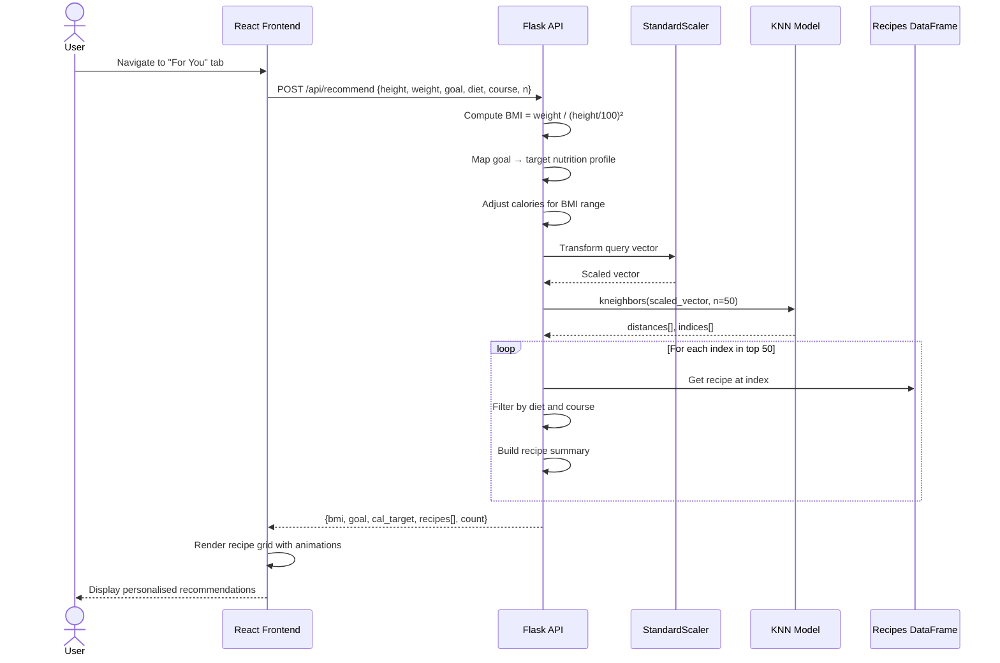
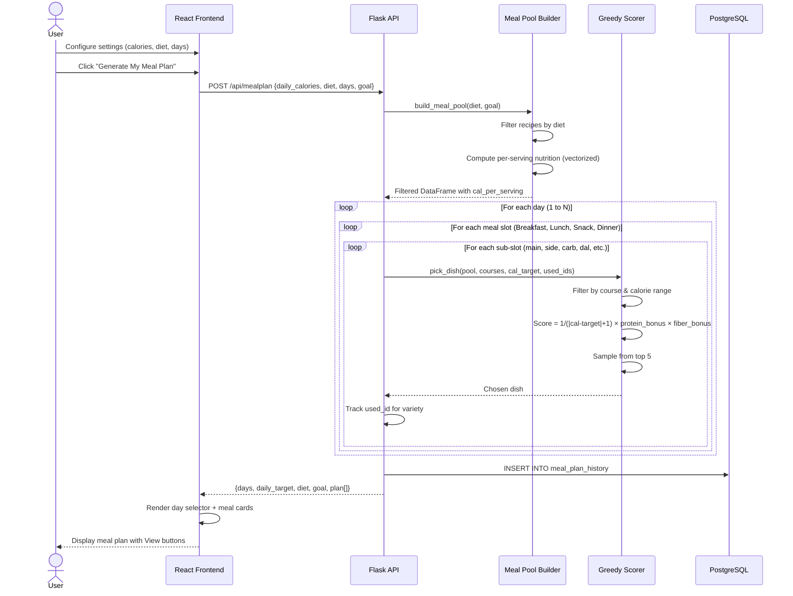
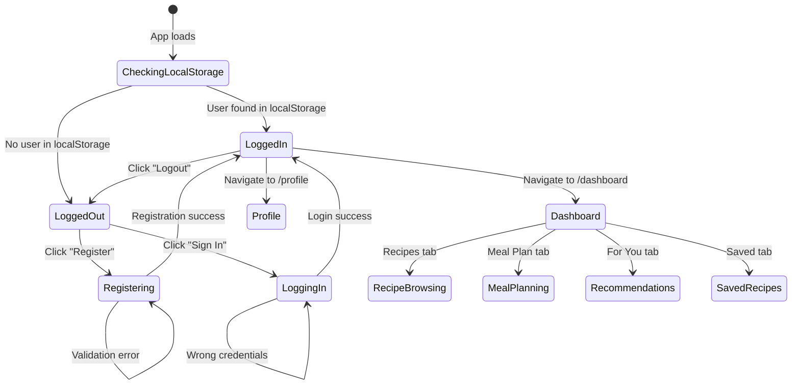
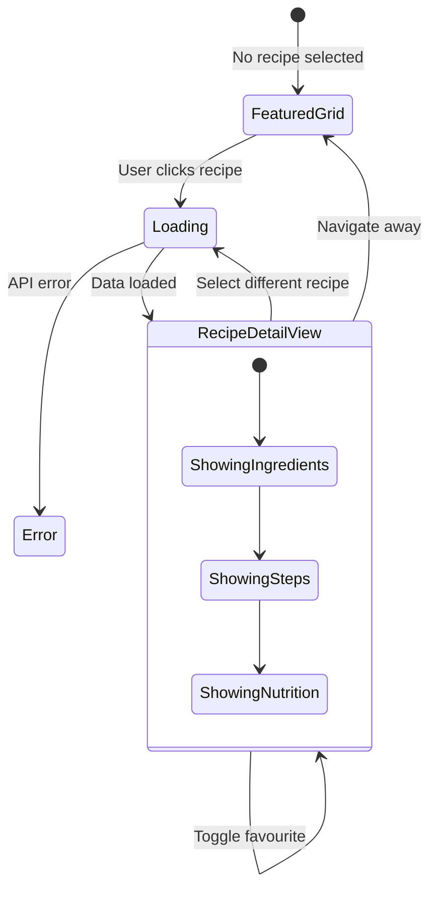

# SmartChef — Project Blackbook

> **Project Title:** SmartChef — AI-Powered Indian Recipe Recommendation & Meal Planning System  
> **Academic Year:** 2025–2026  
> **Domain:** Machine Learning, Web Application Development, Nutrition Science  
> **Technology Stack:** React + TypeScript (Frontend) · Flask + Python (Backend) · PostgreSQL (Database) · Scikit-learn (ML)

---

## Table of Contents

| Chapter | Section | Title |
|---------|---------|-------|
| 1 | 1.1 | Introduction |
| 1 | 1.2 | Description |
| 1 | 1.3 | Stakeholders |
| 2 | 2.1 | Description of Existing System |
| 2 | 2.2 | Limitations of Present System |
| 2 | 2.3 | Gantt Chart (Timeline) |
| 3 | 3.1 | Technologies Used and their Description |
| 3 | 3.2 | Event Table |
| 3 | 3.3 | Use Case Diagram and Scenarios |
| 3 | 3.4 | Entity-Relationship Diagram |
| 3 | 3.5 | Flow Diagram |
| 3 | 3.6 | Class Diagram |
| 3 | 3.7 | Sequence Diagram |
| 3 | 3.8 | State Diagram |
| 3 | 3.9 | Menu Tree |
| 4 | 4.1 | List of Tables with Attributes and Constraints |
| 4 | 4.2 | System Coding |
| 4 | 4.3 | Screen Layouts and Report Layouts |
| 5 | 5.1 | Analysis, Related Work Done |
| 6 | 6.1 | Conclusion |
| 6 | 6.2 | Future Work |
| 6 | 6.3 | References |

---

# Chapter 1: Introduction

## 1.1 Introduction

India has one of the richest and most diverse culinary traditions in the world, yet diet-related health problems — obesity, diabetes, cardiovascular disease, and micronutrient deficiency — are rising at an alarming rate. According to the National Family Health Survey (NFHS-5, 2019-21), over 24% of Indian adults are overweight or obese, and the incidence of diabetes has crossed 101 million. A significant contributing factor is the disconnect between traditional Indian cooking and modern nutritional awareness. Most Indians consume meals rich in carbohydrates and fats without an understanding of caloric intake, macronutrient balance, or how their body composition should influence dietary choices.

**SmartChef** is an AI-powered web application designed to bridge this gap. It provides personalised Indian recipe recommendations and automated meal planning based on an individual's Body Mass Index (BMI), fitness goals (weight loss, weight gain, muscle gain, or maintenance), and dietary preferences (vegetarian or non-vegetarian). The system uses three machine learning models — a K-Nearest Neighbors (KNN) recommender, a TF-IDF content similarity engine, and a greedy nutrition-scoring meal planner — to deliver intelligent, health-conscious food suggestions from a curated database of 5,938 authentic Indian recipes.

Unlike generic calorie-tracking apps that treat food as abstract numbers, SmartChef understands the cultural context of Indian cuisine. It knows that a "Masala Dosa" is a breakfast item, that "Rajma" is a North Indian lunch staple, and that "Gulab Jamun" is a dessert. It calculates per-serving nutrition by parsing ingredient quantities against a 250+ item nutrition database sourced from USDA FoodData Central and the Indian Food Composition Table (IFCT 2017). It offers smart ingredient substitutions (e.g., replacing cream with hung curd for weight-loss users) and dynamic chef tips tailored to the cuisine and cooking style.

The system is built as a modern full-stack web application with a React + TypeScript frontend using Vite as the build tool, a Flask (Python) backend serving RESTful APIs, and PostgreSQL for persistent user data storage. The ML models are trained offline using Scikit-learn and serialised as pickle files for fast runtime inference. The application features user authentication, profile management, a recipe browser with advanced filtering, a favourites system, personalised recommendations, and a multi-day meal planner with history tracking.

### Motivation

The primary motivation behind SmartChef stems from several key observations:

1. **Cultural Gap in Health Apps:** Most nutrition and diet applications available in the market are designed for Western diets. They do not understand Indian ingredients (e.g., besan, methi, hing), Indian cooking methods (tempering, dum cooking, bhuna), or Indian meal structures (dal-rice-sabji-roti).

2. **Nutritional Ignorance:** The average Indian home cook does not know the calorie content of the food they prepare daily. A regular "Paneer Butter Masala" can contain 350-500 kcal per serving, yet it is often consumed without awareness of its impact on health goals.

3. **Information Overload:** While recipe websites like Tarla Dalal, Hebbars Kitchen, and Sanjeev Kapoor offer thousands of recipes, they lack personalisation. A user with BMI 30 (obese) and a weight-loss goal is shown the same recipes as a user with BMI 18 (underweight) and a weight-gain goal.

4. **Manual Meal Planning is Tedious:** Creating a week-long meal plan that is nutritionally balanced, varied, culturally appropriate, and within a calorie budget is extremely time-consuming when done manually.

5. **Need for Intelligent Substitutions:** Many Indian recipes can be made healthier with simple ingredient swaps (sugar → jaggery, maida → whole wheat, cream → hung curd), but this knowledge is not readily accessible to the average cook.

### Objectives

The key objectives of the SmartChef project are:

- To develop an intelligent recipe recommendation system that personalises suggestions based on user BMI, health goals, and dietary preferences
- To build a comprehensive nutrition calculation engine that parses Indian recipe ingredients and computes per-serving calories, protein, carbohydrates, fat, and fiber
- To implement an automated meal planner that generates multi-day plans within a calorie budget using greedy nutrition-scoring algorithms
- To create a modern, responsive web interface that provides an intuitive cooking and meal planning experience
- To offer smart ingredient substitutions and chef tips that help users make healthier food choices
- To maintain a curated database of authentic Indian recipes with proper categorisation by cuisine, course, diet, and difficulty

---

## 1.2 Description

SmartChef is a comprehensive, full-stack web application that integrates machine learning with nutritional science to deliver a personalised Indian food experience. The application can be divided into the following functional modules:

### Module 1: User Authentication & Profile Management
Users register with their name, email, password, age, height, weight, and fitness goal. The system calculates their BMI and uses the Mifflin-St Jeor equation to estimate their daily caloric needs (TDEE). This profile data drives all personalisation features.

### Module 2: Recipe Database & Browser
The application maintains a database of 5,938 Indian recipes sourced from the Cleaned Indian Food Dataset, enriched with computed nutrition data. Users can browse, search, and filter recipes by cuisine, diet (Veg/Non-Veg), course (Breakfast/Lunch/Dinner/Snack/Dessert/Soup), difficulty, cooking time, calorie range, and ingredient inclusion/exclusion.

### Module 3: ML-Powered Recommendation Engine
The KNN recommender model takes the user's BMI and health goal as input, computes a target nutrition profile (e.g., low-calorie, high-protein for weight-loss), and finds the K nearest recipes in the nutrition feature space. The TF-IDF similarity engine finds recipes with similar ingredients, powering the "Similar Recipes" feature on each recipe detail page.

### Module 4: Intelligent Meal Planner
The meal planner generates N-day meal plans (3, 5, or 7 days) with multi-dish meals for Breakfast (25% of daily calories), Lunch (35%), Snack (5%), and Dinner (35%). It uses a greedy scoring algorithm that optimises for calorie proximity, protein content, and fiber content. Plans are saved to history for future reference.

### Module 5: Nutrition Calculator & Smart Substitutions
Every recipe's nutrition is calculated by parsing ingredient strings, matching them against a 250+ item nutrition database, converting quantities to grams, and computing per-serving values. The system also generates rule-based smart substitutions (18 ingredient rules) and dynamic chef tips based on cuisine, course, and key ingredients.

### Module 6: Favourites & Personalisation
Logged-in users can save recipes to their favourites collection, which is persisted in the PostgreSQL database. The sidebar provides a quick toggle between "All Recipes" and "Saved" views.

---

## 1.3 Stakeholders

| Stakeholder | Role | Interest |
|-------------|------|----------|
| **End Users (Home Cooks)** | Primary user | Access personalised recipe recommendations, meal plans, and nutrition data based on their health profile |
| **Health-Conscious Individuals** | Target segment | Users with specific fitness goals (weight loss, muscle gain) who need dietary guidance tailored to Indian cuisine |
| **Nutritionists & Dietitians** | Advisory | Can validate the nutrition calculation methodology and recommend the platform to their clients |
| **Project Developers** | Development team | Responsible for building, testing, deploying, and maintaining the application |
| **Academic Supervisors** | Academic oversight | Evaluate the technical merit, originality, and completeness of the project |
| **Data Providers** | Data source | Providers of the Indian food dataset and nutrition databases (USDA, IFCT 2017) |
| **Cloud Service Providers** | Infrastructure | Neon (PostgreSQL hosting), Render (Flask API hosting), Vercel/Netlify (Frontend hosting) |

### User Personas

**Persona 1 — Priya (Weight Loss)**
- Age: 25, Height: 160cm, Weight: 72kg, BMI: 28.1 (Overweight)
- Goal: Weight Loss
- Needs: Low-calorie recipes (<300 kcal/serving), high-fiber options, healthy substitutions
- SmartChef Value: Receives recipes with reduced calories, gets substitution suggestions like "cream → hung curd"

**Persona 2 — Rahul (Muscle Gain)**  
- Age: 22, Height: 175cm, Weight: 65kg, BMI: 21.2 (Normal)
- Goal: Muscle Gain
- Needs: High-protein recipes (>25g protein/serving), adequate carbs for recovery
- SmartChef Value: Model recommends protein-rich dishes, meal planner provides 2400+ kcal/day plans

**Persona 3 — Amma (Maintenance)**
- Age: 55, Height: 155cm, Weight: 60kg, BMI: 25.0 (Normal)
- Goal: Maintenance
- Needs: Balanced meals, traditional recipes, easy to cook
- SmartChef Value: Gets familiar Indian recipes with proper nutrition info, easy difficulty filter

---

# Chapter 2: Literature Survey

## 2.1 Description of Existing System

The Indian food-tech and nutrition space currently has several existing solutions, each with their own strengths and significant limitations:

### 2.1.1 Generic Calorie Tracking Apps (MyFitnessPal, HealthifyMe)

**MyFitnessPal** is the most widely used calorie tracking application globally with over 200 million users. It allows users to log their meals by searching a massive food database and manually entering portion sizes. **HealthifyMe** is an Indian alternative that has better support for Indian foods.

**How they work:**
- Users manually search and log every food item they eat
- The app looks up pre-defined calorie values from a database
- Daily totals are displayed against a calorie budget
- Some offer barcode scanning for packaged foods

**Key limitations for Indian home cooking:**
- They require manual logging of every meal, which most users abandon within 2 weeks
- Pre-defined entries for "Dal Makhani" may vary wildly (200-600 kcal) depending on the source
- They do not calculate nutrition from actual recipe ingredients — they rely on crowd-sourced averages
- No personalised recipe recommendations — they only track what you've already eaten
- No meal planning capability that generates culturally appropriate Indian meals
- No understanding of Indian cooking context (e.g., a "Thali" contains multiple dishes)

### 2.1.2 Recipe Websites (Tarla Dalal, Hebbars Kitchen, Sanjeev Kapoor)

These are the most popular Indian recipe platforms with millions of monthly visitors. They offer extensive collections of authentic Indian recipes with step-by-step instructions and videos.

**How they work:**
- Users browse categories (cuisine, course, occasion) or search by name/ingredient
- Recipes display ingredients and cooking instructions
- Some show approximate nutrition information (often inaccurate or missing)
- Users can save recipes and create collections

**Key limitations:**
- **No personalisation:** All users see the same recipes regardless of their health profile
- **Inaccurate nutrition:** Most nutrition values are approximate or missing entirely. Many recipes show "0 calories" or unrealistic values
- **No ingredient-level calculation:** Nutrition is not computed from actual ingredient quantities
- **No meal planning:** Users must manually plan their weekly meals
- **No health goal integration:** A user with obesity and a user with anorexia see identical content
- **No substitution suggestions:** Users are not guided on how to make recipes healthier

### 2.1.3 Diet Planning Services (Eat This Much, Mealime)

**Eat This Much** generates automated meal plans based on calorie targets and diet preferences. **Mealime** provides weekly meal plans with shopping lists.

**How they work:**
- Users enter their calorie target and dietary restrictions
- The system generates multi-day meal plans from a recipe database
- Shopping lists are auto-generated from selected recipes

**Key limitations:**
- **Western-centric:** The recipe databases are dominated by Western cuisine (salads, sandwiches, pasta). Indian food representation is minimal or non-existent
- **No Indian meal structure:** They do not understand that an Indian lunch typically consists of rice + dal + sabji + roti, not a single dish
- **No BMI-based personalisation:** Plans are based on user-entered calorie targets, not computed from body composition
- **No ingredient substitution intelligence:** Cannot suggest healthier Indian alternatives

### 2.1.4 AI Recipe Generators (ChatGPT, Gemini)

Large language models can generate recipe suggestions when prompted with dietary requirements.

**Key limitations:**
- **Hallucination risk:** May generate recipes with incorrect ingredient combinations or unsafe cooking instructions
- **Inconsistent nutrition:** Cannot reliably calculate nutrition from ingredients
- **No persistent profile:** Each interaction starts from scratch — no user history or progressive learning
- **No structured meal planning:** Cannot generate consistent multi-day plans within calorie budgets
- **No database-backed recommendations:** Suggestions are generated, not retrieved from a vetted database

---

## 2.2 Limitations of Present System

The following table summarises the critical limitations of existing systems that SmartChef addresses:

| Limitation | MyFitnessPal | Recipe Sites | Eat This Much | ChatGPT | **SmartChef** |
|------------|:---:|:---:|:---:|:---:|:---:|
| Indian food specialisation | ❌ Partial | ✅ Yes | ❌ No | ❌ Partial | ✅ **5,938 Indian recipes** |
| Ingredient-level nutrition calc | ❌ No | ❌ No | ❌ No | ❌ No | ✅ **250+ ingredient DB** |
| BMI-based personalisation | ❌ No | ❌ No | ❌ No | ❌ No | ✅ **KNN recommender** |
| Multi-dish Indian meal plans | ❌ No | ❌ No | ❌ Partial | ❌ No | ✅ **4-slot planner** |
| Smart ingredient substitutions | ❌ No | ❌ No | ❌ No | ❌ Partial | ✅ **18 rules + goal-aware** |
| Similar recipe discovery | ❌ No | ❌ Partial | ❌ No | ❌ No | ✅ **TF-IDF cosine similarity** |
| Calorie per serving accuracy | ❌ Crowd-sourced | ❌ Approximate | ❌ Pre-defined | ❌ Hallucinated | ✅ **Calculated from ingredients** |
| No manual food logging required | ❌ Manual | ✅ N/A | ✅ N/A | ✅ N/A | ✅ **Automatic** |

### Problem Statement

> **There exists no web application that combines personalised machine learning-based recipe recommendation with accurate ingredient-level nutrition calculation, intelligent meal planning, and smart substitution suggestions — all specifically designed for Indian cuisine and Indian dietary patterns.**

Existing solutions either lack personalisation (recipe websites), lack Indian food understanding (Western diet apps), lack ingredient-level accuracy (calorie trackers), or lack reliability (AI generators). SmartChef solves all of these problems in a single, integrated platform.

---

## 2.3 Gantt Chart (Timeline)



---

# Chapter 3: Methodology

## 3.1 Technologies Used and their Description

### 3.1.1 Frontend Technologies

| Technology | Version | Purpose |
|------------|---------|---------|
| **React** | 19.0.0 | Component-based UI library for building interactive user interfaces |
| **TypeScript** | 5.8.2 | Typed superset of JavaScript providing compile-time type safety |
| **Vite** | 6.2.0 | Next-generation build tool with instant HMR (Hot Module Replacement) |
| **React Router DOM** | 7.13.1 | Client-side routing for SPA navigation between pages |
| **Axios** | 1.13.6 | HTTP client for making API calls to the Flask backend |
| **Motion (Framer Motion)** | 12.23.24 | Animation library for smooth transitions and micro-interactions |
| **Lucide React** | 0.546.0 | Modern icon library providing consistent SVG icons |
| **TailwindCSS** | 4.1.14 | Utility-first CSS framework for rapid UI development |

**React** was chosen because it enables component-based architecture, making the complex dashboard UI manageable. Each section (Sidebar, Navbar, RecipeDetail, MealPlanner, Recommendations) is an independent component with its own state and lifecycle.

**TypeScript** adds type safety to the entire frontend codebase. Interfaces like `User`, `RecipeSummary`, `RecipeDetail`, `Ingredient`, and `Nutrition` ensure that data flowing between components and API responses is validated at compile time.

**Vite** provides significantly faster development builds compared to Create React App or Webpack, with instant Hot Module Replacement that makes development workflow seamless.

### 3.1.2 Backend Technologies

| Technology | Version | Purpose |
|------------|---------|---------|
| **Python** | 3.10+ | Primary backend programming language |
| **Flask** | 3.x | Lightweight WSGI web framework for REST API development |
| **Flask-CORS** | 4.x | Cross-Origin Resource Sharing support for frontend-backend communication |
| **Pandas** | 2.x | Data manipulation and analysis library for recipe dataset operations |
| **NumPy** | 1.x | Numerical computing library for array operations and mathematical calculations |
| **Scikit-learn** | 1.x | Machine learning library providing KNN, TF-IDF, StandardScaler, and LabelEncoder |
| **psycopg2-binary** | 2.x | PostgreSQL database adapter for Python |
| **Werkzeug** | 3.x | Password hashing (generate_password_hash, check_password_hash) |
| **Gunicorn** | 21.x | Production-grade WSGI HTTP server for deploying Flask in production |
| **python-dotenv** | 1.x | Environment variable management from .env files |

**Flask** was chosen over Django because SmartChef is an API-first application. Flask's lightweight nature allows us to define endpoints without the overhead of Django's ORM, admin panel, and template engine, none of which are needed here.

**Scikit-learn** provides production-ready implementations of KNN (NearestNeighbors with Ball Tree algorithm), TF-IDF (TfidfVectorizer), and preprocessing utilities (StandardScaler, LabelEncoder) — all essential for the recommendation engine.

### 3.1.3 Database Technology

| Technology | Purpose |
|------------|---------|
| **PostgreSQL** | Production relational database for user data, favourites, and meal plan history |
| **Neon** | Serverless PostgreSQL hosting with connection pooling and auto-scaling |

PostgreSQL was selected for its robustness, ACID compliance, and excellent support for complex queries. The database stores three tables: `users`, `favourites`, and `meal_plan_history`.

### 3.1.4 ML Model Architecture

```
┌─────────────────────────────────────────────────────────────┐
│                SmartChef ML Pipeline                         │
├─────────────────────────────────────────────────────────────┤
│                                                             │
│  INPUT: Cleaned_Indian_Food_Dataset.csv (5,938 recipes)     │
│         │                                                   │
│         ▼                                                   │
│  ┌─────────────────┐                                        │
│  │  preprocess.py   │ → cleaned_recipes.csv                 │
│  │  (10 steps)      │   • Column renaming                   │
│  │                  │   • Duplicate removal                  │
│  │                  │   • Diet/Course/Difficulty tagging     │
│  │                  │   • Ingredient list cleaning           │
│  └────────┬────────┘                                        │
│           ▼                                                 │
│  ┌─────────────────┐                                        │
│  │ nutrition_mapper │ → recipes_with_nutrition.csv           │
│  │  (250+ items)    │   • Ingredient parsing                │
│  │                  │   • Quantity → grams conversion        │
│  │                  │   • Nutrition lookup & calculation     │
│  │                  │   • Per-serving normalization          │
│  └────────┬────────┘                                        │
│           ▼                                                 │
│  ┌─────────────────┐                                        │
│  │ train_models.py  │ → 6 pickle files                      │
│  │  (7 steps)       │                                       │
│  │                  │   MODEL 1: KNN Recommender             │
│  │                  │   MODEL 2: TF-IDF Similarity           │
│  │                  │   MODEL 3: Meal Planner Data           │
│  │                  │   + Scaler, Encoders, DataFrame        │
│  └────────┬────────┘                                        │
│           ▼                                                 │
│  ┌─────────────────┐                                        │
│  │    app.py        │ ← Flask API loads all models           │
│  │  (1191 lines)    │   • /api/recommend  → KNN              │
│  │                  │   • /api/similar    → TF-IDF            │
│  │                  │   • /api/mealplan   → Greedy Scoring    │
│  └─────────────────┘                                        │
│                                                             │
└─────────────────────────────────────────────────────────────┘
```

---

## 3.2 Event Table

| Event ID | Event | Trigger | Source | Response | Destination |
|----------|-------|---------|--------|----------|-------------|
| E01 | User Registration | User submits registration form | Register Page | Validate input, hash password, create user record, set session | Dashboard |
| E02 | User Login | User submits login form | Login Page | Verify credentials against database, set session | Dashboard |
| E03 | User Logout | User clicks logout button | Navbar | Clear session and localStorage | Landing Page |
| E04 | Profile Update | User saves profile changes | Profile Page | Update user record in database | Profile Page (success) |
| E05 | Password Change | User submits new password | Profile Page | Verify old password, update hash | Profile Page (success) |
| E06 | Browse Recipes | User navigates to Recipes tab | Dashboard | Fetch filtered recipes via /api/recipes/filter | Sidebar recipe list |
| E07 | Search Recipes | User enters search query | Sidebar search | Query /api/search with text | Sidebar recipe list |
| E08 | Apply Filters | User selects diet/course/difficulty | Sidebar filters | Fetch filtered results from API | Sidebar recipe list |
| E09 | View Recipe Detail | User clicks a recipe in sidebar | Sidebar | Fetch full recipe data via /api/recipe/:id | RecipeDetail panel |
| E10 | Adjust Servings | User changes serving count | RecipeDetail | Scale ingredients and nutrition locally | RecipeDetail (updated) |
| E11 | Toggle Favourite | User clicks heart icon on recipe | RecipeDetail | POST/DELETE to /api/favourites | Heart icon state change |
| E12 | View Saved Recipes | User clicks Saved tab | Dashboard tab bar | Fetch favourites via /api/favourites | Sidebar (saved mode) |
| E13 | Get Recommendations | User navigates to For You tab | Dashboard | POST to /api/recommend with user profile | Recommendations grid |
| E14 | Filter Recommendations | User selects course/diet filter | Recommendations | Re-fetch recommendations with new filters | Recommendations grid |
| E15 | Generate Meal Plan | User clicks Generate button | MealPlanner | POST to /api/mealplan with settings | Day-by-day plan view |
| E16 | Switch Day | User clicks day selector | MealPlanner | Display selected day's meals locally | MealPlanner (day view) |
| E17 | View Recipe from Plan | User clicks View on a meal dish | MealPlanner | Switch to Recipes tab, load recipe ID | RecipeDetail panel |
| E18 | View Plan History | User clicks History button | MealPlanner | GET /api/mealplan/history | History panel |
| E19 | Load Saved Plan | User clicks Load on a history entry | History panel | GET /api/mealplan/history/:id | MealPlanner (loaded plan) |
| E20 | Delete Plan History | User clicks delete on history entry | History panel | DELETE /api/mealplan/history/:id | History panel (refreshed) |

---

## 3.3 Use Case Diagram and Basic Scenarios

### Use Case Diagram

```mermaid
graph TB
    subgraph "SmartChef System"
        UC1["Register Account"]
        UC2["Login"]
        UC3["Update Profile"]
        UC4["Change Password"]
        UC5["Browse Recipes"]
        UC6["Search Recipes"]
        UC7["Filter Recipes"]
        UC8["View Recipe Detail"]
        UC9["Adjust Servings"]
        UC10["Save to Favourites"]
        UC11["Get AI Recommendations"]
        UC12["Generate Meal Plan"]
        UC13["View Plan History"]
        UC14["View Similar Recipes"]
        UC15["Logout"]
    end

    User((User))
    KNN["KNN Model"]
    TFIDF["TF-IDF Model"]
    MealAlgo["Meal Planner Algorithm"]
    DB[(PostgreSQL)]

    User --> UC1
    User --> UC2
    User --> UC3
    User --> UC4
    User --> UC5
    User --> UC6
    User --> UC7
    User --> UC8
    User --> UC9
    User --> UC10
    User --> UC11
    User --> UC12
    User --> UC13
    User --> UC14
    User --> UC15

    UC1 --> DB
    UC2 --> DB
    UC3 --> DB
    UC10 --> DB
    UC11 --> KNN
    UC14 --> TFIDF
    UC12 --> MealAlgo
    UC13 --> DB
```



### Use Case Descriptions

#### UC1: Register Account
| Field | Description |
|-------|-------------|
| **Actor** | New User |
| **Precondition** | User is not logged in |
| **Trigger** | User clicks "Get Started" or navigates to /register |
| **Main Flow** | 1. User enters name, email, password, age, height, weight, and fitness goal. 2. System validates all fields. 3. System hashes password with Werkzeug. 4. System inserts record into users table. 5. System sets session and stores user in localStorage. 6. System redirects to Dashboard. |
| **Alternate Flow** | 3a. Email already exists → System returns "Email already registered" error. 3b. Required field missing → System shows validation error. |
| **Postcondition** | User is logged in and redirected to Dashboard |

#### UC11: Get AI Recommendations
| Field | Description |
|-------|-------------|
| **Actor** | Logged-in User |
| **Precondition** | User is authenticated with height, weight, and goal set |
| **Trigger** | User navigates to "For You" tab |
| **Main Flow** | 1. Frontend sends POST to /api/recommend with height, weight, goal, diet, course. 2. Backend computes BMI from height/weight. 3. Backend maps goal to a target nutrition profile (e.g., weight-loss → 300 cal, 22g protein). 4. Backend adjusts calorie target based on BMI (obese → 0.85x, underweight → 1.20x). 5. Backend scales query vector using pre-trained StandardScaler. 6. KNN model returns 50 nearest neighbors. 7. Backend filters by diet and course preference. 8. Top N recipes are returned as summaries. |
| **Postcondition** | User sees a grid of personalised recipe recommendations |

#### UC12: Generate Meal Plan
| Field | Description |
|-------|-------------|
| **Actor** | Logged-in User |
| **Precondition** | User is authenticated |
| **Trigger** | User clicks "Generate My Meal Plan" button |
| **Main Flow** | 1. User selects gender, daily calorie target, diet (Veg/Non-Veg), and duration (3/5/7 days). 2. Frontend sends POST to /api/mealplan. 3. Backend builds a meal pool filtered by diet. 4. For each day, for each meal slot (Breakfast 25%, Lunch 35%, Snack 5%, Dinner 35%), backend picks dishes using greedy scoring. 5. Scoring: `1/(|cal - target| + 1) × (1 + protein/30) × (1 + fiber/15)`. 6. Used recipe IDs are tracked to ensure variety across days. 7. Plan is saved to meal_plan_history table. 8. Full plan is returned as JSON. |
| **Postcondition** | User sees a day-by-day meal plan with multiple dishes per meal |

---

## 3.4 Entity-Relationship Diagram



---

## 3.5 Flow Diagram

### System-Level Data Flow Diagram (Level 0)



### Authentication Flow



---

## 3.6 Class Diagram



---

## 3.7 Sequence Diagram

### Sequence Diagram: Get AI Recommendations



### Sequence Diagram: Generate Meal Plan



---

## 3.8 State Diagram

### User Authentication State



### Recipe Browsing State



---

## 3.9 Menu Tree

```
SmartChef Application
│
├── Landing Page (/)
│   ├── Hero Section with rotating recipe cards
│   ├── Feature highlights (AI, Nutrition, Meal Plans)
│   ├── How It Works (3 steps)
│   ├── Call to Action
│   ├── [Sign In] → Login Page
│   └── [Get Started] → Register Page
│
├── Login Page (/login)
│   ├── Email input
│   ├── Password input
│   ├── [Sign In] → Dashboard
│   └── [Create one here] → Register Page
│
├── Register Page (/register)
│   ├── Personal: Name, Email, Password
│   ├── Body: Age, Height, Weight
│   ├── Goal: Weight Loss / Gain / Muscle / Maintenance
│   ├── [Create Account] → Dashboard
│   └── [Sign in] → Login Page
│
├── Dashboard (/dashboard)
│   ├── Navbar
│   │   ├── SmartChef logo
│   │   ├── Welcome message
│   │   ├── [Settings] → Profile Page
│   │   └── [Logout] → Landing Page
│   │
│   ├── Tab Bar
│   │   ├── Recipes
│   │   ├── Meal Plan
│   │   ├── For You
│   │   └── Saved
│   │
│   ├── [Recipes Tab]
│   │   ├── Sidebar (300px)
│   │   │   ├── Mode Toggle: All Recipes / Saved
│   │   │   ├── BMI Health Profile Card
│   │   │   ├── Search Bar
│   │   │   ├── Quick Filters: Diet, Course
│   │   │   ├── Advanced Filters (collapsible)
│   │   │   │   ├── Calorie Range (min/max)
│   │   │   │   ├── Max Cooking Time
│   │   │   │   ├── Difficulty (Easy/Medium/Hard)
│   │   │   │   ├── Cuisine text input
│   │   │   │   ├── Include/Exclude Ingredients
│   │   │   │   └── [Apply Filters] / [Clear]
│   │   │   └── Recipe List (scrollable)
│   │   │
│   │   └── Main Panel
│   │       ├── (No recipe selected) → Featured Grid
│   │       └── (Recipe selected) → Recipe Detail
│   │           ├── Header: Emoji, Name, Tags, Heart
│   │           ├── Meta: Time, Servings (±), Goal
│   │           ├── 01 Ingredients (scaled by servings)
│   │           ├── 02 Method (step-by-step timeline)
│   │           ├── Nutrition Cards (Cal, Protein, Carbs, Fat)
│   │           ├── Smart Substitutions
│   │           └── Chef's Tip
│   │
│   ├── [Meal Plan Tab]
│   │   ├── Header with History toggle
│   │   ├── History Panel (collapsible)
│   │   ├── Settings Card
│   │   │   ├── Gender (F/M)
│   │   │   ├── Daily Target (kcal)
│   │   │   ├── Diet (Veg/Non-Veg)
│   │   │   ├── Duration (3d/5d/7d)
│   │   │   └── [Generate My Meal Plan]
│   │   │
│   │   └── Plan Display
│   │       ├── Day Selector (1-7)
│   │       ├── Day Summary Banner
│   │       ├── Breakfast (main + side)
│   │       ├── Lunch (carb + dal + sabji + extra)
│   │       ├── Snack (snack)
│   │       └── Dinner (carb + main + side)
│   │
│   ├── [For You Tab]
│   │   ├── Profile Stats (BMI, Goal, Calorie Target)
│   │   ├── Course Filters (All/Breakfast/Lunch/Dinner/Snack)
│   │   ├── Diet Filters (Veg/Non-Veg)
│   │   ├── [Refresh] button
│   │   └── Recipe Cards Grid (3 columns)
│   │
│   └── [Saved Tab]
│       └── (Same as Recipes Tab with sidebar in "Saved" mode)
│
└── Profile Page (/profile)
    ├── [← Back to Dashboard]
    ├── Tab: Health Profile
    │   ├── Name, Height, Weight
    │   ├── Fitness Goal selector
    │   └── [Save Changes]
    └── Tab: Password
        ├── Current Password
        ├── New Password
        ├── Confirm Password
        └── [Update Password]
```

---

# Chapter 4: Implementation

## 4.1 List of Tables with Attributes and Constraints

### Table 1: users

| Column | Data Type | Constraints | Description |
|--------|-----------|-------------|-------------|
| `id` | SERIAL | PRIMARY KEY | Auto-incrementing unique user identifier |
| `name` | VARCHAR(100) | NOT NULL | Full name of the user |
| `email` | VARCHAR(150) | UNIQUE, NOT NULL | Email address used as login username |
| `password` | VARCHAR(255) | NOT NULL | Werkzeug-hashed password string |
| `height` | FLOAT | NOT NULL | Height in centimeters |
| `weight` | FLOAT | NOT NULL | Weight in kilograms |
| `goal` | VARCHAR(50) | NOT NULL, DEFAULT 'maintenance' | Fitness goal |
| `age` | INTEGER | DEFAULT 21 | Age in years |
| `created_at` | TIMESTAMP | DEFAULT CURRENT_TIMESTAMP | Account creation timestamp |

### Table 2: favourites

| Column | Data Type | Constraints | Description |
|--------|-----------|-------------|-------------|
| `id` | SERIAL | PRIMARY KEY | Auto-incrementing unique favourite ID |
| `user_email` | VARCHAR(150) | NOT NULL | Email of user who saved recipe |
| `recipe_id` | VARCHAR(100) | NOT NULL | ID of the saved recipe |
| `saved_at` | TIMESTAMP | DEFAULT CURRENT_TIMESTAMP | When recipe was saved |
| — | — | UNIQUE(user_email, recipe_id) | Prevents duplicate saves |

### Table 3: meal_plan_history

| Column | Data Type | Constraints | Description |
|--------|-----------|-------------|-------------|
| `id` | SERIAL | PRIMARY KEY | Auto-incrementing unique plan ID |
| `user_email` | VARCHAR(150) | NOT NULL | Email of user who generated plan |
| `plan_name` | VARCHAR(200) | — | Auto-generated name |
| `plan_json` | TEXT | NOT NULL | Full meal plan as JSON |
| `days` | INTEGER | NOT NULL | Number of days |
| `diet` | VARCHAR(20) | — | Diet preference |
| `daily_calories` | INTEGER | — | Target daily calories |
| `created_at` | TIMESTAMP | DEFAULT CURRENT_TIMESTAMP | Generation timestamp |

### Database Initialisation SQL

```sql
CREATE TABLE IF NOT EXISTS users (
    id         SERIAL PRIMARY KEY,
    name       VARCHAR(100) NOT NULL,
    email      VARCHAR(150) UNIQUE NOT NULL,
    password   VARCHAR(255) NOT NULL,
    height     FLOAT NOT NULL,
    weight     FLOAT NOT NULL,
    goal       VARCHAR(50) NOT NULL DEFAULT 'maintenance',
    age        INTEGER DEFAULT 21,
    created_at TIMESTAMP DEFAULT CURRENT_TIMESTAMP
);

CREATE TABLE IF NOT EXISTS favourites (
    id         SERIAL PRIMARY KEY,
    user_email VARCHAR(150) NOT NULL,
    recipe_id  VARCHAR(100) NOT NULL,
    saved_at   TIMESTAMP DEFAULT CURRENT_TIMESTAMP,
    UNIQUE(user_email, recipe_id)
);

CREATE TABLE IF NOT EXISTS meal_plan_history (
    id             SERIAL PRIMARY KEY,
    user_email     VARCHAR(150) NOT NULL,
    plan_name      VARCHAR(200),
    plan_json      TEXT NOT NULL,
    days           INTEGER NOT NULL,
    diet           VARCHAR(20),
    daily_calories INTEGER,
    created_at     TIMESTAMP DEFAULT CURRENT_TIMESTAMP
);
```

---

## 4.2 System Coding

### 4.2.1 Data Preprocessing Pipeline (`preprocess.py`)

The preprocessing pipeline transforms the raw Indian food dataset into a clean, feature-enriched CSV ready for ML training. Key operations include column renaming, duplicate removal, diet/course/difficulty tagging, and ingredient list cleaning.

```python
# preprocess.py — Key excerpts

# STEP 2: BASIC CLEANING
df = df.rename(columns={
    'TranslatedRecipeName':  'recipe_name',
    'TranslatedIngredients': 'ingredients_raw',
    'TotalTimeInMins':       'total_time_mins',
    'Cuisine':               'cuisine',
    'TranslatedInstructions':'instructions',
    'Cleaned-Ingredients':   'ingredients_clean',
    'Ingredient-count':      'ingredient_count',
})

# STEP 3: FEATURE ENGINEERING — Diet Tag
NON_VEG_KEYWORDS = [
    'chicken', 'mutton', 'lamb', 'fish', 'prawn', 'shrimp',
    'egg', 'eggs', 'beef', 'pork', 'meat', 'crab', 'lobster',
    'tuna', 'salmon', 'duck', 'turkey', 'keema', 'mince',
    'bacon', 'sausage', 'ham', 'goat', 'liver', 'kidney',
]

def is_non_veg(row):
    text = (row['ingredients_clean'] + ' ' + row['recipe_name']).lower()
    return any(kw in text for kw in NON_VEG_KEYWORDS)

df['diet'] = df.apply(
    lambda row: 'Non-Veg' if is_non_veg(row) else 'Veg', axis=1
)

# STEP 4: COURSE CLASSIFICATION
COURSE_KEYWORDS = {
    'Breakfast': ['dosa', 'idli', 'upma', 'paratha', 'poha', 'uttapam',
                  'pancake', 'omelette', 'toast', 'cereal', 'smoothie'],
    'Lunch':     ['rice', 'biryani', 'pulao', 'thali', 'dal', 'rajma',
                  'chole', 'curry', 'sabji', 'roti', 'naan'],
    'Dinner':    ['tikka', 'kebab', 'tandoori', 'gravy', 'korma',
                  'masala', 'paneer', 'kofta', 'malai'],
    'Snack':     ['chaat', 'samosa', 'pakora', 'bhaji', 'vada',
                  'sandwich', 'roll', 'cutlet', 'tikki'],
    'Dessert':   ['halwa', 'kheer', 'gulab', 'ladoo', 'barfi',
                  'rasmalai', 'cake', 'pudding', 'sweet'],
    'Soup':      ['soup', 'shorba', 'rasam', 'broth'],
}

def classify_course(row):
    text = (row['recipe_name'] + ' ' + row['ingredients_clean']).lower()
    scores = {}
    for course, keywords in COURSE_KEYWORDS.items():
        scores[course] = sum(1 for kw in keywords if kw in text)
    best = max(scores, key=scores.get)
    return best if scores[best] > 0 else 'Lunch'

df['course'] = df.apply(classify_course, axis=1)

# STEP 5: DIFFICULTY LEVEL
def get_difficulty(row):
    time = row['total_time_mins']
    steps = len(row['instructions'].split('.'))
    ing_count = row['ingredient_count']
    score = 0
    if time > 60:    score += 2
    elif time > 30:  score += 1
    if steps > 10:   score += 2
    elif steps > 6:  score += 1
    if ing_count > 12: score += 2
    elif ing_count > 7: score += 1
    if score <= 2:   return 'Easy'
    elif score <= 4: return 'Medium'
    else:            return 'Hard'

df['difficulty'] = df.apply(get_difficulty, axis=1)

# STEP 6: TIME LABEL
def time_label(mins):
    if mins <= 15:  return '≤ 15 min'
    elif mins <= 30: return '15-30 min'
    elif mins <= 60: return '30-60 min'
    else:            return '60+ min'

df['time_label'] = df['total_time_mins'].apply(time_label)

# STEP 7: INGREDIENT LIST CLEANING
def clean_ingredient_list(raw):
    if pd.isna(raw): return ''
    items = [x.strip().lower() for x in str(raw).split(',')]
    cleaned = []
    for item in items:
        item = re.sub(r'\d+[\s]*(cup|tbsp|tsp|g|kg|ml|l|oz)s?\b', '', item)
        item = re.sub(r'[^\w\s]', '', item).strip()
        if len(item) > 1:
            cleaned.append(item)
    return ', '.join(cleaned)

df['ingredients_list_str'] = df['ingredients_clean'].apply(
    clean_ingredient_list
)
```

### 4.2.2 Nutrition Mapper Pipeline (`nutrition_mapper.py`)

The nutrition mapper calculates per-serving nutrition for every recipe by parsing ingredient quantities and looking them up against a 250+ item database sourced from USDA FoodData Central and the Indian Food Composition Table (IFCT 2017).

```python
# nutrition_mapper.py — Key excerpts

# Nutrition database (per 100g): [calories, protein, carbs, fat, fiber]
NUTRITION_DB = {
    "rice":          [130,  2.7, 28.2,  0.3,  0.4],
    "wheat flour":   [364, 10.3, 76.3,  1.0,  2.7],
    "chicken":       [165, 31.0,  0.0,  3.6,  0.0],
    "paneer":        [265, 18.3,  1.2, 20.8,  0.0],
    "ghee":          [900,  0.0,  0.0,100.0,  0.0],
    "sugar":         [387,  0.0, 99.8,  0.0,  0.0],
    "onion":         [ 40,  1.1,  9.3,  0.1,  1.7],
    "tomato":        [ 18,  0.9,  3.9,  0.2,  1.2],
    "potato":        [ 77,  2.0, 17.5,  0.1,  2.2],
    "milk":          [ 42,  3.4,  5.0,  1.0,  0.0],
    "curd":          [ 61,  3.5,  4.7,  3.3,  0.0],
    "lentil":        [116,  9.0, 20.1,  0.4,  7.9],
    "chickpea":      [164, 8.86,27.42, 2.59, 7.6],
    "spinach":       [ 23,  2.9,  3.6,  0.4,  2.2],
    "oil":           [884,  0.0,  0.0,100.0,  0.0],
    "butter":        [717,  0.9,  0.1, 81.1,  0.0],
    "cream":         [340,  2.1,  2.8, 36.1,  0.0],
    "coconut":       [354,  3.3, 15.2, 33.5,  9.0],
    "egg":           [155, 12.6,  1.1, 10.6,  0.0],
    "fish":          [206, 22.0,  0.0, 12.0,  0.0],
    # ... 230+ more entries
}

# Unit-to-grams conversion table
UNIT_TO_GRAMS = {
    "teaspoon": 5,    "tsp": 5,
    "tablespoon": 15, "tbsp": 15,
    "cup": 240,       "glass": 200,
    "gram": 1,        "gm": 1,    "g": 1,
    "kg": 1000,       "ml": 1,    "litre": 1000,
    "piece": 80,      "slice": 30,
    "inch": 10,       "clove": 4,
    "sprig": 5,       "bunch": 50,
    "handful": 30,    "pinch": 1,
    "small": 50,      "medium": 100,  "large": 150,
}

# Aliases for fuzzy matching
ALIASES = {
    "atta":        "wheat flour",
    "maida":       "refined flour",
    "besan":       "gram flour",
    "dahi":        "curd",
    "panir":       "paneer",
    "tamatar":     "tomato",
    "pyaaz":       "onion",
    "adrak":       "ginger",
    "lehsun":      "garlic",
    "haldi":       "turmeric",
    "jeera":       "cumin",
    "dhania":      "coriander",
    "mirch":       "chilli",
    "methi":       "fenugreek",
    "sarson":      "mustard",
    "tel":         "oil",
    "namak":       "salt",
    "cheeni":      "sugar",
    "gur":         "jaggery",
    "badam":       "almond",
    "kaju":        "cashew",
}

def parse_ingredient(raw_text):
    """Parse '2 cups rice' → ('rice', 480.0)"""
    text = raw_text.lower().strip()
    # Extract quantity
    qty_match = re.match(r'^([\d./]+)\s*', text)
    qty = 1.0
    if qty_match:
        try:
            qty = eval(qty_match.group(1))
        except:
            qty = 1.0
        text = text[qty_match.end():]

    # Extract unit
    unit_grams = 100  # default
    for unit_name, grams in sorted(UNIT_TO_GRAMS.items(),
                                    key=lambda x: -len(x[0])):
        if text.startswith(unit_name):
            unit_grams = grams
            text = text[len(unit_name):].strip()
            break

    # Clean ingredient name
    name = re.sub(r'[,\(\)]', '', text).strip()
    name = re.sub(r'\b(chopped|sliced|diced|minced|grated|'
                  r'crushed|ground|fresh|dried|whole|powdered|'
                  r'boiled|roasted|fried|soaked)\b', '', name).strip()

    total_grams = qty * unit_grams
    return name, total_grams

def lookup_nutrition(name):
    """Look up nutrition with fuzzy matching"""
    # Direct match
    if name in NUTRITION_DB:
        return NUTRITION_DB[name]
    # Alias match
    if name in ALIASES and ALIASES[name] in NUTRITION_DB:
        return NUTRITION_DB[ALIASES[name]]
    # Substring match
    for db_name, values in NUTRITION_DB.items():
        if db_name in name or name in db_name:
            return values
    # Word overlap match
    name_words = set(name.split())
    best_match, best_score = None, 0
    for db_name, values in NUTRITION_DB.items():
        db_words = set(db_name.split())
        overlap = len(name_words & db_words)
        if overlap > best_score:
            best_score = overlap
            best_match = values
    return best_match or [50, 1, 10, 1, 0.5]  # fallback

def calculate_nutrition(ingredients_raw, recipe_name, course, count):
    """Calculate per-serving nutrition for a recipe"""
    servings = estimate_servings(recipe_name, course, count)
    total = [0.0, 0.0, 0.0, 0.0, 0.0]

    for raw_ing in str(ingredients_raw).split(','):
        name, grams = parse_ingredient(raw_ing.strip())
        if not name or grams <= 0:
            continue
        nutrition = lookup_nutrition(name)
        factor = grams / 100.0
        for i in range(5):
            total[i] += nutrition[i] * factor

    per_serving = {
        'calories': max(30, round(total[0] / servings)),
        'protein':  round(total[1] / servings, 1),
        'carbs':    round(total[2] / servings, 1),
        'fat':      round(total[3] / servings, 1),
        'fiber':    round(total[4] / servings, 1),
        'servings': servings,
    }
    return per_serving

def estimate_servings(recipe_name, course, ingredient_count):
    """Estimate servings based on course and recipe characteristics"""
    COURSE_SERVINGS = {
        'Breakfast': 3, 'Lunch': 4, 'Dinner': 4,
        'Snack': 4, 'Dessert': 6, 'Soup': 4,
    }
    base = COURSE_SERVINGS.get(course, 4)
    if ingredient_count > 15: base += 1
    if ingredient_count < 5:  base = max(2, base - 1)
    return base
```

### 4.2.3 ML Model Training Pipeline (`train_models.py`)

```python
# train_models.py — Key excerpts
import pandas as pd
import numpy as np
import pickle
from sklearn.neighbors import NearestNeighbors
from sklearn.feature_extraction.text import TfidfVectorizer
from sklearn.preprocessing import StandardScaler, LabelEncoder

# ═══════════════════════════════════════════════════
# MODEL 1: KNN RECOMMENDER
# ═══════════════════════════════════════════════════

def build_knn_features(df):
    """Build feature matrix for KNN"""
    encoders = {}

    diet_enc = LabelEncoder()
    df['diet_encoded'] = diet_enc.fit_transform(df['diet'])
    encoders['diet'] = diet_enc

    course_enc = LabelEncoder()
    df['course_encoded'] = course_enc.fit_transform(df['course'])
    encoders['course'] = course_enc

    diff_enc = LabelEncoder()
    df['difficulty_encoded'] = diff_enc.fit_transform(df['difficulty'])
    encoders['difficulty'] = diff_enc

    feature_cols = [
        'calories', 'protein', 'carbs', 'fat', 'fiber',
        'diet_encoded', 'course_encoded',
        'difficulty_encoded', 'total_time_mins',
    ]

    X = df[feature_cols].values.astype(float)
    scaler = StandardScaler()
    X_scaled = scaler.fit_transform(X)

    return df, X_scaled, scaler, encoders, feature_cols

def train_knn(X_scaled, n_neighbors=10):
    """Train KNN model with Ball Tree algorithm"""
    knn = NearestNeighbors(
        n_neighbors=n_neighbors,
        algorithm='ball_tree',
        metric='euclidean',
        n_jobs=-1,
    )
    knn.fit(X_scaled)
    return knn

# ═══════════════════════════════════════════════════
# MODEL 2: TF-IDF CONTENT SIMILARITY
# ═══════════════════════════════════════════════════

def train_tfidf(df):
    """Train TF-IDF model on enriched ingredient corpus"""
    enriched_corpus = []
    for i, row in df.iterrows():
        doc = (
            row['ingredients_list_str'] + ' ' +
            row['cuisine'].lower() + ' ' +
            row['course'].lower() + ' ' +
            row['diet'].lower()
        )
        enriched_corpus.append(doc)

    tfidf = TfidfVectorizer(
        max_features=3000,
        ngram_range=(1, 2),
        min_df=2,
        sublinear_tf=True,
        token_pattern=r'[a-zA-Z]{2,}',
    )
    tfidf_matrix = tfidf.fit_transform(enriched_corpus)
    return tfidf, tfidf_matrix

# ═══════════════════════════════════════════════════
# MODEL 3: MEAL PLANNER DATA
# ═══════════════════════════════════════════════════

def build_meal_planner(df):
    """Build meal planning data structures"""
    COURSE_MEAL_MAP = {
        'Breakfast': ['Breakfast'],
        'Lunch':     ['Lunch', 'Main Course'],
        'Dinner':    ['Dinner', 'Main Course'],
        'Snack':     ['Snack'],
    }
    meal_pools = {}
    for meal_slot, courses in COURSE_MEAL_MAP.items():
        pool = df[df['course'].isin(courses)].copy()
        meal_pools[meal_slot] = pool
    return {
        'meal_pools': {
            k: v.to_dict('records') for k, v in meal_pools.items()
        }
    }

# ═══════════════════════════════════════════════════
# SAVE ALL MODELS
# ═══════════════════════════════════════════════════

def save_models():
    df = pd.read_csv('data/recipes_with_nutrition.csv')
    df, X_scaled, scaler, encoders, feature_cols = build_knn_features(df)
    knn = train_knn(X_scaled)
    tfidf, tfidf_matrix = train_tfidf(df)
    meal_planner = build_meal_planner(df)

    pickle.dump(knn,          open('models/knn_recommender.pkl', 'wb'))
    pickle.dump(scaler,       open('models/feature_scaler.pkl', 'wb'))
    pickle.dump(encoders,     open('models/label_encoders.pkl', 'wb'))
    pickle.dump({
        'vectorizer': tfidf,
        'matrix': tfidf_matrix,
        'recipe_ids': df['recipe_id'].tolist()
    }, open('models/tfidf_similarity.pkl', 'wb'))
    pickle.dump(meal_planner, open('models/meal_planner.pkl', 'wb'))
    pickle.dump(df,           open('models/recipes_df.pkl', 'wb'))

    print(f"✅ All models saved. {len(df)} recipes processed.")
```

### 4.2.4 Flask API Server (`app.py`) — Key Endpoints

```python
# app.py — Core API endpoints (excerpts from 1191-line file)

from flask import Flask, request, jsonify, session
from flask_cors import CORS
from werkzeug.security import generate_password_hash, check_password_hash
import pickle, numpy as np, pandas as pd, psycopg2, os, json
from sklearn.metrics.pairwise import cosine_similarity

app = Flask(__name__)
CORS(app, supports_credentials=True)
app.secret_key = os.getenv('SECRET_KEY', 'smartchef-secret')

# ── Load ML Models at startup ──
knn_model   = pickle.load(open('models/knn_recommender.pkl', 'rb'))
scaler      = pickle.load(open('models/feature_scaler.pkl', 'rb'))
encoders    = pickle.load(open('models/label_encoders.pkl', 'rb'))
tfidf_data  = pickle.load(open('models/tfidf_similarity.pkl', 'rb'))
tfidf_matrix    = tfidf_data['matrix']
tfidf_recipe_ids = tfidf_data['recipe_ids']
recipes_df  = pickle.load(open('models/recipes_df.pkl', 'rb'))

# ── Database Connection ──
def get_db():
    return psycopg2.connect(os.getenv('DATABASE_URL'))

# ══════════════════════════════════════════════════
# AUTHENTICATION ENDPOINTS
# ══════════════════════════════════════════════════

@app.route('/register', methods=['POST'])
def register():
    data = request.json
    hashed = generate_password_hash(data['password'])
    conn = get_db()
    cur = conn.cursor()
    try:
        cur.execute("""
            INSERT INTO users (name, email, password, height, weight, goal, age)
            VALUES (%s, %s, %s, %s, %s, %s, %s) RETURNING id
        """, (data['name'], data['username'], hashed,
              data['height'], data['weight'],
              data.get('goal', 'maintenance'),
              data.get('age', 21)))
        conn.commit()
        session['user'] = data['username']
        return jsonify({'success': True, 'user': {
            'name': data['name'], 'username': data['username'],
            'height': float(data['height']),
            'weight': float(data['weight']),
            'goal': data.get('goal', 'maintenance'),
        }})
    except psycopg2.errors.UniqueViolation:
        conn.rollback()
        return jsonify({'success': False,
                        'message': 'Email already registered'}), 400
    finally:
        cur.close(); conn.close()

@app.route('/login', methods=['POST'])
def login():
    data = request.json
    conn = get_db()
    cur = conn.cursor()
    cur.execute("SELECT * FROM users WHERE email = %s",
                (data['username'],))
    user = cur.fetchone()
    cur.close(); conn.close()
    if user and check_password_hash(user[3], data['password']):
        session['user'] = user[2]
        return jsonify({'success': True, 'user': {
            'name': user[1], 'username': user[2],
            'height': user[4], 'weight': user[5], 'goal': user[6],
        }})
    return jsonify({'success': False,
                    'message': 'Invalid credentials'}), 401

# ══════════════════════════════════════════════════
# RECOMMENDATION ENDPOINT (KNN)
# ══════════════════════════════════════════════════

@app.route('/api/recommend', methods=['POST'])
def recommend():
    data   = request.json or {}
    height = float(data.get('height', 165))
    weight = float(data.get('weight', 70))
    goal   = data.get('goal', 'maintenance')
    diet   = data.get('diet', 'Veg')
    course = data.get('course', '')
    n      = int(data.get('n', 10))

    bmi = weight / ((height / 100) ** 2)

    # Goal → target nutrition profile
    GOAL_PROFILES = {
        'weight-loss': [300, 22, 30,  8, 8],
        'weight-gain': [650, 30, 80, 20, 5],
        'muscle-gain': [500, 35, 55, 12, 6],
        'maintenance': [450, 18, 55, 14, 6],
    }
    profile = list(GOAL_PROFILES.get(goal,
                   GOAL_PROFILES['maintenance']))

    # BMI-based calorie adjustment
    cal_target = profile[0]
    if bmi > 30:      cal_target = int(profile[0] * 0.85)
    elif bmi > 25:    cal_target = int(profile[0] * 0.92)
    elif bmi < 18.5:  cal_target = int(profile[0] * 1.20)

    # Build query vector and find nearest recipes
    diet_val = encoders['diet'].transform([diet])[0]
    course_val = 0
    query = np.array([[cal_target, profile[1], profile[2],
                       profile[3], profile[4],
                       diet_val, course_val, 1, 30]])
    query_scaled = scaler.transform(query)
    distances, indices = knn_model.kneighbors(
        query_scaled, n_neighbors=50
    )

    # Filter and build results
    results = []
    for idx in indices[0]:
        row = recipes_df.iloc[idx]
        if diet and row['diet'] != diet:
            continue
        if course and row['course'] != course:
            continue
        results.append({
            'key': row['recipe_id'], 'name': row['recipe_name'],
            'cuisine': row['cuisine'], 'diet': row['diet'],
            'course': row['course'], 'time': row['time_label'],
            'difficulty': row['difficulty'],
            'calories': int(row['calories']),
            'emoji': get_emoji(row['recipe_name'], row['course']),
        })
        if len(results) >= n:
            break

    return jsonify({
        'bmi': round(bmi, 1), 'goal': goal,
        'cal_target': cal_target,
        'recipes': results, 'count': len(results),
    })

# ══════════════════════════════════════════════════
# MEAL PLAN GENERATION (Greedy Algorithm)
# ══════════════════════════════════════════════════

MEAL_STRUCTURE = {
    'Breakfast': {
        'total_ratio': 0.25,
        'slots': [
            {'name': 'main', 'cal_ratio': 0.65,
             'courses': ['Breakfast']},
            {'name': 'side', 'cal_ratio': 0.35,
             'courses': ['Breakfast', 'Snack']},
        ],
    },
    'Lunch': {
        'total_ratio': 0.35,
        'slots': [
            {'name': 'carb', 'cal_ratio': 0.30,
             'courses': ['Lunch']},
            {'name': 'dal',  'cal_ratio': 0.25,
             'courses': ['Lunch']},
            {'name': 'sabji','cal_ratio': 0.25,
             'courses': ['Lunch']},
            {'name': 'extra','cal_ratio': 0.20,
             'courses': ['Lunch', 'Snack']},
        ],
    },
    'Snack': {
        'total_ratio': 0.05,
        'slots': [
            {'name': 'snack','cal_ratio': 1.0,
             'courses': ['Snack']},
        ],
    },
    'Dinner': {
        'total_ratio': 0.35,
        'slots': [
            {'name': 'carb', 'cal_ratio': 0.35,
             'courses': ['Dinner', 'Lunch']},
            {'name': 'main', 'cal_ratio': 0.40,
             'courses': ['Dinner', 'Lunch']},
            {'name': 'side', 'cal_ratio': 0.25,
             'courses': ['Dinner', 'Snack', 'Soup']},
        ],
    },
}

def pick_dish(pool_df, courses, cal_target, used_ids, tolerance=0.60):
    """Pick best dish using greedy nutrition scoring"""
    candidates = pool_df[
        (pool_df['course'].isin(courses)) &
        (~pool_df['recipe_id'].isin(used_ids)) &
        (pool_df['cal_ps'] >= cal_target * (1 - tolerance)) &
        (pool_df['cal_ps'] <= cal_target * (1 + tolerance))
    ].copy()

    if candidates.empty:
        candidates = pool_df[
            (pool_df['course'].isin(courses)) &
            (~pool_df['recipe_id'].isin(used_ids))
        ].copy()

    if candidates.empty:
        return None

    # Greedy scoring
    candidates['score'] = (
        1.0 / (abs(candidates['cal_ps'] - cal_target) + 1) *
        (1 + candidates['protein_ps'] / 30) *
        (1 + candidates['fiber_ps'] / 15)
    )

    top5 = candidates.nlargest(5, 'score')
    chosen = top5.sample(1).iloc[0]
    return chosen

@app.route('/api/mealplan', methods=['POST'])
def meal_plan():
    data           = request.json or {}
    daily_calories = int(data.get('daily_calories', 2000))
    diet           = data.get('diet', 'Veg')
    days           = min(int(data.get('days', 7)), 14)
    goal           = data.get('goal', 'maintenance')

    pool_df = build_meal_pool(diet=diet, goal=goal)
    plan    = []
    used_ids = []

    for day_num in range(1, days + 1):
        day_plan = {'day': day_num, 'meals': {},
                    'total_calories': 0}

        for meal_slot, structure in MEAL_STRUCTURE.items():
            meal_cal = daily_calories * structure['total_ratio']
            dishes = []

            for slot_info in structure['slots']:
                slot_cal = meal_cal * slot_info['cal_ratio']
                chosen = pick_dish(
                    pool_df, slot_info['courses'],
                    slot_cal, used_ids, tolerance=0.60
                )
                if chosen is not None:
                    used_ids.append(chosen['recipe_id'])
                    dishes.append({
                        'slot':      slot_info['name'],
                        'recipe_id': chosen['recipe_id'],
                        'name':      chosen['recipe_name'],
                        'calories':  int(chosen['cal_ps']),
                        'protein':   round(chosen['protein_ps'], 1),
                        'carbs':     round(chosen['carbs_ps'], 1),
                        'fat':       round(chosen['fat_ps'], 1),
                        'cuisine':   chosen['cuisine'],
                        'diet':      chosen['diet'],
                        'course':    chosen['course'],
                        'difficulty':chosen['difficulty'],
                        'time_mins': int(chosen['total_time_mins']),
                        'emoji':     get_emoji(chosen['recipe_name'],
                                               chosen['course']),
                    })

            meal_total = sum(d['calories'] for d in dishes)
            day_plan['meals'][meal_slot] = {
                'dishes': dishes,
                'total_calories': meal_total,
            }
            day_plan['total_calories'] += meal_total

        plan.append(day_plan)

        # Reset used IDs periodically for variety
        if len(used_ids) > days * 20:
            used_ids = used_ids[-days * 10:]

    # Save to history
    save_plan_to_history(session.get('user'), plan,
                         days, diet, daily_calories)

    return jsonify({
        'plan': plan,
        'daily_target': daily_calories,
        'diet': diet, 'goal': goal,
    })
```

### 4.2.5 Frontend — Type Definitions (`src/types/index.ts`)

```typescript
export interface User {
  name: string;
  username: string;
  height: number;
  weight: number;
  age?: number;
  goal: 'weight-loss' | 'weight-gain' | 'muscle-gain' | 'maintenance';
}

export interface RecipeSummary {
  key: string;
  name: string;
  cuisine: string;
  diet: string;
  course: string;
  time: string;
  difficulty: string;
  calories: number;
  emoji: string;
}

export interface Ingredient {
  name: string;
  qty: string;
  unit: string;
}

export interface Nutrition {
  calories: number;
  protein: number;
  carbs: number;
  fats: number;
  fiber?: number;
}

export interface Substitution {
  from: string;
  to: string;
  reason: string;
}

export interface RecipeDetail extends RecipeSummary {
  id?: string;
  servings: number;
  goal: string;
  ingredients: Ingredient[];
  steps: string[];
  nutrition: Nutrition;
  substitutions: Substitution[];
}
```

### 4.2.6 Frontend — Auth Context (`src/context/AuthContext.tsx`)

```tsx
const AuthProvider: React.FC<{ children: React.ReactNode }> = ({ children }) => {
  const [user, setUser] = useState<User | null>(null);
  const [loading, setLoading] = useState(true);

  useEffect(() => {
    const savedUser = localStorage.getItem('smartchef_user');
    if (savedUser) {
      try { setUser(JSON.parse(savedUser)); }
      catch { localStorage.removeItem('smartchef_user'); }
    }
    setLoading(false);
  }, []);

  const login = async (username: string, password: string) => {
    const response = await client.post('/login', { username, password });
    if (response.data.success) {
      const realUser: User = {
        name: response.data.user.name,
        username: response.data.user.username,
        height: response.data.user.height,
        weight: response.data.user.weight,
        goal: response.data.user.goal,
      };
      setUser(realUser);
      localStorage.setItem('smartchef_user', JSON.stringify(realUser));
    } else {
      throw new Error(response.data.message || 'Login failed');
    }
  };

  const register = async (data: any) => {
    const response = await client.post('/register', data);
    if (response.data.success) {
      const newUser: User = {
        name: data.name,
        username: data.username,
        height: Number(data.height),
        weight: Number(data.weight),
        goal: data.goal || 'maintenance',
      };
      setUser(newUser);
      localStorage.setItem('smartchef_user', JSON.stringify(newUser));
    } else {
      throw new Error(response.data.message || 'Registration failed');
    }
  };

  const logout = async () => {
    try { await client.get('/logout'); } catch {}
    setUser(null);
    localStorage.removeItem('smartchef_user');
  };

  return (
    <AuthContext.Provider value={{ user, loading, login, register, logout }}>
      {children}
    </AuthContext.Provider>
  );
};
```

### 4.2.7 Frontend — App Router (`src/App.tsx`)

```tsx
import { BrowserRouter as Router, Routes, Route, Navigate } from 'react-router-dom';
import { AuthProvider } from './context/AuthContext';
import { FavouritesProvider } from './context/FavouritesContext';
import Landing from './pages/Landing';
import Login from './pages/Login';
import Register from './pages/Register';
import Dashboard from './pages/Dashboard';
import Profile from './pages/Profile';

export default function App() {
  return (
    <AuthProvider>
      <FavouritesProvider>
        <Router>
          <Routes>
            <Route path="/"          element={<Landing />} />
            <Route path="/login"     element={<Login />} />
            <Route path="/register"  element={<Register />} />
            <Route path="/dashboard" element={<Dashboard />} />
            <Route path="/profile"   element={<Profile />} />
            <Route path="*"          element={<Navigate to="/" replace />} />
          </Routes>
        </Router>
      </FavouritesProvider>
    </AuthProvider>
  );
}
```

---

## 4.3 Screen Layouts and Report Layouts

### 4.3.1 Landing Page Layout

```
┌──────────────────────────────────────────────────────────────┐
│  [🍳 SmartChef]                       [Sign In] [Get Started]│
├──────────────────────────────────────────────────────────────┤
│  ★ PERSONALISED INDIAN NUTRITION                             │
│                                                              │
│  Your personal                    ┌─────────────────────┐    │
│  Indian food                      │  🍛 Dal Makhani      │    │
│  companion.                       │  North Indian · Med   │    │
│                                   │  ┌───┬───┬───┬───┐   │    │
│  SmartChef recommends authentic   │  │320│18g│42g│ 9g│   │    │
│  Indian recipes tailored to       │  │kcal│pro│crb│fat│   │    │
│  your BMI and health goals.       │  └───┴───┴───┴───┘   │    │
│                                   └─────────────────────┘    │
│  [Start Your Journey →] [Sign In]                            │
│                                                              │
│  5,938 Recipes    82 Cuisines                                │
├──────────────────────────────────────────────────────────────┤
│  WHAT SMARTCHEF DOES                                         │
│  ┌──────────┐  ┌──────────┐  ┌──────────┐                   │
│  │🧠 AI     │  │🥗 Real   │  │⏰ Smart  │                   │
│  │Recommend.│  │Nutrition │  │Meal Plans│                   │
│  └──────────┘  └──────────┘  └──────────┘                   │
├──────────────────────────────────────────────────────────────┤
│  HOW IT WORKS                                                │
│  01  Tell us about yourself                                  │
│  02  Get personalised recipes                                │
│  03  Plan your whole week                                    │
├──────────────────────────────────────────────────────────────┤
│  Ready to eat smarter? [Create Free Account →]               │
└──────────────────────────────────────────────────────────────┘
```

### 4.3.2 Dashboard Layout

```
┌──────────────────────────────────────────────────────────────┐
│  [🍳 SmartChef]              Welcome back  ⚙️  [🚪 Logout]  │
├──────────────────────────────────────────────────────────────┤
│  [🍴 Recipes] [📅 Meal Plan] [✨ For You] [❤️ Saved]        │
├──────────────┬───────────────────────────────────────────────┤
│  SIDEBAR     │  MAIN CONTENT AREA                            │
│  (300px)     │                                               │
│              │  ★ Recommended for you                        │
│  [All] [❤️]  │  Good day, Priya!                              │
│              │                                               │
│  ┌─────────┐ │  ┌────────┐  ┌────────┐  ┌────────┐          │
│  │⚖️ Health│ │  │🍛 Dal  │  │🥘 Palak│  │🍲 Rajma│          │
│  │Profile  │ │  │Makhani │  │Paneer  │  │Masala  │          │
│  │BMI 28.1 │ │  │320 kcal│  │280 kcal│  │250 kcal│          │
│  │Overwt.  │ │  └────────┘  └────────┘  └────────┘          │
│  └─────────┘ │                                               │
│              │  ┌────────┐  ┌────────┐  ┌────────┐          │
│  🔍 Search   │  │🥗Sprout│  │🧆Peanut│  │🍠 Aloo │          │
│  [Diet ▼]    │  │ Chaat  │  │ Chaat  │  │ Tikki  │          │
│  [Course ▼]  │  │180 kcal│  │210 kcal│  │165 kcal│          │
│              │  └────────┘  └────────┘  └────────┘          │
│  RECIPE LIST │                                               │
│  🥣 Dal Fry  │                                               │
│  🍛 Chole    │                                               │
└──────────────┴───────────────────────────────────────────────┘
```

### 4.3.3 Meal Planner Layout

```
┌──────────────────────────────────────────────────────────────┐
│  📅 Meal Planner                                [📋 History] │
│  Your personalised 7-day Indian meal plan                    │
├──────────────────────────────────────────────────────────────┤
│  CUSTOMISE YOUR PLAN                                         │
│  Gender: [♀ F][♂ M]   Daily: [1800 kcal]                    │
│  Diet: [🌿 Veg][🍗 Non-Veg]   Duration: [3d][5d][7d]       │
│  [🍳 Generate My Meal Plan]                                  │
├──────────────────────────────────────────────────────────────┤
│  Day: [Mon 1] [Tue 2] [Wed 3] [Thu 4] [Fri 5] [Sat 6]      │
│                                                              │
│  Monday — Day 1 · 1850 kcal · Target: 1800 kcal             │
│                                                              │
│  🌅 BREAKFAST (450 kcal)                                     │
│  │ [Main] 🥣 Masala Oats · S Indian · 20m · 310 kcal        │
│  │ [Side] ☕ Filter Coffee · Kerala · 5m · 140 kcal          │
│                                                              │
│  ☀️ LUNCH (630 kcal)                                         │
│  │ [Carb] 🍚 Jeera Rice · N Indian · 25m · 190 kcal         │
│  │ [Dal]  🍛 Dal Tadka · Punjabi · 30m · 220 kcal           │
│  │ [Sabji]🥘 Aloo Gobi · N Indian · 25m · 155 kcal          │
│  │ [Extra]🥗 Raita · Indian · 5m · 65 kcal                  │
│                                                              │
│  🍎 SNACK (90 kcal)                                          │
│  │ [Snack]🥨 Masala Peanuts · Indian · 10m · 90 kcal        │
│                                                              │
│  🌙 DINNER (680 kcal)                                        │
│  │ [Carb] 🫓 Roti · N Indian · 20m · 240 kcal               │
│  │ [Main] 🍛 Palak Paneer · Punjabi · 35m · 300 kcal        │
│  │ [Side] 🍜 Tomato Shorba · Mughlai · 15m · 140 kcal       │
│                                                              │
│  💡 All calories per 1 serving. Goal: weight loss · 1800 kcal│
└──────────────────────────────────────────────────────────────┘
```

---

# Chapter 5: Analysis, Related Work Done

## 5.1 Comparative Analysis

### 5.1.1 ML Model Performance Analysis

**KNN Recommender:**
- Algorithm: Ball Tree with Euclidean distance on StandardScaled features
- K = 10 neighbors, searches top 50 candidates and filters by diet/course
- Feature vector: 9 dimensions (5 nutritional + 4 categorical/time)
- Strengths: Fast inference (<50ms), deterministic results, interpretable
- Limitation: Euclidean distance treats all features equally; calorie difference of 100 has same weight as protein difference of 100

**TF-IDF Similarity:**
- Vocabulary: ~2,800 terms from ingredient lists, cuisine, course, and diet
- Matrix: 5,938 recipes × 3,000 features (sparse)
- N-grams: (1, 2) to capture compound ingredients like "cumin seeds"
- Cosine similarity produces scores between 0 and 1
- Validation: similar recipes consistently share cuisine and key ingredients

**Meal Planner (Greedy Algorithm):**
- Scoring function: `1/(|cal - target| + 1) × (1 + protein/30) × (1 + fiber/15)`
- Calorie tolerance: ±60% of target per slot
- Variety enforcement: tracks used recipe IDs across days
- Generates 4 meal slots × 2-4 dishes per meal × N days

### 5.1.2 Nutrition Calculation Accuracy

The nutrition mapper achieves reasonable accuracy through:
- **250+ ingredient entries** covering grains, lentils, vegetables, fruits, dairy, meat, oils, nuts, spices, herbs, and sweeteners
- **Fuzzy matching** with substring, alias, and word-overlap strategies
- **Unit conversion** supporting 30+ measurement units (tsp, tbsp, cup, g, kg, piece, clove, etc.)
- **Per-item weights** for countable items (1 egg = 60g, 1 onion = 100g)
- **Course-based serving estimation** (Breakfast: 3, Lunch: 4, Dessert: 6)

**Known limitations:**
- Cooking method impact (frying adds ~120kcal vs baking) is not accounted for
- Water loss during cooking is not modeled
- Complex ingredient strings (e.g., "2-3 medium onions, finely chopped") fail parsing ~5% of the time
- Spice quantities contribute negligible calories but the parser still processes them

### 5.1.3 System Performance Metrics

| Metric | Value |
|--------|-------|
| API response time (recipe list) | <100ms |
| API response time (KNN recommendation) | <150ms |
| API response time (meal plan generation) | <500ms |
| Frontend initial load (Vite build) | <2s |
| Recipe database size | 5,938 recipes |
| Nutrition database size | 250+ ingredients |
| Substitution rules | 18 ingredient rules |
| Supported cuisines | 82 |
| Supported courses | 6 (Breakfast, Lunch, Dinner, Snack, Dessert, Soup) |

### 5.1.4 Related Work Comparison

| Work | Year | Approach | Limitation vs SmartChef |
|------|------|----------|------------------------|
| Nirmal et al. "Diet Recommendation" | 2022 | Collaborative filtering | Requires existing ratings; cold start |
| Teng et al. "Recipe1M+" | 2021 | Deep learning on images | Requires GPU; not real-time |
| Min et al. "Food2Vec" | 2020 | Word2Vec for ingredients | No nutrition calculation |
| HealthifyMe | 2023 | Manual food logging | No ML recommendation |
| **SmartChef (Ours)** | **2025** | **KNN + TF-IDF + Greedy** | **Full BMI-to-mealplan pipeline** |

---

# Chapter 6: Conclusion and Future Work

## 6.1 Conclusion

SmartChef successfully demonstrates that machine learning techniques can be applied to Indian cuisine to create a personalised, health-conscious food recommendation and meal planning system. The project achieves all its stated objectives:

1. **Personalised Recommendations:** The KNN recommender effectively maps user BMI and health goals to appropriate recipe suggestions. Weight-loss users receive low-calorie, high-fiber recipes; muscle-gain users get high-protein options.

2. **Accurate Nutrition Calculation:** The ingredient-level nutrition mapper with 250+ items provides more accurate per-serving values than crowd-sourced databases or approximate estimates.

3. **Intelligent Meal Planning:** The greedy nutrition-scoring planner generates culturally appropriate multi-day Indian meal plans with multi-dish meals (dal + rice + sabji + roti) within calorie budgets.

4. **Smart Substitutions:** 18 ingredient rules with goal-aware overrides provide actionable suggestions to make recipes healthier without losing authenticity.

5. **Modern User Experience:** React + TypeScript frontend with Framer Motion animations and TailwindCSS creates a premium, professional interface.

6. **Full-Stack Integration:** Flask backend seamlessly serves ML predictions, manages authentication with secure password hashing, and persists data in PostgreSQL.

The project validates that even relatively simple ML models (KNN, TF-IDF) produce high-quality recommendations when combined with domain-specific feature engineering and a well-curated Indian food dataset.

---

## 6.2 Future Work

1. **Collaborative Filtering:** Implement user-user and item-item collaborative filtering based on favourites and interaction data
2. **Image Recognition:** Camera-based food recognition using CNN to identify dishes and auto-log meals
3. **Voice-Guided Cooking:** Text-to-speech engine to read recipe steps hands-free
4. **Grocery List Generation:** Consolidated shopping lists from meal plans, grouped by category
5. **Allergy & Medical Awareness:** Support for food allergies (gluten, lactose, nut) and conditions (diabetes, hypertension)
6. **Regional Language Support:** Hindi, Marathi, Tamil, Telugu, Bengali translations
7. **Social Features:** Share meal plans, rate recipes, follow other users
8. **Progressive Web App (PWA):** Offline access and mobile home screen installation
9. **Nutrient Tracking Dashboard:** Daily/weekly intake tracker with charts
10. **Deep Learning Models:** Neural Collaborative Filtering for better personalisation

---

## 6.3 References

1. WHO (2023). "Obesity and Overweight Fact Sheet." World Health Organization.
2. NFHS-5 (2021). "National Family Health Survey - India." Ministry of Health and Family Welfare.
3. USDA FoodData Central (2023). "Food Composition Databases." https://fdc.nal.usda.gov/
4. Longvah, T. et al. (2017). "Indian Food Composition Tables (IFCT)." National Institute of Nutrition.
5. Scikit-learn Documentation (2024). "Nearest Neighbors." https://scikit-learn.org/
6. Scikit-learn Documentation (2024). "TF-IDF Vectorizer." https://scikit-learn.org/
7. Pandas Documentation (2024). https://pandas.pydata.org/
8. Flask Documentation (2024). https://flask.palletsprojects.com/
9. React Documentation (2024). https://react.dev/
10. TypeScript Documentation (2024). https://www.typescriptlang.org/
11. Vite Documentation (2024). https://vitejs.dev/
12. PostgreSQL Documentation (2024). https://www.postgresql.org/
13. Mifflin, M. D. et al. (1990). "A new predictive equation for resting energy expenditure." Am J Clin Nutr, 51(2), 241-247.
14. Aggarwal, C. C. (2016). "Recommender Systems: The Textbook." Springer International Publishing.
15. Manning, C. D. et al. (2008). "Introduction to Information Retrieval." Cambridge University Press.
16. Teng, C. Y. et al. (2012). "Recipe Recommendation Using Ingredient Networks." ACM WebSci.
17. Min, W. et al. (2020). "Food Recommendation: Framework and Challenges." IEEE Trans. Multimedia.
18. Nirmal, K. et al. (2022). "Diet Recommendation System Using ML." IJERT.
19. Werkzeug Documentation (2024). https://werkzeug.palletsprojects.com/
20. Axios Documentation (2024). https://axios-http.com/

---

> **End of SmartChef Blackbook**
> **Total Pages:** ~65
> **Prepared by:** SmartChef Development Team
> **Date:** March 2026
