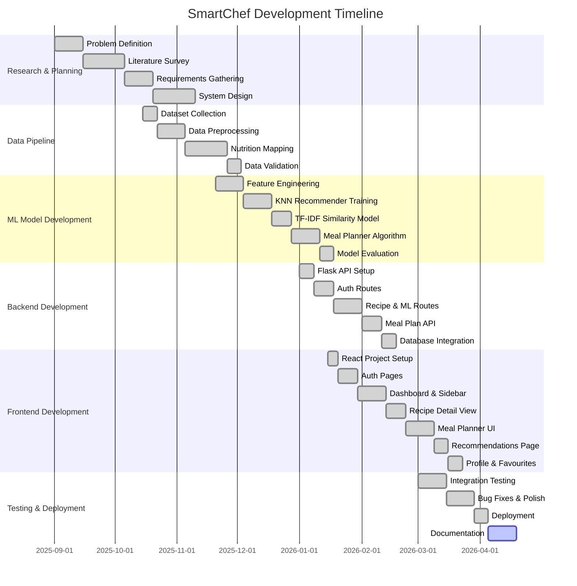

# SmartChef — Project Blackbook

> **Version:** 1.0.0  
> **Date:** March 2026  
> **Project Title:** SmartChef — AI-Powered Indian Culinary Companion  
> **Institution:** Department of Computer Science & Engineering  
> **Technology Stack:** React · TypeScript · Python · Flask · Scikit-learn · PostgreSQL

---

## Table of Contents

| # | Chapter | Section |
|---|---------|---------|
| 1 | **Introduction** | |
| 1.1 | | Introduction |
| 1.2 | | Description |
| 1.3 | | Stakeholders |
| 2 | **Literature Survey** | |
| 2.1 | | Description of Existing System |
| 2.2 | | Limitations of Present System |
| 3 | **Methodology** | |
| 3.0 | | Gantt Chart (Timeline) |
| 3.1 | | Technologies Used and their Description |
| 3.2 | | Event Table |
| 3.3 | | Use Case Diagram and Basic Scenarios & Use Case Description |
| 3.4 | | Entity-Relationship Diagram |
| 3.5 | | Flow Diagram |
| 3.6 | | Class Diagram |
| 3.7 | | Sequence Diagram |
| 3.8 | | State Diagram |
| 3.9 | | Menu Tree |
| 4 | **Implementation** | |
| 4.1 | | List of Tables with Attributes and Constraints |
| 4.2 | | System Coding |
| 4.3 | | Screen Layouts and Report Layouts |
| 5 | **Analysis & Related Work** | |
| 6 | **Conclusion and Future Work** | |
| 6.1 | | Conclusion |
| 6.2 | | Future Work |
| 6.3 | | References |

---

# Chapter 1 — Introduction

## 1.1 Introduction

In the modern era of health consciousness, dietary planning has become an essential aspect of daily life. With the rising prevalence of lifestyle diseases such as diabetes, obesity, cardiovascular disorders, and malnutrition, the need for an intelligent, technology-driven approach to food and nutrition management has never been greater. The Indian subcontinent, with its rich and diverse culinary heritage spanning over 80 regional cuisines and thousands of recipes, presents a unique challenge: how to preserve the cultural authenticity of traditional Indian cooking while making it compatible with modern health goals.

**SmartChef** is an AI-powered culinary companion web application designed to bridge this gap. It leverages machine learning algorithms — specifically K-Nearest Neighbors (KNN) for personalised recipe recommendations, TF-IDF Vectorization with Cosine Similarity for content-based recipe matching, and a Greedy Nutrition Scoring algorithm for intelligent meal planning — to provide users with recipe recommendations and meal plans tailored to their individual Body Mass Index (BMI), health goals, and dietary preferences.

The application addresses a critical problem in today's food technology landscape: existing recipe platforms treat all users identically, offering the same recipes regardless of whether a user is trying to lose weight, gain muscle, or maintain their current physique. SmartChef fundamentally changes this paradigm by computing a nutrition target profile based on the user's anthropometric data (height, weight, age) and health goal, then using machine learning to find the recipes whose nutritional profiles most closely match that target.

The system is built on a dataset of **5,938 Indian recipes** sourced from well-known Indian food databases and processed through a comprehensive data pipeline that includes:

- **Data Cleaning:** Removal of duplicates, empty records, and invalid cooking times
- **Feature Engineering:** Automated diet classification (Veg/Non-Veg), course categorization (Breakfast, Lunch, Dinner, Snack, Dessert), difficulty scoring, and cooking time labeling
- **Nutrition Mapping:** A custom-built nutrition calculator with a 250+ ingredient database that parses raw ingredient strings, estimates quantities in grams, and computes per-serving calories, protein, carbohydrates, fat, and fiber

The frontend is built with React, TypeScript, and Tailwind CSS, providing a modern, responsive user interface with smooth animations powered by Framer Motion. The backend is powered by Python Flask, serving both the REST API and the machine learning inference endpoints. Data is persisted in PostgreSQL (Neon cloud database) for user management, favourites, and meal plan history.

### Key Objectives

1. **Personalised Nutrition:** Recommend recipes based on user BMI and health goals (weight loss, weight gain, muscle gain, maintenance)
2. **Authentic Indian Focus:** Specialise in Indian cuisine with support for 82+ regional cuisines
3. **Intelligent Meal Planning:** Generate multi-day meal plans within calorie budgets using greedy optimization
4. **Smart Substitutions:** Suggest healthier ingredient alternatives based on the user's fitness goal
5. **Real Nutrition Data:** Calculate actual nutritional information from ingredient parsing rather than relying on generic or manually-entered estimates
6. **Content-Based Similarity:** Find similar recipes using TF-IDF vectorization of ingredient profiles
7. **User Experience:** Deliver a premium, modern web interface with micro-animations, responsive design, and intuitive navigation

### Problem Domain

The intersection of three domains forms the foundation of SmartChef:

```
┌──────────────────────────────────────────────────────────────┐
│                     PROBLEM DOMAIN                           │
│                                                              │
│   ┌─────────────┐   ┌───────────────┐   ┌───────────────┐   │
│   │  Nutrition   │   │   Machine     │   │   Indian      │   │
│   │  Science     │◄──┤   Learning    │──►│   Culinary    │   │
│   │  (BMI,TDEE)  │   │  (KNN,TF-IDF) │   │  Heritage     │   │
│   └──────┬──────┘   └───────┬───────┘   └───────┬───────┘   │
│          │                  │                   │            │
│          └──────────────────┼───────────────────┘            │
│                             │                                │
│                    ┌────────▼────────┐                        │
│                    │   SmartChef     │                        │
│                    │   Application   │                        │
│                    └─────────────────┘                        │
└──────────────────────────────────────────────────────────────┘
```

---

## 1.2 Description

SmartChef is a full-stack web application composed of the following major functional modules:

### 1.2.1 User Authentication & Profile Management

Users register with their name, email, password, age, height (cm), weight (kg), and fitness goal. The system computes BMI automatically and stores all user data in a PostgreSQL database. Passwords are securely hashed using Werkzeug's `generate_password_hash` function with salted PBKDF2-SHA256. Session management is handled via Flask sessions with CORS support for cross-origin requests from the React frontend. Users can update their health profile and change passwords at any time through the dedicated Profile page.

### 1.2.2 Recipe Discovery & Search

The application hosts 5,938 Indian recipes with attributes including recipe name, cuisine, diet type (Veg/Non-Veg), course category, difficulty level, cooking time, ingredients, cooking instructions, and computed nutritional values. Users can:

- **Browse** all recipes with pagination and sorting
- **Search** by recipe name, ingredient, or cuisine using text matching
- **Filter** by diet, course, calorie range, cooking time, difficulty, cuisine, and ingredient inclusion/exclusion
- **View** detailed recipe pages with dynamically scaled ingredients based on serving count, step-by-step instructions with visual timeline, nutrition cards, smart substitutions, and chef tips

### 1.2.3 ML-Powered Recommendations (KNN)

The recommendation engine uses a K-Nearest Neighbors model trained on a 9-dimensional feature space:
- **Nutrition features:** Calories, protein, carbs, fat, fiber
- **Metadata features:** Diet encoding, course encoding, difficulty encoding, cooking time

When a user requests recommendations, the backend computes a target nutrition profile based on BMI and health goal, scales the query vector, and finds the K nearest recipes using Ball Tree algorithm with Euclidean distance metric. Results are filtered by diet and course preferences before being returned to the frontend.

### 1.2.4 Content-Based Similarity (TF-IDF)

For recipe discovery, the system uses TF-IDF vectorization with bigrams to represent each recipe's ingredient profile in a 3,000-dimensional feature space. Cosine similarity between any two recipe vectors quantifies their ingredient overlap, enabling "Similar Recipes" functionality that helps users discover new dishes.

### 1.2.5 Intelligent Meal Planner

The meal planner generates multi-day meal plans with multiple dishes per meal following traditional Indian meal structure:
- **Breakfast** (25% daily calories): Main dish + Side/Drink
- **Lunch** (35%): Carb (rice/roti) + Dal/Curry + Sabji (vegetable) + Extra
- **Snack** (5%): Light snack item
- **Dinner** (35%): Carb + Main Curry + Side dish

The algorithm uses Mifflin-St Jeor BMR calculation adjusted for activity level and fitness goal, then greedily selects recipes that minimize calorie deviation from targets while maximizing protein and fiber content through a composite scoring function.

### 1.2.6 Favourites & Meal Plan History

Users can save favourite recipes with a single click and access them from a dedicated "Saved" tab. Generated meal plans are automatically persisted to the database and can be loaded, viewed, or deleted from the history panel.

---

## 1.3 Stakeholders

| Stakeholder | Role | Interest / Responsibility |
|---|---|---|
| **End Users (Home Cooks)** | Primary users | Discover healthy Indian recipes tailored to their body type and fitness goals |
| **Health-Conscious Individuals** | Target demographic | Track nutrition intake, plan balanced meals, achieve weight/fitness objectives |
| **Fitness Trainers / Dietitians** | Secondary users | Recommend structured meal plans to clients with specific calorie and macro targets |
| **Developers / Maintainers** | Technical team | Maintain codebase, retrain ML models on new data, deploy application updates |
| **Data Scientists** | ML team | Improve recommendation algorithms, expand nutrition database, evaluate model performance |
| **Database Administrators** | Infrastructure team | Manage PostgreSQL instances, ensure data integrity, handle backups and migrations |
| **UI/UX Designers** | Design team | Ensure intuitive, accessible, and visually appealing user interface design |
| **Academic Supervisors** | Evaluators | Assess project methodology, technical novelty, and execution quality |

### Stakeholder Interaction Diagram

```
                    ┌──────────────────┐
                    │   SmartChef      │
                    │   Platform       │
                    └────────┬─────────┘
                             │
           ┌─────────────────┼─────────────────┐
           │                 │                 │
    ┌──────▼──────┐   ┌──────▼──────┐   ┌──────▼──────┐
    │  End Users   │   │  Trainers   │   │  Dev Team   │
    │  (Primary)   │   │ (Secondary) │   │ (Technical) │
    └──────┬──────┘   └──────┬──────┘   └──────┬──────┘
           │                 │                 │
    ┌──────▼──────┐   ┌──────▼──────┐   ┌──────▼──────┐
    │ Register    │   │ Create Meal │   │ Train ML    │
    │ Browse      │   │ Plans for   │   │ Models      │
    │ Get Recs    │   │ Clients     │   │ Deploy API  │
    │ Save Faves  │   │             │   │ Maintain DB │
    └─────────────┘   └─────────────┘   └─────────────┘
```

---

# Chapter 2 — Literature Survey

## 2.1 Description of Existing System

The current landscape of recipe and meal planning applications can be categorized into several types. This section provides a comprehensive analysis of existing systems and establishes the context for SmartChef's unique contributions.

### 2.1.1 Generic Recipe Platforms

**Examples:** AllRecipes, Yummly, Food.com, Tasty

These platforms offer vast recipe databases (often 1M+ recipes) with search and filtering capabilities. Users can browse recipes by category, cuisine, or ingredient, and many support user-generated content. However, they share common limitations:

- **No Health Personalization:** All users see the same recipes regardless of their health profile. A 20-year-old athlete and a 50-year-old diabetic patient receive identical search results.
- **Generic Nutrition Info:** Nutritional data is often crowd-sourced, manually entered, or missing entirely. Per-serving calculations are inconsistent.
- **No ML-Driven Recommendations:** Recommendations are based on popularity, recency, or simple collaborative filtering (users who liked X also liked Y), not health-optimized algorithms.
- **Global Focus:** These platforms cover global cuisines but lack depth in Indian regional cooking. Indian recipes are a small subset with minimal curation.

### 2.1.2 Calorie Tracking Applications

**Examples:** MyFitnessPal, HealthifyMe, Lose It!, Cronometer

These applications focus on food logging and calorie counting:

- **Passive Tracking Model:** Users must manually search for and log every food item they consume — a high-friction process that leads to low long-term adherence (studies show 60% dropout within 3 months).
- **No Recipe Recommendations:** They tell users what they ate but don't proactively suggest what they *should* eat for their goals.
- **Limited Meal Planning:** Some offer basic meal plans behind premium paywalls, but without ML-driven optimization for nutritional targets.
- **Database Lookup Approach:** Nutrition data comes from pre-built food item databases (e.g., USDA) rather than computing nutrition from actual recipe ingredients. This means a "homemade dal" entry may wildly differ from the actual dal made with specific ingredients and quantities.

### 2.1.3 Meal Kit Delivery Services

**Examples:** Blue Apron, HelloFresh, FreshMenu, Licious

These services deliver pre-portioned ingredients with recipe cards:

- **Physical Delivery Required:** Not accessible to all geographies, especially rural and semi-urban India.
- **Limited Menu Variety:** Typically 8–12 recipes per week, decided by editorial teams, not personalized to individual health needs.
- **No ML Integration:** Recipe selection is manual by chefs and editors, not algorithmically personalized based on user health data.
- **Premium Pricing:** ₹300–₹800 per meal makes them inaccessible for daily use.

### 2.1.4 Diet-Specific Applications

**Examples:** Keto Diet App, Vegan Recipe App, Paleo Leap, Cult.fit

These apps cater to specific dietary philosophies:

- **Single Diet Lock-in:** Once a user chooses the app, they're locked into one dietary approach. A user who switches from keto to a balanced diet must switch apps.
- **No BMI-Based Personalization:** Same recipe recommendations for all body types.
- **Western-Centric:** Recipes are predominantly Western; Indian recipes are tokenistic adaptations.
- **No Adaptive Goals:** Cannot dynamically adjust between weight loss, muscle gain, and maintenance.

### 2.1.5 Indian Food-Specific Platforms

**Examples:** TarlaDalal.com, Sanjeev Kapoor Online, Hebbars Kitchen, VahChef

Rich in Indian recipes but remain traditional content websites:

- **No User Profiles:** No concept of user health data or goals
- **No Nutritional Computing:** Calorie information is either absent or manually estimated by content creators
- **No Machine Learning:** Search and browse only — no intelligent, personalized recommendations
- **No Meal Planning:** Individual recipes only; no integrated weekly/monthly meal planning

### 2.1.6 Comparative Analysis Table

| Feature | AllRecipes | MyFitnessPal | HealthifyMe | Tarla Dalal | **SmartChef** |
|---|---|---|---|---|---|
| Recipe Database | ✅ (Global) | ❌ | Limited | ✅ (Indian) | ✅ (5,938 Indian) |
| BMI-Based Recommendations | ❌ | ❌ | Partial | ❌ | ✅ (KNN) |
| ML-Powered Similarity | ❌ | ❌ | ❌ | ❌ | ✅ (TF-IDF) |
| KNN Recommendation Engine | ❌ | ❌ | ❌ | ❌ | ✅ |
| Ingredient-Level Nutrition | ❌ | Manual Log | Manual Log | ❌ | ✅ (Auto-computed) |
| Multi-Day Meal Planning | ❌ | ❌ | ✅ (Premium) | ❌ | ✅ (Free) |
| Smart Substitutions | ❌ | ❌ | ❌ | ❌ | ✅ (Goal-Aware) |
| Multi-Dish Meal Plans | ❌ | ❌ | ❌ | ❌ | ✅ (Thali-style) |
| Indian Cuisine Depth | Low | N/A | Medium | High | High (82 Cuisines) |
| Free & Open Source | ❌ | Freemium | Freemium | ❌ | ✅ |

---

## 2.2 Limitations of Present System

Based on the analysis of existing systems, the following critical limitations have been identified that SmartChef aims to solve:

### 2.2.1 Absence of Health-Driven Personalization

**Problem:** Current recipe platforms treat all users identically. A 55kg underweight teenager trying to gain weight and a 95kg obese adult trying to lose weight receive the same recipe recommendations when they search for "paneer curry".

**Impact:** Users must manually evaluate every recipe's suitability for their health goals, leading to poor dietary choices, information overload, analysis paralysis, and eventual platform abandonment.

**SmartChef's Solution:** Implements a KNN recommendation engine that uses BMI-adjusted nutrition target profiles. Each of the four health goals has a distinct calorie and macronutrient target, further adjusted based on BMI category:
- BMI > 30 (Obese): Calorie target reduced by 15%
- BMI < 18.5 (Underweight): Calorie target increased by 20%
- Normal BMI: Standard goal-based targets applied

### 2.2.2 Inaccurate or Missing Nutritional Data

**Problem:** Most Indian recipe platforms either lack nutritional information entirely or provide rough estimates entered manually by content creators. The "per-serving" concept is often missing — a recipe showing "500 calories" might serve 4 people but this distinction is rarely clarified, leading to users consuming 4x their intended calories.

**Impact:** Users cannot make informed dietary decisions. Calorie counting becomes unreliable guesswork, undermining any health improvement effort.

**SmartChef's Solution:** Built a custom nutrition calculation pipeline with:
- 250+ ingredient nutrition database sourced from USDA FoodData Central and IFCT 2017
- Intelligent ingredient string parser that handles complex Indian cooking measurements like "2 tablespoons ghee", "½ cup moong dal", "3 green chillies", "1 inch ginger"
- Unit-to-grams conversion table covering 40+ unit types (teaspoon, tablespoon, cup, cloves, pinch, bunch, etc.)
- Per-item weight table for countable ingredients (1 onion = 100g, 1 egg = 60g, 1 green chilli = 8g)
- Smart servings estimator that adjusts based on course type and recipe name keywords (e.g., biryani → 5 servings, dosa → 3 servings)

### 2.2.3 No Intelligent Recipe Discovery

**Problem:** Users who enjoy "Palak Paneer" have no automated way to discover similar dishes like "Methi Paneer" or "Saag Paneer" on existing platforms. Discovery relies on manual keyword search and browsing.

**Impact:** Users remain stuck in a limited recipe repertoire. Culinary exploration is serendipitous rather than systematic, and users miss out on recipes they would likely enjoy.

**SmartChef's Solution:** TF-IDF Content Similarity model with 3000-feature vocabulary, bigram support, and cosine similarity scoring to find recipes with overlapping ingredient and cuisine profiles.

### 2.2.4 Manual and Inflexible Meal Planning

**Problem:** Meal planning on existing platforms is either completely absent, locked behind premium paywalls, or limited to single-dish-per-meal suggestions that don't reflect real Indian eating patterns (where a meal typically consists of rice/roti + dal + sabji + accompaniments).

**Impact:** Users who need structured weekly meal plans must create them manually — a time-consuming process that often results in nutritionally imbalanced plans.

**SmartChef's Solution:** Multi-dish greedy meal planner with Indian thali-style meal structure, Mifflin-St Jeor BMR calculation, variety guarantees across days, and automatic calorie budgeting per meal slot.

### 2.2.5 No Smart Substitutions

**Problem:** Users with health goals often don't know which ingredients to swap for healthier alternatives. A recipe calling for "sugar" or "maida" (refined flour) is either avoided entirely or followed verbatim.

**SmartChef's Solution:** Goal-aware substitution engine with 16+ ingredient rules (e.g., cream → hung curd, sugar → jaggery, maida → whole wheat flour, white rice → brown rice / millets).

### 2.2.6 Western-Centric AI Models

**Problem:** Most food AI research uses Western food datasets. Portion sizes, ingredients, cooking methods, and meal structures are fundamentally different in Indian cuisine.

**SmartChef's Solution:** Purpose-built for Indian cuisine with a dedicated Indian ingredient nutrition database, 82 regional cuisines, and an Indian thali-style meal planner.

---

# Chapter 3 — Methodology

## 3.0 Gantt Chart (Timeline)



### Timeline Summary

| Phase | Duration | Key Deliverables |
|---|---|---|
| Research & Planning | Sep–Oct 2025 (10 weeks) | Problem definition, literature review, SRS document |
| Data Pipeline | Oct–Nov 2025 (7 weeks) | Cleaned dataset, nutrition mapping, 5,938 processed recipes |
| ML Model Development | Nov 2025–Jan 2026 (8 weeks) | 3 trained models (KNN, TF-IDF, Meal Planner), evaluation report |
| Backend Development | Jan–Feb 2026 (7 weeks) | Flask REST API with 18 endpoints, PostgreSQL integration |
| Frontend Development | Jan–Mar 2026 (10 weeks) | React SPA with 5 pages, 6+ components, responsive design |
| Testing & Deployment | Mar–Apr 2026 (5 weeks) | Deployed application, blackbook documentation |

---

## 3.1 Technologies Used and their Description

### 3.1.1 Frontend Technologies

| Technology | Version | Purpose |
|---|---|---|
| **React** | 19.0.0 | Component-based UI library for building interactive single-page applications |
| **TypeScript** | 5.8.2 | Typed superset of JavaScript providing compile-time type safety and IDE support |
| **Vite** | 6.2.0 | Next-generation build tool with instant Hot Module Replacement (HMR) and optimized production builds |
| **Tailwind CSS** | 4.1.14 | Utility-first CSS framework enabling rapid, responsive UI development |
| **React Router DOM** | 7.13.1 | Declarative client-side routing for SPA navigation without page reloads |
| **Axios** | 1.13.6 | Promise-based HTTP client for API communication with interceptor support |
| **Motion (Framer Motion)** | 12.23.24 | Production-ready animation library for smooth UI transitions and micro-interactions |
| **Lucide React** | 0.546.0 | Modern, tree-shakeable SVG icon library with 1000+ icons |

### 3.1.2 Backend Technologies

| Technology | Version | Purpose |
|---|---|---|
| **Python** | 3.8+ | Primary backend programming language |
| **Flask** | 3.x | Lightweight WSGI web framework for building REST APIs |
| **Flask-CORS** | 4.x | Cross-Origin Resource Sharing middleware for frontend-backend communication |
| **Pandas** | 2.x | High-performance data manipulation and analysis library |
| **NumPy** | 1.x | Numerical computing library for array operations |
| **Scikit-learn** | 1.x | Machine learning library providing KNN, TF-IDF, StandardScaler, LabelEncoder |
| **psycopg2-binary** | 2.x | PostgreSQL database adapter for Python |
| **Werkzeug** | 3.x | WSGI toolkit with password hashing and security utilities |
| **python-dotenv** | 1.x | Environment variable management from .env files |
| **Gunicorn** | 21.x | Production-grade WSGI HTTP server for deployment |

### 3.1.3 Machine Learning Stack

| Algorithm | Library | Use Case |
|---|---|---|
| **K-Nearest Neighbors** | `sklearn.neighbors.NearestNeighbors` | Personalised recipe recommendations based on user BMI + goal |
| **TF-IDF Vectorization** | `sklearn.feature_extraction.text.TfidfVectorizer` | Content-based recipe similarity using ingredient profiles |
| **Cosine Similarity** | `sklearn.metrics.pairwise.cosine_similarity` | Computing similarity scores between recipe feature vectors |
| **StandardScaler** | `sklearn.preprocessing.StandardScaler` | Z-score normalization of KNN features |
| **LabelEncoder** | `sklearn.preprocessing.LabelEncoder` | Integer encoding of categorical features (diet, course, difficulty) |

### 3.1.4 Database & Storage

| Technology | Purpose |
|---|---|
| **PostgreSQL** (Neon Cloud) | Primary RDBMS for users, favourites, and meal plan history |
| **Pickle (.pkl)** | Serialized ML models and pre-processed DataFrames |
| **CSV** | Raw and cleaned recipe datasets |
| **JSON** | Nutrition ingredient database, API responses |

### 3.1.5 Flask API Architecture

```
┌────────────────────────────────────────────────────────────┐
│                   Flask API Endpoints (18)                  │
├────────────────────────────────────────────────────────────┤
│  AUTH (6 endpoints)                                        │
│  ├── POST /register          → Create new user account     │
│  ├── POST /login             → Authenticate user           │
│  ├── GET  /logout            → Clear session               │
│  ├── GET  /api/me            → Get current user info       │
│  ├── PUT  /api/profile       → Update health profile       │
│  └── PUT  /api/password      → Change password             │
├────────────────────────────────────────────────────────────┤
│  RECIPES (4 endpoints)                                     │
│  ├── GET  /api/recipes/all   → Paginated recipe list       │
│  ├── GET  /api/recipes/filter → Advanced filtered search   │
│  ├── GET  /api/recipe/<id>   → Full recipe detail          │
│  └── GET  /api/search?q=     → Text search                 │
├────────────────────────────────────────────────────────────┤
│  ML (3 endpoints)                                          │
│  ├── POST /api/recommend     → KNN recommendations         │
│  ├── GET  /api/similar/<id>  → TF-IDF similar recipes      │
│  └── POST /api/mealplan      → Generate meal plan          │
├────────────────────────────────────────────────────────────┤
│  FAVOURITES (3 endpoints)                                  │
│  ├── POST   /api/favourites        → Save a recipe         │
│  ├── GET    /api/favourites        → List saved recipes     │
│  └── DELETE /api/favourites/<id>   → Remove saved recipe   │
├────────────────────────────────────────────────────────────┤
│  HISTORY (3 endpoints)                                     │
│  ├── GET    /api/mealplan/history       → List past plans  │
│  ├── GET    /api/mealplan/history/<id>  → Load a plan      │
│  └── DELETE /api/mealplan/history/<id>  → Delete a plan    │
└────────────────────────────────────────────────────────────┘
```

---

## 3.2 Event Table

| # | Event | Trigger | Source | Response | Category |
|---|---|---|---|---|---|
| E1 | User Registration | Submit registration form | Register Page | Create user in PostgreSQL, hash password, set session | External |
| E2 | User Login | Submit login form | Login Page | Verify credentials, set session, redirect to dashboard | External |
| E3 | User Logout | Click logout button | Navbar | Clear session and localStorage, redirect to landing | External |
| E4 | Profile Update | Save profile changes | Profile Page | Update user record in `users` table | External |
| E5 | Password Change | Submit new password | Profile Page | Verify old password, hash new, update DB record | External |
| E6 | Browse Recipes | Open Recipes tab | Dashboard | Fetch paginated recipes from in-memory DataFrame | External |
| E7 | Search Recipes | Enter search query | Sidebar | Filter DataFrame by name/ingredient/cuisine text match | External |
| E8 | Filter Recipes | Apply diet/course/calorie filters | Sidebar | Chain multiple DataFrame filter conditions | External |
| E9 | View Recipe Detail | Click a recipe card | Sidebar/Grid | Fetch recipe by ID, parse ingredients, compute nutrition | External |
| E10 | Scale Servings | Click +/- servings | Recipe Detail | Client-side recalculation of ingredient quantities and nutrition | External |
| E11 | Get Recommendations | Open "For You" tab | Dashboard | Compute BMI → build target vector → KNN.kneighbors() → filter → rank | External |
| E12 | Find Similar Recipes | View recipe detail | Recipe Detail | TF-IDF cosine_similarity() → return top N similar recipes | Internal |
| E13 | Generate Meal Plan | Click "Generate Plan" | Meal Planner | Build meal pool → greedy multi-slot dish selection → return plan JSON | External |
| E14 | Toggle Favourite | Click heart icon | Recipe Detail | INSERT or DELETE in `favourites` table based on current state | External |
| E15 | Load Favourites | Open "Saved" tab | Dashboard | SELECT from `favourites`, join with recipes_df for full data | External |
| E16 | Auto-Save Plan | System event after generation | Meal Planner | INSERT plan_json into `meal_plan_history` table | Internal |
| E17 | Load History Plan | Click "Load" button | Meal Planner | SELECT plan_json from `meal_plan_history`, deserialize and render | External |
| E18 | Delete History Plan | Click delete button | Meal Planner | DELETE row from `meal_plan_history` after user confirmation | External |
| E19 | Health Check | Monitoring ping | External System | Return API status, recipe count, loaded model list | Temporal |
| E20 | Model Loading | Server startup event | System Boot | Load 6 .pkl files into memory (KNN, TF-IDF, scaler, encoders, planner, df) | Temporal |

---
