# SmartChef — Project Whitebook

> **Version:** 1.0.0
> **Date:** March 2026
> **Project Title:** SmartChef — AI-Powered Indian Culinary Companion
> **Institution:** Department of Computer Science & Engineering
> **Technology Stack:** React · TypeScript · Python · Flask · Scikit-learn · PostgreSQL

---

## Table of Contents

| # | Chapter | Page |
|---|---------|------|
| 1 | Introduction | 1 |
| 1.1 | Introduction | 1 |
| 1.2 | Description | 2 |
| 1.3 | Stakeholders | 3 |
| 2 | Literature Survey | 4 |
| 2.1 | Description of Existing System | 4 |
| 2.2 | Limitations of Present System | 6 |
| 3 | Methodology | 8 |
| 3.0 | Gantt Chart (Timeline) | 8 |
| 3.1 | Technologies Used and their Description | 10 |
| 3.2 | Event Table | 14 |
| 3.3 | Use Case Diagram and Scenarios | 16 |
| 3.4 | Entity-Relationship Diagram | 22 |
| 3.5 | Flow Diagram | 25 |
| 3.6 | Class Diagram | 28 |
| 3.7 | Sequence Diagram | 31 |
| 3.8 | State Diagram | 34 |
| 3.9 | Menu Tree | 36 |
| 4 | Implementation | 38 |
| 4.1 | List of Tables with Attributes & Constraints | 38 |
| 4.2 | System Coding | 42 |
| 4.3 | Screen Layouts and Report Layouts | 80 |
| 5 | Analysis & Related Work | 82 |
| 6 | Conclusion and Future Work | 85 |
| 6.1 | Conclusion | 85 |
| 6.2 | Future Work | 86 |
| 6.3 | References | 88 |

---

# Chapter 1 — Introduction

## 1.1 Introduction

In the modern era of health consciousness, dietary planning has become an essential aspect of daily life. With the rising prevalence of lifestyle diseases such as diabetes, obesity, cardiovascular disorders, and malnutrition, the need for an intelligent, technology-driven approach to food and nutrition management has never been greater. The Indian subcontinent, with its rich and diverse culinary heritage spanning over 80 regional cuisines and thousands of recipes, presents a unique challenge: how to preserve the cultural authenticity of traditional Indian cooking while making it compatible with modern health goals.

**SmartChef** is an AI-powered culinary companion web application designed to bridge this gap. It leverages machine learning algorithms — specifically K-Nearest Neighbors (KNN) for personalised recipe recommendations, TF-IDF Vectorization with Cosine Similarity for content-based recipe matching, and a Greedy Nutrition Scoring algorithm for intelligent meal planning — to provide users with recipe recommendations and meal plans tailored to their individual Body Mass Index (BMI), health goals, and dietary preferences.

The application addresses a critical problem: existing recipe platforms treat all users identically, offering the same recipes regardless of whether a user is trying to lose weight, gain muscle, or maintain their current physique. SmartChef fundamentally changes this paradigm by computing a nutrition target profile based on the user's anthropometric data (height, weight, age) and health goal, then using machine learning to find the recipes whose nutritional profiles most closely match that target.

The system is built on a dataset of **5,938 Indian recipes** sourced from well-known Indian food databases. Each recipe has been preprocessed through a comprehensive data pipeline that includes:

- **Data Cleaning:** Removal of duplicates, empty records, and invalid cooking times
- **Feature Engineering:** Automated diet classification (Veg/Non-Veg), course categorization (Breakfast, Lunch, Dinner, Snack, Dessert), difficulty scoring, and cooking time labeling
- **Nutrition Mapping:** A custom-built nutrition calculator with a 250+ ingredient database that parses raw ingredient strings, estimates quantities in grams, and computes per-serving calories, protein, carbohydrates, fat, and fiber

The frontend is built with React, TypeScript, and Tailwind CSS, providing a modern, responsive user interface. The backend is powered by Python Flask, serving both the REST API and the machine learning inference endpoints. Data is persisted in PostgreSQL (Neon cloud database) for user management, favourites, and meal plan history.

### Key Objectives

1. **Personalised Nutrition:** Recommend recipes based on user BMI and health goals (weight loss, weight gain, muscle gain, maintenance)
2. **Authentic Indian Focus:** Specialise in Indian cuisine with support for 82+ regional cuisines
3. **Intelligent Meal Planning:** Generate multi-day meal plans within calorie budgets using greedy optimization
4. **Smart Substitutions:** Suggest healthier ingredient alternatives based on the user's goal
5. **Real Nutrition Data:** Calculate actual nutritional information from ingredient parsing rather than relying on generic estimates
6. **Content Similarity:** Find similar recipes using TF-IDF vectorization of ingredient profiles

### Problem Domain

The intersection of three domains:

```
┌──────────────────────────────────────────────────────────────┐
│                     PROBLEM DOMAIN                           │
│                                                              │
│   ┌─────────────┐   ┌───────────────┐   ┌───────────────┐   │
│   │  Nutrition   │   │   Machine     │   │   Indian      │   │
│   │  Science     │◄──┤   Learning    │──►│   Culinary    │   │
│   │  (BMI,TDEE)  │   │  (KNN,TF-IDF) │   │  Heritage     │   │
│   └──────┬──────┘   └───────┬───────┘   └───────┬───────┘   │
│          │                  │                   │            │
│          └──────────────────┼───────────────────┘            │
│                             │                                │
│                    ┌────────▼────────┐                        │
│                    │   SmartChef     │                        │
│                    │   Application   │                        │
│                    └─────────────────┘                        │
└──────────────────────────────────────────────────────────────┘
```

---

## 1.2 Description

SmartChef is a full-stack web application composed of the following major modules:

### 1.2.1 User Authentication & Profile Management

Users register with their name, email, password, height (cm), weight (kg), age, and fitness goal. The system computes BMI automatically and stores user data in a PostgreSQL database. Passwords are hashed using Werkzeug's `generate_password_hash` function. Session management is handled via Flask sessions with CORS support for the React frontend.

### 1.2.2 Recipe Discovery & Search

The application hosts 5,938 Indian recipes with attributes including recipe name, cuisine, diet type (Veg/Non-Veg), course category, difficulty level, cooking time, ingredients, instructions, and computed nutritional values. Users can:

- **Browse** all recipes with pagination
- **Search** by recipe name, ingredient, or cuisine
- **Filter** by diet, course, calorie range, cooking time, difficulty, cuisine, and ingredient inclusion/exclusion
- **View** detailed recipe pages with scaled ingredients, step-by-step instructions, nutrition cards, smart substitutions, and chef tips

### 1.2.3 ML-Powered Recommendations (KNN)

The recommendation engine uses a K-Nearest Neighbors model trained on a 9-dimensional feature space:
- Calories, protein, carbs, fat, fiber (nutrition features)
- Diet encoding, course encoding, difficulty encoding, cooking time (categorical/metadata features)

When a user requests recommendations, the system:
1. Computes a target nutrition profile based on the user's BMI and health goal
2. Scales the query vector using the same StandardScaler used during training
3. Finds the K nearest recipes in the feature space using Ball Tree algorithm
4. Filters results by user's diet and course preferences
5. Returns ranked recipe summaries

### 1.2.4 Content-Based Similarity (TF-IDF)

When viewing a recipe, users can discover similar dishes. The similarity engine:
1. Represents each recipe as a TF-IDF vector of its ingredients, cuisine, course, and diet
2. Computes cosine similarity between the query recipe and all other recipes
3. Returns the top N most similar recipes with similarity scores

### 1.2.5 Intelligent Meal Planner

The meal planner generates multi-day meal plans with multiple dishes per meal:
- **Breakfast** (25% daily calories): Main + Side
- **Lunch** (35%): Carb + Dal/Curry + Sabji + Extra
- **Snack** (5%): Snack item
- **Dinner** (35%): Carb + Main Curry + Side

The algorithm uses Mifflin-St Jeor BMR calculation adjusted for activity level and goal, then greedily selects recipes that minimize the distance to calorie targets while maximizing protein and fiber content.

### 1.2.6 Favourites & Meal Plan History

Users can save favourite recipes and access past meal plans. Both features are persisted in PostgreSQL with user-specific access controls.

---

## 1.3 Stakeholders

| Stakeholder | Role | Interest |
|---|---|---|
| **End Users (Home Cooks)** | Primary users | Discover healthy Indian recipes tailored to their body and goals |
| **Health-Conscious Individuals** | Target segment | Track nutrition, plan meals, achieve weight/fitness goals |
| **Fitness Trainers / Dietitians** | Secondary users | Recommend meal plans to clients with specific calorie targets |
| **Developers / Maintainers** | Technical team | Maintain codebase, train models, deploy updates |
| **Data Scientists** | ML team | Improve recommendation algorithms, expand nutrition database |
| **Database Administrators** | Infrastructure | Manage PostgreSQL, ensure data integrity and backups |
| **UI/UX Designers** | Design team | Ensure intuitive, accessible, and visually appealing interface |
| **Academic Supervisors** | Evaluation | Assess project methodology, novelty, and execution quality |

### Stakeholder Interaction Matrix

```
                    ┌──────────────────┐
                    │   SmartChef      │
                    │   Platform       │
                    └────────┬─────────┘
                             │
           ┌─────────────────┼─────────────────┐
           │                 │                 │
    ┌──────▼──────┐   ┌──────▼──────┐   ┌──────▼──────┐
    │  End Users   │   │  Trainers   │   │  Dev Team   │
    │  (Primary)   │   │ (Secondary) │   │ (Technical) │
    └──────┬──────┘   └──────┬──────┘   └──────┬──────┘
           │                 │                 │
    ┌──────▼──────┐   ┌──────▼──────┐   ┌──────▼──────┐
    │ Register    │   │ Create Meal │   │ Train ML    │
    │ Browse      │   │ Plans for   │   │ Models      │
    │ Get Recs    │   │ Clients     │   │ Deploy API  │
    │ Save Faves  │   │             │   │ Maintain DB │
    └─────────────┘   └─────────────┘   └─────────────┘
```

---

# Chapter 2 — Literature Survey

## 2.1 Description of Existing System

The current landscape of recipe and meal planning applications can be categorized into several types. This section provides a comprehensive analysis of existing systems and establishes the context for SmartChef's unique contributions.

### 2.1.1 Generic Recipe Platforms

**Examples:** AllRecipes, Yummly, Food.com, Tasty

These platforms offer vast recipe databases with search and filtering capabilities. Users can browse recipes by category, cuisine, or ingredient. However, they share common limitations:

- **No Health Personalization:** All users see the same recipes regardless of their health profile
- **Generic Nutrition Info:** Nutritional data is often manually entered or missing entirely
- **No ML-Driven Recommendations:** Recommendations are based on popularity or simple collaborative filtering, not health-optimized algorithms
- **Global Focus:** These platforms cover global cuisines but lack depth in Indian regional cooking

### 2.1.2 Calorie Tracking Applications

**Examples:** MyFitnessPal, HealthifyMe, Lose It!, Cronometer

These applications focus on food logging and calorie counting. Users manually log what they eat, and the app tracks their daily intake against goals. Key characteristics:

- **Passive Tracking:** Users must manually log every meal — high friction and low adherence
- **No Recipe Recommendations:** They tell you what you ate but don't suggest what you should eat
- **Limited Meal Planning:** Some offer basic meal plans but without the intelligence to optimize for nutritional targets
- **Database Lookup:** Nutrition data comes from pre-built food databases rather than ingredient-level calculation

### 2.1.3 Meal Kit Delivery Services

**Examples:** Blue Apron, HelloFresh, FreshMenu

These services deliver pre-portioned ingredients with recipe cards. While convenient, they:

- **Require Physical Delivery:** Not accessible to all geographies, especially rural India
- **Limited Customization:** Menu is fixed weekly with limited options (typically 8–12 recipes)
- **No ML Integration:** Recipe selection is manual by editorial teams, not algorithmically personalized
- **High Cost:** Premium pricing makes them inaccessible to budget-conscious users

### 2.1.4 Diet-Specific Applications

**Examples:** Keto Diet App, Vegan Recipe App, Paleo Leap

These apps cater to specific dietary philosophies but:

- **Single Diet Focus:** Locked into one dietary approach (keto, vegan, etc.)
- **No BMI-Based Personalization:** Same recommendations for a 50kg person and a 100kg person
- **Western-Centric:** Recipes are predominantly Western; Indian recipes, if present, are tokenistic
- **No Adaptive Goals:** Cannot dynamically switch between weight loss, muscle gain, and maintenance

### 2.1.5 Indian Food-Specific Platforms

**Examples:** TarlaDalal.com, Sanjeev Kapoor Online, HebbarS Kitchen

These platforms are rich in Indian recipes but remain traditional content websites:

- **No User Profiles:** No concept of user health data or goals
- **No Nutritional Computing:** Calorie information is either absent or manually estimated
- **No Machine Learning:** Search and browse only — no intelligent recommendations
- **No Meal Planning:** Individual recipes only, no integrated weekly planning

### 2.1.6 Comparative Analysis Table

| Feature | AllRecipes | MyFitnessPal | HealthifyMe | Tarla Dalal | **SmartChef** |
|---|---|---|---|---|---|
| Recipe Database | ✅ (Global) | ❌ | Limited | ✅ (Indian) | ✅ (5,938 Indian) |
| BMI-Based Recommendations | ❌ | ❌ | Partial | ❌ | ✅ |
| ML-Powered Similarity | ❌ | ❌ | ❌ | ❌ | ✅ (TF-IDF) |
| KNN Recommendation Engine | ❌ | ❌ | ❌ | ❌ | ✅ |
| Ingredient-Level Nutrition | ❌ | Manual Log | Manual Log | ❌ | ✅ (Auto-computed) |
| Multi-Day Meal Planning | ❌ | ❌ | ✅ (Premium) | ❌ | ✅ (Free) |
| Smart Substitutions | ❌ | ❌ | ❌ | ❌ | ✅ (Goal-Aware) |
| User Goal Adaptation | ❌ | Calories only | ✅ | ❌ | ✅ (4 Goals) |
| Multi-Dish Meal Plans | ❌ | ❌ | ❌ | ❌ | ✅ (Carb+Dal+Sabji) |
| Cuisine Specialization | Global | N/A | Indian (limited) | Indian | Indian (82 Cuisines) |
| Free & Open Source | ❌ | Freemium | Freemium | ❌ | ✅ |

---

## 2.2 Limitations of Present System

Based on the analysis of existing systems, the following critical limitations have been identified:

### 2.2.1 Absence of Health-Driven Personalization

**Problem:** Current recipe platforms treat all users identically. A 20-year-old athlete looking to gain muscle and a 50-year-old diabetic patient trying to lose weight receive the same recipe recommendations.

**Impact:** Users must manually evaluate every recipe's suitability for their health goals, leading to poor dietary choices, information overload, and eventual platform abandonment.

**SmartChef's Solution:** Uses KNN recommendation with BMI-adjusted nutrition target profiles. Each of the four health goals (weight-loss, weight-gain, muscle-gain, maintenance) has a distinct calorie/macro target that is further adjusted based on BMI category:
- BMI > 30 (Obese): Calorie target reduced by 15%
- BMI < 18.5 (Underweight): Calorie target increased by 20%

### 2.2.2 Inaccurate or Missing Nutritional Data

**Problem:** Most Indian recipe platforms either lack nutritional information entirely or provide rough estimates entered manually. The per-serving concept is often missing — a recipe showing "500 calories" might serve 4 people but this is rarely clarified.

**Impact:** Users cannot make informed dietary decisions. Calorie counting becomes guesswork.

**SmartChef's Solution:** Built a custom nutrition calculation pipeline with:
- 250+ ingredient nutrition database (sourced from USDA FoodData Central and IFCT 2017)
- Intelligent ingredient parser that handles Indian cooking measurements ("2 tablespoons ghee", "½ cup moong dal", "3 green chillies")
- Unit-to-grams conversion table with 40+ unit types
- Per-item weight table for countable ingredients (1 onion = 100g, 1 egg = 60g)
- Smart servings estimator based on course type and recipe name keywords

### 2.2.3 No Intelligent Recipe Discovery

**Problem:** Existing platforms rely on keyword search and manual category browsing. Users who enjoy "Palak Paneer" have no automated way to discover similar dishes they might like.

**Impact:** Users are stuck in a limited recipe repertoire. Discovery of new recipes is serendipitous rather than systematic.

**SmartChef's Solution:** TF-IDF Content Similarity model that:
- Vectorizes each recipe's ingredients, cuisine, course, and diet into a 3000-dimensional feature space
- Uses bigrams to capture compound terms ("cumin seeds", "red chilli")
- Computes cosine similarity to find recipes with overlapping ingredient profiles
- Returns top N similar recipes with numeric similarity scores

### 2.2.4 Manual and Inflexible Meal Planning

**Problem:** Meal planning on existing platforms is either:
- Completely absent (most recipe websites)
- Premium-only (HealthifyMe, MyFitnessPal Pro)
- Single-dish per meal (no concept of a typical Indian thali with rice + dal + sabji)

**Impact:** Users who need structured weekly meal plans must create them manually, which is time-consuming and often nutritionally imbalanced.

**SmartChef's Solution:** Multi-dish meal planner with:
- Greedy optimization algorithm that selects the best recipe per meal slot within calorie budget
- Indian meal structure: Breakfast (Main + Side), Lunch (Carb + Dal + Sabji + Extra), Dinner (Carb + Main + Side), Snack
- Mifflin-St Jeor BMR calculation with goal-based adjustments (±200 to ±400 kcal)
- Variety guarantee: tracks used recipe IDs across days to avoid repetition
- Meal plan history with save/load/delete functionality

### 2.2.5 No Smart Substitutions

**Problem:** Users with health goals often don't know how to modify recipes to make them healthier. A recipe calling for "sugar" or "maida" (refined flour) is either avoided entirely or followed verbatim.

**Impact:** Missed opportunity for healthier cooking. Users either give up favorite recipes or consume unhealthy ingredients unknowingly.

**SmartChef's Solution:** Rule-based smart substitution engine with 16+ ingredient rules and goal-specific overrides:
- Sugar → Jaggery or Stevia (lower glycemic index)
- Maida → Whole wheat flour or Besan (higher fibre)
- Fresh cream → Hung curd (lower fat, higher protein)
- White rice → Brown rice or Millets (more fibre)
- Goal-specific: Muscle-gain users get protein-boosting substitutions (plain rice → rice + lentils)

### 2.2.6 Western-Centric AI Models

**Problem:** Most food AI research and applications are trained on Western food datasets. Ingredient databases, portion sizes, cooking methods, and meal structures don't translate well to Indian cooking.

**Impact:** Indian users get poor recommendations from global platforms. An algorithm trained on pasta and burgers cannot understand the nuances of biryanis, dals, and dosas.

**SmartChef's Solution:** Purpose-built for Indian cuisine:
- Dataset: 5,938 Indian recipes from Cleaned_Indian_Food_Dataset.csv
- 82 cuisines including North Indian, South Indian, Bengali, Gujarati, Maharashtrian, Rajasthani, Kerala, Hyderabadi, Mughlai, and Fusion
- Indian ingredient nutrition database with entries for ghee, paneer, jaggery, ragi, besan, tamarind, etc.
- Indian meal structure (thali-style) in meal planner
- Cuisine-specific chef tips for authentic cooking guidance

---

# Chapter 3 — Methodology

## 3.0 Gantt Chart (Timeline)

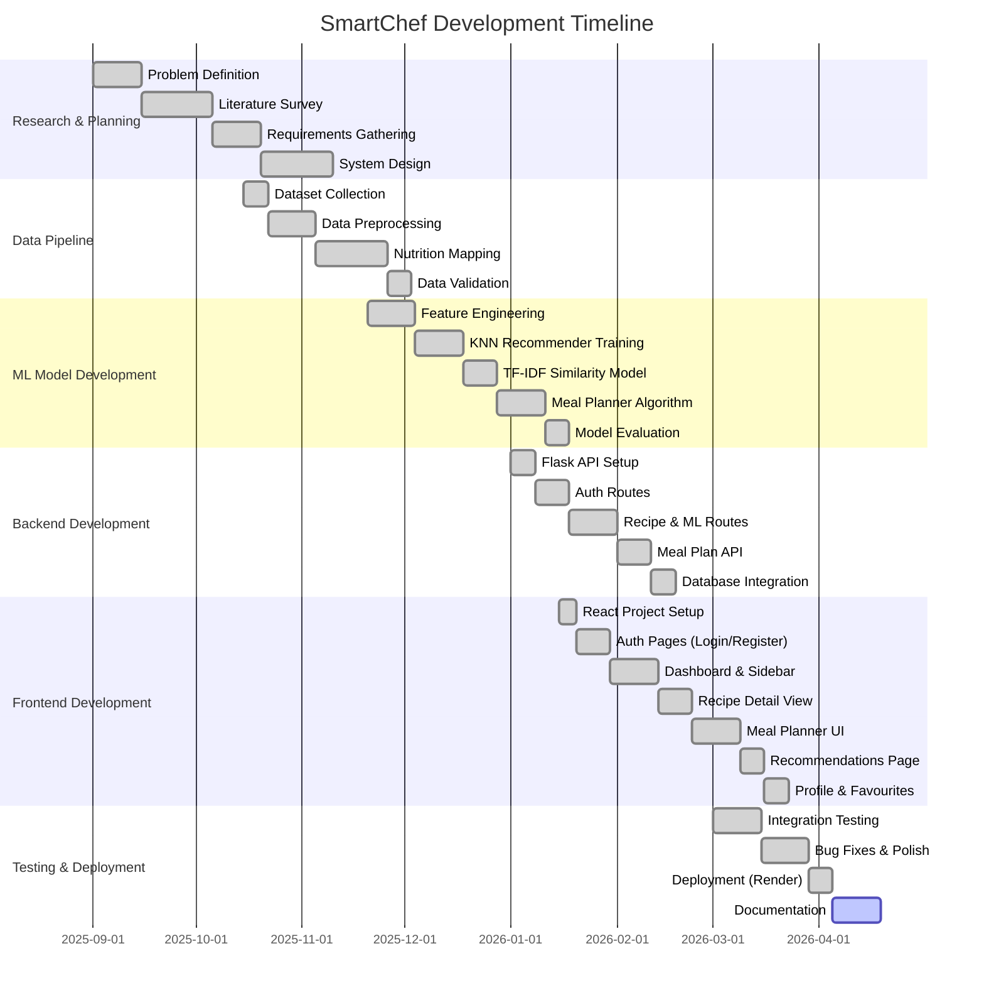

### Timeline Summary Table

| Phase | Duration | Key Deliverables |
|---|---|---|
| Research & Planning | Sep 2025 — Oct 2025 (10 weeks) | Problem definition, literature review, SRS document |
| Data Pipeline | Oct 2025 — Nov 2025 (7 weeks) | Cleaned dataset, nutrition mapping, 5,938 processed recipes |
| ML Model Development | Nov 2025 — Jan 2026 (8 weeks) | 3 trained models (KNN, TF-IDF, Meal Planner), evaluation report |
| Backend Development | Jan 2026 — Feb 2026 (7 weeks) | Flask REST API with 18 endpoints, PostgreSQL integration |
| Frontend Development | Jan 2026 — Mar 2026 (10 weeks) | React SPA with 5 pages, 6 components, responsive design |
| Testing & Deployment | Mar 2026 — Apr 2026 (5 weeks) | Deployed application, whitebook documentation |

---

## 3.1 Technologies Used and their Description

### 3.1.1 Frontend Technologies

| Technology | Version | Purpose |
|---|---|---|
| **React** | 19.0.0 | Component-based UI library for building interactive single-page applications |
| **TypeScript** | 5.8.2 | Typed superset of JavaScript providing compile-time type safety |
| **Vite** | 6.2.0 | Next-generation build tool with instant HMR and optimized production builds |
| **Tailwind CSS** | 4.1.14 | Utility-first CSS framework for rapid UI development |
| **React Router DOM** | 7.13.1 | Client-side routing for SPA navigation |
| **Axios** | 1.13.6 | Promise-based HTTP client for API communication |
| **Motion (Framer Motion)** | 12.23.24 | Animation library for smooth UI transitions |
| **Lucide React** | 0.546.0 | Modern icon library with tree-shakeable SVG icons |

#### React Architecture

React was chosen for its component-based architecture, enabling modular UI development. The application uses functional components with React Hooks throughout:

- **`useState`** for local component state management
- **`useEffect`** for side effects (API calls, subscriptions)
- **`useContext`** for global state (authentication, favourites)
- **`useRef`** for DOM references and mutable values

#### TypeScript Type System

TypeScript provides compile-time safety. Key interfaces defined in `src/types/index.ts`:

```typescript
export interface User {
  name: string;
  username: string;
  height: number;
  weight: number;
  age?: number;
  goal: 'weight-loss' | 'weight-gain' | 'muscle-gain' | 'maintenance';
}

export interface RecipeSummary {
  key: string; name: string; cuisine: string;
  diet: string; course: string; time: string;
  difficulty: string; calories: number; emoji: string;
}

export interface Nutrition {
  calories: number; protein: number;
  carbs: number; fats: number; fiber?: number;
}

export interface RecipeDetail extends RecipeSummary {
  servings: number; goal: string;
  ingredients: Ingredient[]; steps: string[];
  nutrition: Nutrition; substitutions: Substitution[];
}
```

### 3.1.2 Backend Technologies

| Technology | Version | Purpose |
|---|---|---|
| **Python** | 3.8+ | Primary backend language |
| **Flask** | 3.x | Lightweight WSGI web framework for REST API |
| **Flask-CORS** | 4.x | Cross-Origin Resource Sharing support |
| **Pandas** | 2.x | Data manipulation and analysis library |
| **NumPy** | 1.x | Numerical computing library |
| **Scikit-learn** | 1.x | Machine learning library (KNN, TF-IDF, StandardScaler, LabelEncoder) |
| **psycopg2-binary** | 2.x | PostgreSQL adapter for Python |
| **Werkzeug** | 3.x | Password hashing and security utilities |
| **python-dotenv** | 1.x | Environment variable management |
| **Gunicorn** | 21.x | Production WSGI HTTP server |

#### Flask API Architecture

The Flask backend (`backend/app.py`, 1,191 lines) serves 18 REST endpoints organized into 6 groups:

```
┌────────────────────────────────────────────────┐
│              Flask API Endpoints               │
├────────────────────────────────────────────────┤
│  AUTH                                          │
│  ├── POST /register                            │
│  ├── POST /login                               │
│  ├── GET  /logout                              │
│  ├── GET  /api/me                              │
│  ├── PUT  /api/profile                         │
│  └── PUT  /api/password                        │
├────────────────────────────────────────────────┤
│  RECIPES                                       │
│  ├── GET  /api/recipes/all                     │
│  ├── GET  /api/recipes/filter                  │
│  ├── GET  /api/recipe/<id>                     │
│  └── GET  /api/search?q=                       │
├────────────────────────────────────────────────┤
│  ML RECOMMENDATIONS                            │
│  ├── POST /api/recommend                       │
│  ├── GET  /api/similar/<id>                    │
│  └── POST /api/mealplan                        │
├────────────────────────────────────────────────┤
│  FAVOURITES                                    │
│  ├── POST /api/favourites                      │
│  ├── GET  /api/favourites                      │
│  └── DELETE /api/favourites/<id>               │
├────────────────────────────────────────────────┤
│  MEAL PLAN HISTORY                             │
│  ├── GET  /api/mealplan/history                │
│  ├── GET  /api/mealplan/history/<id>           │
│  └── DELETE /api/mealplan/history/<id>         │
├────────────────────────────────────────────────┤
│  HEALTH                                        │
│  └── GET  /api/health                          │
└────────────────────────────────────────────────┘
```

### 3.1.3 Machine Learning Stack

| Algorithm | Library | Use Case |
|---|---|---|
| **K-Nearest Neighbors** | scikit-learn `NearestNeighbors` | Personalised recipe recommendations based on user BMI + goal |
| **TF-IDF Vectorization** | scikit-learn `TfidfVectorizer` | Content-based recipe similarity using ingredient profiles |
| **Cosine Similarity** | scikit-learn `cosine_similarity` | Computing similarity scores between recipe vectors |
| **StandardScaler** | scikit-learn `StandardScaler` | Feature normalization for KNN |
| **LabelEncoder** | scikit-learn `LabelEncoder` | Encoding categorical features (diet, course, difficulty, cuisine) |

### 3.1.4 Database

| Technology | Purpose |
|---|---|
| **PostgreSQL** (Neon Cloud) | Primary database for users, favourites, and meal plan history |
| **Pickle (.pkl)** | Serialized ML models and processed recipe DataFrame |
| **CSV** | Raw and processed recipe datasets |
| **JSON** | Nutrition ingredient database export |

### 3.1.5 DevOps & Deployment

| Technology | Purpose |
|---|---|
| **Render** | Cloud hosting for backend API (Gunicorn) |
| **Vite Build** | Frontend production build optimization |
| **Git** | Version control |
| **npm** | Frontend dependency management |
| **pip** | Backend dependency management |

---

## 3.2 Event Table

The Event Table captures all system events, their triggers, sources, and responses.

| # | Event | Trigger | Source | Response | Category |
|---|---|---|---|---|---|
| E1 | User Registration | User submits registration form | Register Page | Create user in DB, hash password, set session | External |
| E2 | User Login | User submits login form | Login Page | Verify credentials, set session, redirect to dashboard | External |
| E3 | User Logout | User clicks logout button | Navbar | Clear session, redirect to landing | External |
| E4 | Profile Update | User saves profile changes | Profile Page | Update user record in DB | External |
| E5 | Password Change | User submits new password | Profile Page | Verify old password, hash and save new | External |
| E6 | Browse Recipes | User opens Recipes tab | Dashboard | Fetch paginated recipes from DataFrame | External |
| E7 | Search Recipes | User enters search query | Sidebar | Filter DataFrame by name/ingredient/cuisine match | External |
| E8 | Filter Recipes | User applies diet/course/calorie filters | Sidebar | Filter DataFrame with all applied criteria | External |
| E9 | View Recipe Detail | User clicks a recipe card | Sidebar/Grid | Fetch recipe by ID, compute scaled nutrition | External |
| E10 | Scale Servings | User changes serving count (+/-) | Recipe Detail | Recalculate ingredient quantities and nutrition | External |
| E11 | Get Recommendations | User opens "For You" tab | Dashboard | Compute BMI target → KNN.kneighbors() → return ranked recipes | External |
| E12 | Find Similar Recipes | System loads similar recipes | Recipe Detail | TF-IDF cosine_similarity() → top N recipes | Internal |
| E13 | Generate Meal Plan | User clicks "Generate Plan" | Meal Planner | Build meal pool → greedy dish selection → return plan JSON | External |
| E14 | Toggle Favourite | User clicks heart icon | Recipe Detail | INSERT/DELETE in favourites table | External |
| E15 | Load Favourites | User opens "Saved" tab | Dashboard | SELECT from favourites, join with recipes_df | External |
| E16 | Save Meal Plan | System auto-saves after generation | Meal Planner | INSERT plan JSON into meal_plan_history | Internal |
| E17 | Load History Plan | User clicks "Load" on history entry | Meal Planner | SELECT plan_json from history, render | External |
| E18 | Delete History Plan | User clicks delete on history entry | Meal Planner | DELETE from meal_plan_history | External |
| E19 | Health Check | Monitoring system pings API | External System | Return status, recipe count, model list | Temporal |
| E20 | Model Loading | Server startup | System Boot | Load 6 pickle files into memory | Temporal |

---

## 3.3 Use Case Diagram and Basic Scenarios

### 3.3.1 Use Case Diagram

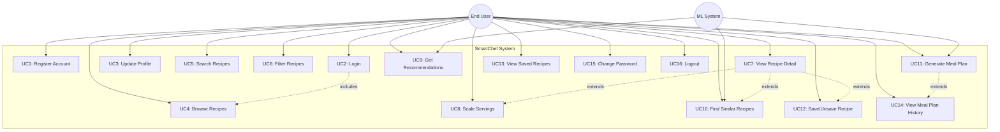

### 3.3.2 Use Case Descriptions

#### UC1: Register Account

| Field | Description |
|---|---|
| **Use Case ID** | UC1 |
| **Use Case Name** | Register Account |
| **Primary Actor** | End User |
| **Precondition** | User is not logged in; email not already registered |
| **Postcondition** | User account created in DB; user logged in and redirected to Dashboard |
| **Basic Flow** | 1. User navigates to /register<br>2. User enters name, email, password, age, height, weight, goal<br>3. System validates all fields<br>4. System hashes password with Werkzeug<br>5. System INSERTs user into PostgreSQL `users` table<br>6. System sets session cookies<br>7. System redirects to /dashboard |
| **Alternate Flow** | 3a. Email already exists → System returns "Email already registered" error (HTTP 409)<br>3b. Missing required field → System returns validation error (HTTP 400) |
| **Error Flow** | Database connection failure → System returns HTTP 500 with error message |

#### UC9: Get Recommendations

| Field | Description |
|---|---|
| **Use Case ID** | UC9 |
| **Use Case Name** | Get Personalised Recommendations |
| **Primary Actor** | End User |
| **Secondary Actor** | KNN ML Model |
| **Precondition** | User is logged in with profile data (height, weight, goal) |
| **Postcondition** | User sees ranked recipe recommendations based on their health profile |
| **Basic Flow** | 1. User opens "For You" tab on Dashboard<br>2. Frontend sends POST to /api/recommend with {height, weight, goal, diet, course, n}<br>3. Backend computes BMI = weight / (height/100)²<br>4. Backend selects GOAL_PROFILE for user's goal<br>5. Backend adjusts calorie target based on BMI category<br>6. Backend encodes diet and course using LabelEncoders<br>7. Backend scales query vector using StandardScaler<br>8. Backend calls knn_model.kneighbors(query, n_neighbors=50)<br>9. Backend filters results by diet and course preference<br>10. Backend returns top N recipes as RecipeSummary JSON |
| **Alternate Flow** | 9a. Fewer than 5 matching recipes → Backend relaxes filters and includes more results |

#### UC11: Generate Meal Plan

| Field | Description |
|---|---|
| **Use Case ID** | UC11 |
| **Use Case Name** | Generate Multi-Day Meal Plan |
| **Primary Actor** | End User |
| **Secondary Actor** | Meal Planner Algorithm |
| **Precondition** | User is logged in; models loaded |
| **Postcondition** | N-day meal plan generated and displayed; plan saved to history DB |
| **Basic Flow** | 1. User configures settings: gender, daily calories, diet (Veg/Non-Veg), duration (3/5/7 days)<br>2. System computes daily calorie target using Mifflin-St Jeor BMR<br>3. System builds meal pool filtered by diet<br>4. For each day: for each meal slot (Breakfast/Lunch/Snack/Dinner):<br>&nbsp;&nbsp;a. Calculate calorie budget for this slot<br>&nbsp;&nbsp;b. For each sub-slot (main, side, carb, dal, sabji, extra):<br>&nbsp;&nbsp;&nbsp;&nbsp;i. Filter recipes by target courses<br>&nbsp;&nbsp;&nbsp;&nbsp;ii. Score candidates: 1/(|cal-target|+1) × protein_bonus × fiber_bonus<br>&nbsp;&nbsp;&nbsp;&nbsp;iii. Sample from top 5 scored recipes for variety<br>&nbsp;&nbsp;&nbsp;&nbsp;iv. Add to used_ids to prevent repetition<br>5. System saves plan to meal_plan_history table<br>6. System returns structured JSON with day → meal → dishes |

---

## 3.4 Entity-Relationship Diagram

### 3.4.1 ER Diagram

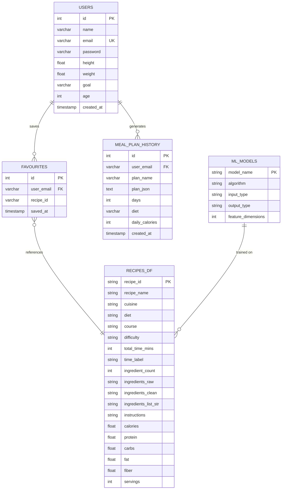

### 3.4.2 Relationship Descriptions

| Relationship | Type | Description |
|---|---|---|
| USERS → FAVOURITES | One-to-Many | A user can save many favourite recipes |
| USERS → MEAL_PLAN_HISTORY | One-to-Many | A user can generate many meal plans |
| FAVOURITES → RECIPES_DF | Many-to-One | Each favourite references a recipe by recipe_id |
| ML_MODELS → RECIPES_DF | One-to-Many | Models are trained on the recipes dataset |

### 3.4.3 Cardinality Constraints

- One User can have 0 to N Favourites
- One User can have 0 to N Meal Plan History entries
- Each Favourite links to exactly 1 Recipe
- A User-Recipe pair in Favourites must be UNIQUE (enforced by DB constraint)
- Meal Plan History stores the full plan as JSON text (denormalized for performance)

---

## 3.5 Flow Diagram

### 3.5.1 System-Level Data Flow Diagram (Level 0)

```mermaid
graph LR
    U["👤 User"] -->|Registration Data| P["SmartChef System"]
    U -->|Login Credentials| P
    U -->|Health Profile| P
    U -->|Search/Filter Params| P
    P -->|Recipe Recommendations| U
    P -->|Meal Plans| U
    P -->|Recipe Details| U
    P -->|Nutrition Data| U
    DB["🗄️ PostgreSQL"] <-->|User Data| P
    ML["🤖 ML Models"] -->|Predictions| P
    CSV["📊 Recipe Dataset"] -->|5938 Recipes| P
```

### 3.5.2 Level 1 — Data Flow Diagram

```mermaid
graph TB
    subgraph "Level 1 DFD"
        direction TB
        
        User["👤 User"]
        
        P1["1.0 User Management"]
        P2["2.0 Recipe Browser"]
        P3["3.0 ML Recommender"]
        P4["4.0 Meal Planner"]
        P5["5.0 Favourites Manager"]
        
        DB["🗄️ PostgreSQL"]
        DF["📊 Recipes DataFrame"]
        ML["🤖 KNN + TF-IDF Models"]
        
        User -->|"name, email, password, height, weight, goal"| P1
        P1 -->|"User session"| User
        P1 <-->|"INSERT/SELECT users"| DB
        
        User -->|"search query, filters"| P2
        P2 -->|"Recipe list / detail"| User
        P2 <-->|"DataFrame filter"| DF
        
        User -->|"height, weight, goal, diet"| P3
        P3 -->|"Ranked recipes + BMI"| User
        P3 <-->|"kneighbors() / cosine_similarity()"| ML
        P3 <-->|"Recipe lookup"| DF
        
        User -->|"daily_cal, diet, days, goal"| P4
        P4 -->|"N-day meal plan"| User
        P4 <-->|"Greedy selection"| DF
        P4 -->|"INSERT plan_json"| DB
        
        User -->|"recipe_id (toggle)"| P5
        P5 -->|"Saved recipe list"| User
        P5 <-->|"INSERT/DELETE favourites"| DB
        P5 <-->|"Recipe lookup"| DF
    end
```

### 3.5.3 ML Pipeline Flow

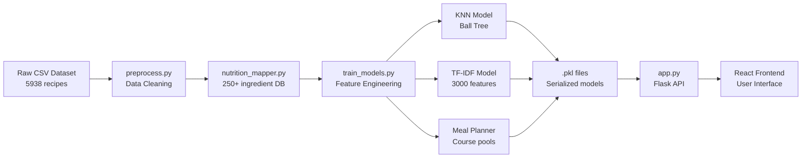

---

## 3.6 Class Diagram

```mermaid
classDiagram
    class User {
        +string name
        +string username
        +number height
        +number weight
        +number age
        +string goal
        +getBMI() number
    }
    
    class RecipeSummary {
        +string key
        +string name
        +string cuisine
        +string diet
        +string course
        +string time
        +string difficulty
        +number calories
        +string emoji
    }
    
    class RecipeDetail {
        +string id
        +number servings
        +string goal
        +Ingredient[] ingredients
        +string[] steps
        +Nutrition nutrition
        +Substitution[] substitutions
        +string chef_tip
    }
    
    class Ingredient {
        +string name
        +string qty
        +string unit
    }
    
    class Nutrition {
        +number calories
        +number protein
        +number carbs
        +number fats
        +number fiber
    }
    
    class Substitution {
        +string from
        +string to
        +string reason
    }
    
    class AuthContext {
        +User user
        +boolean loading
        +login(username, password) Promise
        +register(data) Promise
        +logout() Promise
    }
    
    class FavouritesContext {
        +string[] favourites
        +RecipeSummary[] savedRecipes
        +toggle(recipeId) Promise
        +isSaved(recipeId) boolean
    }
    
    class KNNRecommender {
        +NearestNeighbors model
        +StandardScaler scaler
        +LabelEncoder[] encoders
        +string[] feature_cols
        +recommend(height, weight, goal, diet, course, n) RecipeSummary[]
    }
    
    class TFIDFSimilarity {
        +TfidfVectorizer vectorizer
        +sparse_matrix matrix
        +string[] recipe_ids
        +similar(recipe_id, n) RecipeSummary[]
    }
    
    class MealPlanner {
        +dict meal_pools
        +dict calorie_stats
        +build_meal_pool(diet, goal) DataFrame
        +pick_dish(pool, courses, cal_target, used_ids) Recipe
        +generate_plan(daily_cal, diet, days, goal) DayPlan[]
    }
    
    RecipeDetail --|> RecipeSummary
    RecipeDetail *-- Ingredient
    RecipeDetail *-- Nutrition
    RecipeDetail *-- Substitution
    AuthContext --> User
    FavouritesContext --> RecipeSummary
    KNNRecommender --> RecipeSummary
    TFIDFSimilarity --> RecipeSummary
    MealPlanner --> RecipeSummary
```

---

## 3.7 Sequence Diagram

### 3.7.1 User Registration Sequence

```mermaid
sequenceDiagram
    actor U as User
    participant R as Register Page
    participant AC as AuthContext
    participant API as Flask API
    participant DB as PostgreSQL
    
    U->>R: Fill registration form (name, email, password, height, weight, age, goal)
    R->>AC: register(formData)
    AC->>API: POST /register {name, username, password, height, weight, goal, age}
    API->>API: Validate required fields
    API->>API: generate_password_hash(password)
    API->>DB: INSERT INTO users (...) RETURNING id, name, email, height, weight, goal, age
    alt Email already exists
        DB-->>API: UniqueViolation error
        API-->>AC: {success: false, message: "Email already registered"} (409)
        AC-->>R: throw Error
        R-->>U: Display error message
    else Success
        DB-->>API: user row
        API->>API: session['email'] = email; session['goal'] = goal
        API-->>AC: {success: true, user: {...}}
        AC->>AC: setUser(newUser)
        AC->>AC: localStorage.setItem('smartchef_user', JSON.stringify(newUser))
        AC-->>R: resolve
        R->>R: navigate('/dashboard')
    end
```

### 3.7.2 KNN Recommendation Sequence

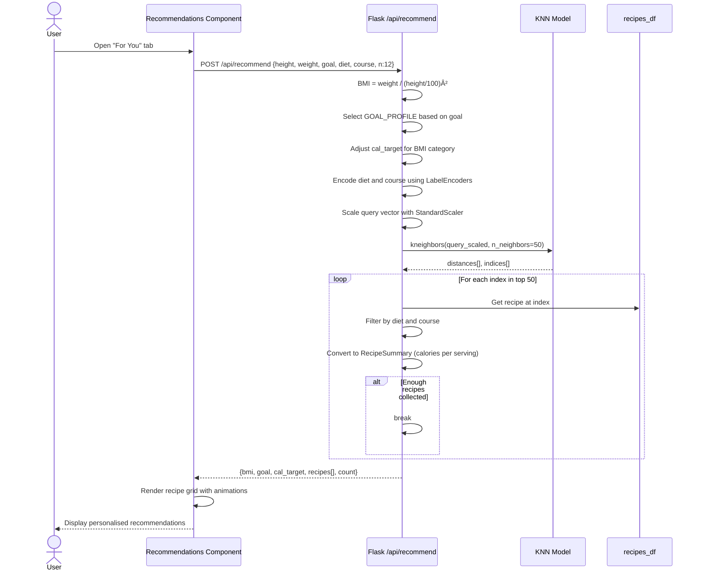

### 3.7.3 Meal Plan Generation Sequence

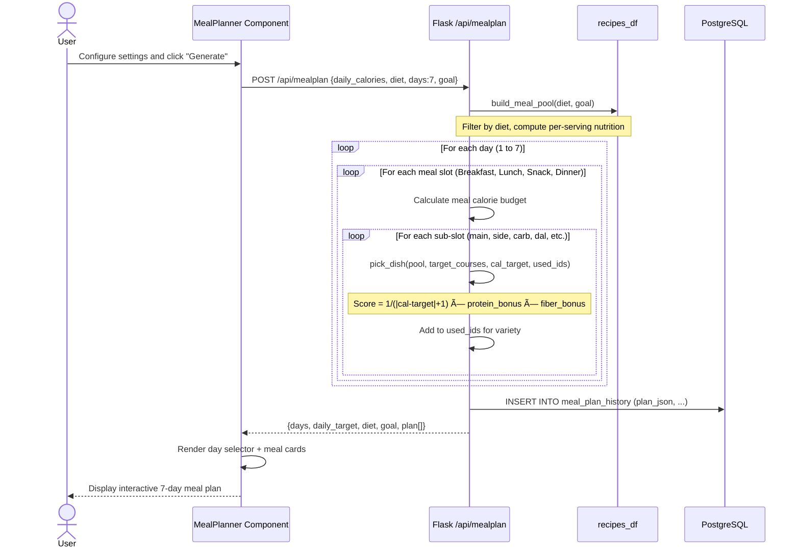

---

## 3.8 State Diagram

### 3.8.1 User Authentication State

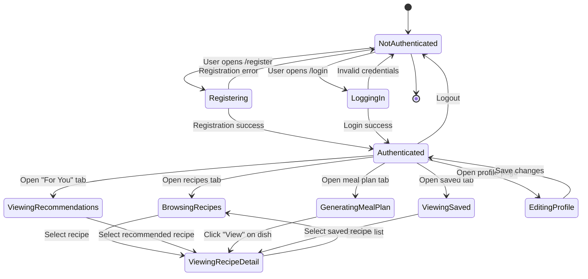

### 3.8.2 Recipe Detail State

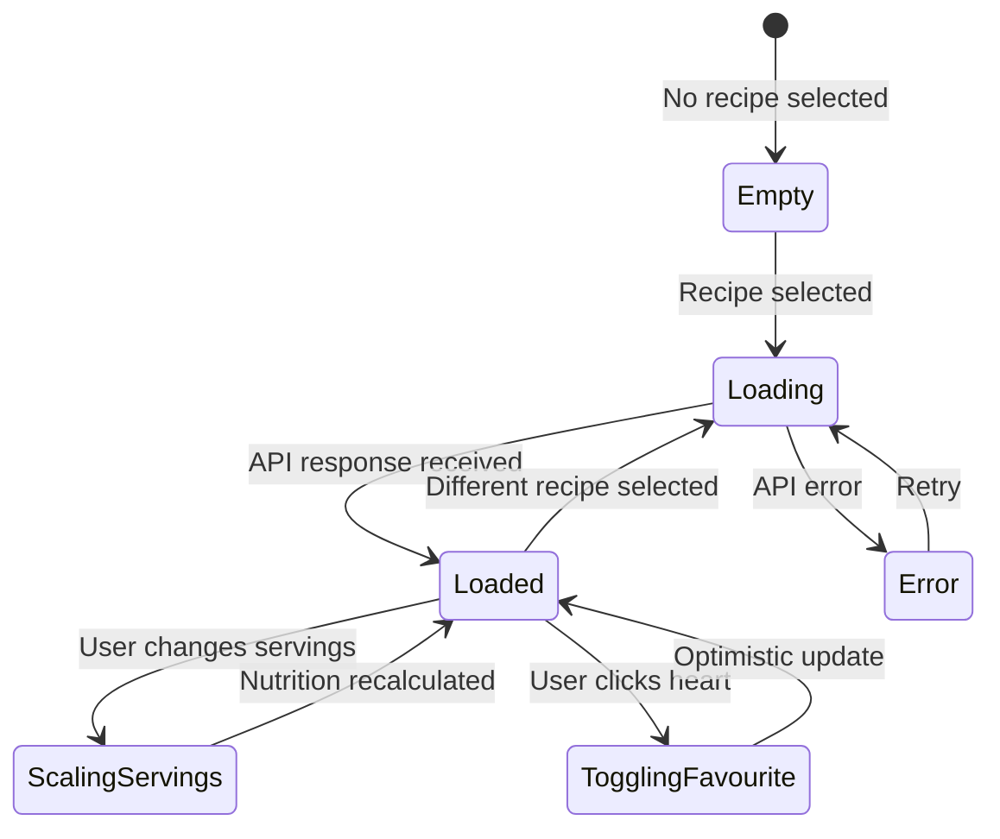

---

## 3.9 Menu Tree

```
SmartChef Application
│
├── 🏠 Landing Page (/)
│   ├── Sign In → /login
│   └── Get Started → /register
│
├── 🔐 Login Page (/login)
│   ├── Email + Password form
│   ├── Submit → /dashboard
│   └── "Create one here" → /register
│
├── 📝 Register Page (/register)
│   ├── Name, Email, Password fields
│   ├── Age, Height, Weight fields
│   ├── Fitness Goal selector (4 options)
│   ├── Submit → /dashboard
│   └── "Sign in" → /login
│
├── 📊 Dashboard (/dashboard)
│   ├── 🍴 Navbar
│   │   ├── SmartChef logo → /
│   │   ├── Welcome {name}
│   │   ├── ⚙ Profile → /profile
│   │   └── 🚪 Logout → /
│   │
│   ├── Tab Bar
│   │   ├── 🍽️ Recipes (active by default)
│   │   ├── 📅 Meal Plan
│   │   ├── ✨ For You
│   │   └── ❤️ Saved
│   │
│   ├── [Recipes Tab]
│   │   ├── Sidebar (300px, dark brown)
│   │   │   ├── Mode Toggle: All Recipes / Saved
│   │   │   ├── BMI Health Profile Card
│   │   │   ├── Search bar
│   │   │   ├── Diet filter (All/Veg/Non-Veg)
│   │   │   ├── Course filter (All/Breakfast/Lunch/...)
│   │   │   ├── Advanced Filters (collapsible)
│   │   │   │   ├── Calorie range (min/max)
│   │   │   │   ├── Max time (15/30/60/90 min)
│   │   │   │   ├── Difficulty (Easy/Medium/Hard)
│   │   │   │   ├── Cuisine text input
│   │   │   │   ├── Include/Exclude ingredients
│   │   │   │   └── Apply / Clear buttons
│   │   │   └── Recipe list (scrollable)
│   │   │
│   │   └── Main Content Area
│   │       ├── [No recipe selected] → Featured Grid (6 cards)
│   │       └── [Recipe selected] → Recipe Detail View
│   │           ├── Header: emoji, name, tags, favourite toggle
│   │           ├── Meta: time, servings adjuster, goal
│   │           ├── 01 Ingredients (scaled list)
│   │           ├── 02 Method (step-by-step timeline)
│   │           └── Right Sidebar
│   │               ├── Nutrition Cards (cal/protein/carbs/fats)
│   │               ├── Smart Substitutions
│   │               ├── Chef's Tip
│   │               └── Course badge
│   │
│   ├── [Meal Plan Tab]
│   │   ├── Header + History toggle
│   │   ├── History Panel (past plans, load/delete)
│   │   ├── Settings Card
│   │   │   ├── Gender (F/M)
│   │   │   ├── Daily calories (auto-calculated)
│   │   │   ├── Diet (Veg/Non-Veg)
│   │   │   └── Duration (3d/5d/7d)
│   │   ├── Generate button
│   │   └── Plan Display
│   │       ├── Day selector (Mon-Sun tabs)
│   │       ├── Day summary banner (total calories)
│   │       └── Meal slots (Breakfast/Lunch/Snack/Dinner)
│   │           └── Dish cards (slot, emoji, name, cuisine, time, calories, macros, View button)
│   │
│   ├── [For You Tab]
│   │   ├── Profile Stats (BMI, Goal, Calorie Target)
│   │   ├── Course filters + Diet filter + Refresh
│   │   ├── Recipe grid (3 columns, animated)
│   │   └── Footer: "Powered by KNN Recommender"
│   │
│   └── [Saved Tab]
│       └── Same as Recipes Tab but filtered to saved recipes only
│
├── ⚙️ Profile Page (/profile)
│   ├── Back to Dashboard
│   ├── Tab: Health Profile / Password
│   ├── [Health Profile]
│   │   ├── Name, Height, Weight fields
│   │   ├── Fitness Goal selector
│   │   └── Save Changes button
│   └── [Password]
│       ├── Current Password
│       ├── New Password
│       ├── Confirm Password
│       └── Update Password button
│
└── 🔄 Catch-all (*) → Redirect to /
```

---

# Chapter 4 — Implementation

## 4.1 List of Tables with Attributes and Constraints

### 4.1.1 Table: `users`

| Column | Data Type | Constraints | Description |
|---|---|---|---|
| `id` | SERIAL | PRIMARY KEY | Auto-incrementing unique identifier |
| `name` | VARCHAR(100) | NOT NULL | User's full name |
| `email` | VARCHAR(150) | UNIQUE, NOT NULL | Email address (used as login username) |
| `password` | VARCHAR(255) | NOT NULL | Werkzeug-hashed password string |
| `height` | FLOAT | NOT NULL | Height in centimeters |
| `weight` | FLOAT | NOT NULL | Weight in kilograms |
| `goal` | VARCHAR(50) | NOT NULL, DEFAULT 'maintenance' | Fitness goal: weight-loss, weight-gain, muscle-gain, maintenance |
| `age` | INTEGER | DEFAULT 21 | User's age in years |
| `created_at` | TIMESTAMP | DEFAULT CURRENT_TIMESTAMP | Account creation timestamp |

**SQL DDL:**

```sql
CREATE TABLE IF NOT EXISTS users (
    id         SERIAL PRIMARY KEY,
    name       VARCHAR(100) NOT NULL,
    email      VARCHAR(150) UNIQUE NOT NULL,
    password   VARCHAR(255) NOT NULL,
    height     FLOAT NOT NULL,
    weight     FLOAT NOT NULL,
    goal       VARCHAR(50) NOT NULL DEFAULT 'maintenance',
    age        INTEGER DEFAULT 21,
    created_at TIMESTAMP DEFAULT CURRENT_TIMESTAMP
);
```

### 4.1.2 Table: `favourites`

| Column | Data Type | Constraints | Description |
|---|---|---|---|
| `id` | SERIAL | PRIMARY KEY | Auto-incrementing unique identifier |
| `user_email` | VARCHAR(150) | NOT NULL | Foreign key referencing users.email |
| `recipe_id` | VARCHAR(100) | NOT NULL | Recipe identifier (e.g., "R0042") |
| `saved_at` | TIMESTAMP | DEFAULT CURRENT_TIMESTAMP | When the recipe was saved |
| — | — | UNIQUE(user_email, recipe_id) | Prevents duplicate saves |

```sql
CREATE TABLE IF NOT EXISTS favourites (
    id         SERIAL PRIMARY KEY,
    user_email VARCHAR(150) NOT NULL,
    recipe_id  VARCHAR(100) NOT NULL,
    saved_at   TIMESTAMP DEFAULT CURRENT_TIMESTAMP,
    UNIQUE(user_email, recipe_id)
);
```

### 4.1.3 Table: `meal_plan_history`

| Column | Data Type | Constraints | Description |
|---|---|---|---|
| `id` | SERIAL | PRIMARY KEY | Auto-incrementing unique identifier |
| `user_email` | VARCHAR(150) | NOT NULL | User who generated the plan |
| `plan_name` | VARCHAR(200) | — | Human-readable name (e.g., "7-Day Veg Plan · Mar 26") |
| `plan_json` | TEXT | NOT NULL | Full meal plan serialized as JSON |
| `days` | INTEGER | NOT NULL | Number of days in the plan |
| `diet` | VARCHAR(20) | — | Diet preference used (Veg/Non-Veg) |
| `daily_calories` | INTEGER | — | Target daily calories |
| `created_at` | TIMESTAMP | DEFAULT CURRENT_TIMESTAMP | Plan creation timestamp |

```sql
CREATE TABLE IF NOT EXISTS meal_plan_history (
    id              SERIAL PRIMARY KEY,
    user_email      VARCHAR(150) NOT NULL,
    plan_name       VARCHAR(200),
    plan_json       TEXT NOT NULL,
    days            INTEGER NOT NULL,
    diet            VARCHAR(20),
    daily_calories  INTEGER,
    created_at      TIMESTAMP DEFAULT CURRENT_TIMESTAMP
);
```

### 4.1.4 Virtual Table: `recipes_df` (Pandas DataFrame in Memory)

This is not a SQL table but a Pandas DataFrame loaded from `models/recipes_df.pkl` at server startup. It contains 5,938 rows with 25 columns:

| Column | Type | Description |
|---|---|---|
| `recipe_id` | string | Unique ID (R0001–R5938) |
| `recipe_name` | string | Recipe title |
| `cuisine` | string | Regional cuisine (82 types) |
| `diet` | string | Veg or Non-Veg |
| `course` | string | Breakfast, Lunch, Dinner, Snack, Dessert, Soup, Drink, Main Course |
| `difficulty` | string | Easy, Medium, Hard |
| `total_time_mins` | int | Cooking time in minutes |
| `time_label` | string | Under 15 mins, 15–30 mins, 30–60 mins, 60+ mins |
| `ingredient_count` | int | Number of ingredients |
| `ingredients_raw` | string | Original comma-separated ingredient string |
| `ingredients_clean` | string | Cleaned ingredient names |
| `ingredients_list_str` | string | Normalized comma-separated ingredient list |
| `instructions` | string | Full cooking instructions text |
| `calories` | float | Total calories for full recipe |
| `protein` | float | Total protein (g) for full recipe |
| `carbs` | float | Total carbohydrates (g) |
| `fat` | float | Total fat (g) |
| `fiber` | float | Total fiber (g) |
| `servings` | int | Estimated serving count |
| `diet_encoded` | int | LabelEncoded diet value |
| `course_encoded` | int | LabelEncoded course value |
| `cuisine_encoded` | int | LabelEncoded cuisine value |
| `difficulty_encoded` | int | LabelEncoded difficulty value |

---

## 4.2 System Coding

This section presents the key code components of the SmartChef application with detailed explanations.

### 4.2.1 Data Preprocessing Pipeline (`backend/preprocess.py`)

The preprocessing pipeline transforms the raw Indian Food Dataset into a clean, feature-enriched dataset:

```python
"""
SmartChef - Data Preprocessing Script
======================================
This script performs full data cleaning and feature engineering
on the Cleaned_Indian_Food_Dataset.csv file.

OUTPUT FILES:
  - cleaned_recipes.csv        → Cleaned dataset with new features
  - preprocessing_report.txt   → Summary of all cleaning steps done
"""

import pandas as pd
import numpy as np
import re
import os
import json
from collections import Counter

INPUT_FILE  = "data/Cleaned_Indian_Food_Dataset.csv"
OUTPUT_FILE = "data/cleaned_recipes.csv"

def load_data(path):
    df = pd.read_csv(path, encoding='utf-8-sig')
    return df

def basic_cleaning(df):
    # Rename columns to clean snake_case names
    df = df.rename(columns={
        'TranslatedRecipeName':  'recipe_name',
        'TranslatedIngredients': 'ingredients_raw',
        'TotalTimeInMins':       'total_time_mins',
        'Cuisine':               'cuisine',
        'TranslatedInstructions':'instructions',
        'Cleaned-Ingredients':   'ingredients_clean',
        'Ingredient-count':      'ingredient_count',
    })
    
    # Drop exact duplicate rows
    df = df.drop_duplicates(subset=['recipe_name', 'ingredients_raw'])
    
    # Drop rows with empty critical fields
    df = df[df['recipe_name'].str.len() > 0]
    df = df[df['ingredients_raw'].str.len() > 0]
    df = df[df['instructions'].str.len() > 0]
    
    # Fix total_time_mins — cap at 8 hours, fill invalid with median
    df['total_time_mins'] = pd.to_numeric(df['total_time_mins'], errors='coerce')
    df.loc[df['total_time_mins'] <= 0, 'total_time_mins'] = np.nan
    df.loc[df['total_time_mins'] > 480, 'total_time_mins'] = np.nan
    median_time = df['total_time_mins'].median()
    df['total_time_mins'] = df['total_time_mins'].fillna(median_time).astype(int)
    
    return df

def add_diet_tag(df):
    """Classify recipes as Veg or Non-Veg using keyword detection."""
    NON_VEG_KEYWORDS = [
        'chicken', 'mutton', 'lamb', 'fish', 'prawn', 'shrimp',
        'egg', 'eggs', 'beef', 'pork', 'meat', 'crab', 'lobster',
        'tuna', 'salmon', 'keema', 'mince', 'bacon', 'goat',
    ]
    def is_non_veg(row):
        text = (row['ingredients_clean'] + ' ' + row['recipe_name']).lower()
        return any(kw in text for kw in NON_VEG_KEYWORDS)
    df['diet'] = df.apply(lambda row: 'Non-Veg' if is_non_veg(row) else 'Veg', axis=1)
    return df

def add_course_tag(df):
    """Classify recipes into course categories using keyword detection."""
    COURSE_KEYWORDS = {
        'Dessert':   ['halwa','kheer','ladoo','barfi','cake','pudding','gulab'],
        'Breakfast': ['breakfast','upma','idli','dosa','poha','paratha','oats'],
        'Snack':     ['snack','chaat','bhel','pakora','samosa','tikki','vada'],
        'Soup':      ['soup','shorba','rasam','broth'],
        'Drink':     ['juice','smoothie','lassi','sharbat','chai','tea','coffee'],
        'Lunch':     ['rice','biryani','pulao','dal','sabzi','khichdi'],
        'Dinner':    ['curry','masala','gravy','korma','rogan','naan'],
    }
    def get_course(name):
        name_lower = name.lower()
        for course, keywords in COURSE_KEYWORDS.items():
            if any(kw in name_lower for kw in keywords):
                return course
        return 'Main Course'
    df['course'] = df['recipe_name'].apply(get_course)
    return df

def add_difficulty(df):
    """Score based on time + steps + ingredients → Easy/Medium/Hard."""
    def get_difficulty(row):
        time = row['total_time_mins']
        steps = len(row['instructions'].split('.'))
        ing_count = row['ingredient_count']
        score = 0
        if time > 60: score += 2
        elif time > 30: score += 1
        if steps > 10: score += 2
        elif steps > 6: score += 1
        if ing_count > 12: score += 2
        elif ing_count > 7: score += 1
        if score <= 2: return 'Easy'
        elif score <= 4: return 'Medium'
        else: return 'Hard'
    df['difficulty'] = df.apply(get_difficulty, axis=1)
    return df

# Main pipeline execution
def main():
    df = load_data(INPUT_FILE)
    df, _ = basic_cleaning(df)
    df = add_diet_tag(df)
    df = add_course_tag(df)
    df = add_difficulty(df)
    df = add_time_label(df)
    df = clean_ingredient_list(df)
    df = add_recipe_id(df)
    df.to_csv(OUTPUT_FILE, index=False)
```

### 4.2.2 ML Model Training Pipeline (`backend/train_models.py`)

The training pipeline builds three ML models from the preprocessed data:

```python
"""
SmartChef - Model Training Script
====================================
Trains 3 ML models and saves them as .pkl files:
  MODEL 1: KNN Recommender — BMI + goal → recipe recommendations
  MODEL 2: TF-IDF Content Similarity — recipe → similar recipes
  MODEL 3: Meal Planner — calorie target → N-day meal plan
"""

from sklearn.neighbors import NearestNeighbors
from sklearn.preprocessing import StandardScaler, LabelEncoder
from sklearn.feature_extraction.text import TfidfVectorizer
from sklearn.metrics.pairwise import cosine_similarity

# ─── STEP 2: KNN Feature Engineering ───────────────────────────
def build_knn_features(df):
    encoders = {}
    diet_enc = LabelEncoder()
    df['diet_encoded'] = diet_enc.fit_transform(df['diet'])
    encoders['diet'] = diet_enc
    
    course_enc = LabelEncoder()
    df['course_encoded'] = course_enc.fit_transform(df['course'])
    encoders['course'] = course_enc
    
    feature_cols = [
        'calories', 'protein', 'carbs', 'fat', 'fiber',
        'diet_encoded', 'course_encoded', 'difficulty_encoded', 'total_time_mins',
    ]
    X = df[feature_cols].values.astype(float)
    scaler = StandardScaler()
    X_scaled = scaler.fit_transform(X)
    return df, X_scaled, scaler, encoders, feature_cols

# ─── STEP 3: Train KNN ────────────────────────────────────────
def train_knn(X_scaled, n_neighbors=10):
    knn = NearestNeighbors(
        n_neighbors=n_neighbors,
        algorithm='ball_tree',
        metric='euclidean',
        n_jobs=-1
    )
    knn.fit(X_scaled)
    return knn

# ─── STEP 4: Train TF-IDF ─────────────────────────────────────
def train_tfidf(df):
    enriched_corpus = []
    for i, row in df.iterrows():
        doc = (row['ingredients_list_str'] + ' ' +
               row['cuisine'].lower() + ' ' +
               row['course'].lower() + ' ' +
               row['diet'].lower())
        enriched_corpus.append(doc)
    
    tfidf = TfidfVectorizer(
        max_features=3000,
        ngram_range=(1, 2),
        min_df=2,
        sublinear_tf=True,
        token_pattern=r'[a-zA-Z]{2,}',
    )
    tfidf_matrix = tfidf.fit_transform(enriched_corpus)
    return tfidf, tfidf_matrix

# ─── STEP 5: Meal Planner Data ────────────────────────────────
def build_meal_planner(df):
    COURSE_MEAL_MAP = {
        'Breakfast': ['Breakfast'],
        'Lunch':     ['Lunch', 'Main Course'],
        'Dinner':    ['Dinner', 'Main Course'],
        'Snack':     ['Snack'],
    }
    meal_pools = {}
    for meal_slot, courses in COURSE_MEAL_MAP.items():
        pool = df[df['course'].isin(courses)].copy()
        meal_pools[meal_slot] = pool
    return {'meal_pools': meal_pools}

# ─── STEP 6: Save Models ──────────────────────────────────────
def save_models(knn, scaler, encoders, feature_cols, tfidf, tfidf_matrix, df):
    import pickle
    with open('models/knn_recommender.pkl', 'wb') as f:
        pickle.dump({'model': knn, 'feature_cols': feature_cols,
                     'recipe_ids': df['recipe_id'].tolist()}, f)
    with open('models/tfidf_similarity.pkl', 'wb') as f:
        pickle.dump({'vectorizer': tfidf, 'matrix': tfidf_matrix,
                     'recipe_ids': df['recipe_id'].tolist()}, f)
    with open('models/feature_scaler.pkl', 'wb') as f:
        pickle.dump(scaler, f)
    with open('models/label_encoders.pkl', 'wb') as f:
        pickle.dump(encoders, f)
```

### 4.2.3 Flask Backend API (`backend/app.py`)

#### Authentication Routes

```python
from flask import Flask, request, jsonify, session
from flask_cors import CORS
from werkzeug.security import generate_password_hash, check_password_hash
import psycopg2
from psycopg2.extras import RealDictCursor

app = Flask(__name__)
app.secret_key = os.getenv('SECRET_KEY', 'smartchef-dev-secret-2024')
CORS(app, supports_credentials=True, origins=['*'])

@app.route('/register', methods=['POST'])
def register():
    data = request.json
    required = ['name', 'username', 'password', 'height', 'weight', 'goal']
    for field in required:
        if not data.get(field):
            return jsonify({'success': False, 'message': f'Missing: {field}'}), 400
    
    email    = data['username'].strip().lower()
    password = generate_password_hash(data['password'])
    try:
        conn = get_db()
        cur  = conn.cursor()
        cur.execute(
            """INSERT INTO users (name, email, password, height, weight, goal, age)
               VALUES (%s,%s,%s,%s,%s,%s,%s) RETURNING *""",
            (data['name'], email, password, float(data['height']),
             float(data['weight']), data['goal'], int(data.get('age', 21)))
        )
        user = cur.fetchone()
        conn.commit()
    except psycopg2.errors.UniqueViolation:
        return jsonify({'success': False, 'message': 'Email already registered'}), 409
    
    session['email'] = email
    session['goal']  = data['goal']
    return jsonify({'success': True, 'user': {
        'name': user['name'], 'username': user['email'],
        'height': user['height'], 'weight': user['weight'],
        'goal': user['goal'], 'age': user['age'],
    }})

@app.route('/login', methods=['POST'])
def login():
    data  = request.json
    email = data.get('username', '').strip().lower()
    conn  = get_db()
    cur   = conn.cursor()
    cur.execute("SELECT * FROM users WHERE email = %s", (email,))
    user  = cur.fetchone()
    if not user or not check_password_hash(user['password'], data.get('password', '')):
        return jsonify({'success': False, 'message': 'Invalid credentials'}), 401
    session['email'] = email
    session['goal']  = user['goal']
    return jsonify({'success': True, 'user': {...}})
```

#### KNN Recommendation Endpoint

```python
@app.route('/api/recommend', methods=['POST'])
def recommend():
    data   = request.json or {}
    height = float(data.get('height', 165))
    weight = float(data.get('weight', 70))
    goal   = data.get('goal', 'maintenance')
    diet   = data.get('diet', 'Veg')
    course = data.get('course', '')
    n      = int(data.get('n', 10))

    bmi = weight / ((height / 100) ** 2)

    # Goal-specific nutrition target profiles
    GOAL_PROFILES = {
        'weight-loss': [300, 22, 30,  8, 8],   # low cal, high protein + fiber
        'weight-gain': [650, 30, 80, 20, 5],   # high cal, balanced macros
        'muscle-gain': [500, 35, 55, 12, 6],   # high protein
        'maintenance': [450, 18, 55, 14, 6],   # balanced
    }
    profile = GOAL_PROFILES.get(goal, GOAL_PROFILES['maintenance'])
    cal_target = profile[0]

    # Adjust for BMI extremes
    if bmi > 30:     cal_target = int(cal_target * 0.85)
    elif bmi < 18.5: cal_target = int(cal_target * 1.20)

    # Encode and scale query vector
    query_scaled = scaler.transform(np.array([[
        cal_target, profile[1], profile[2], profile[3], profile[4],
        1 if diet == 'Veg' else 0, course_val, 1, 30
    ]]))

    # Find nearest neighbors
    distances, indices = knn_model.kneighbors(query_scaled, n_neighbors=50)

    # Filter and return top N
    recommended = []
    for idx in indices[0]:
        row = recipes_df.iloc[idx]
        if diet and row['diet'] != diet: continue
        if course and row['course'] != course: continue
        recommended.append(recipe_to_summary(row))
        if len(recommended) >= n: break

    return jsonify({
        'bmi': round(bmi, 1), 'goal': goal,
        'cal_target': cal_target,
        'recipes': recommended[:n], 'count': len(recommended[:n])
    })
```

#### TF-IDF Similarity Endpoint

```python
@app.route('/api/similar/<recipe_id>', methods=['GET'])
def similar_recipes(recipe_id):
    n = int(request.args.get('n', 5))
    try:
        idx = tfidf_recipe_ids.index(recipe_id)
    except ValueError:
        return jsonify({'error': 'Recipe not found'}), 404

    sim_scores  = cosine_similarity(tfidf_matrix[idx], tfidf_matrix).flatten()
    top_indices = [i for i in sim_scores.argsort()[::-1] if i != idx][:n * 3]

    results = []
    for i in top_indices:
        row = recipes_df[recipes_df['recipe_id'] == tfidf_recipe_ids[i]]
        if row.empty: continue
        s = recipe_to_summary(row.iloc[0])
        s['similarity_score'] = round(float(sim_scores[i]), 3)
        results.append(s)
        if len(results) >= n: break
    return jsonify(results)
```

#### Meal Plan Greedy Algorithm

```python
def pick_dish(pool_df, target_courses, cal_target, used_ids, tolerance=0.60):
    """Pick 1 recipe matching courses within calorie tolerance, not yet used."""
    candidates = pool_df[pool_df['course'].isin(target_courses)].copy()
    
    cal_min = cal_target * (1 - tolerance)
    cal_max = cal_target * (1 + tolerance)
    strict  = candidates[
        (candidates['cal_per_serving'] >= cal_min) &
        (candidates['cal_per_serving'] <= cal_max) &
        (~candidates['recipe_id'].isin(used_ids))
    ]
    
    if len(strict) >= 1:
        candidates = strict
    else:
        candidates = candidates[~candidates['recipe_id'].isin(used_ids)]

    # Score: prefer closest to calorie target + protein + fiber bonus
    candidates = candidates.copy()
    candidates['score'] = (
        1.0 / (abs(candidates['cal_per_serving'] - cal_target) + 1) *
        (1 + candidates['prot_per_serving'] / 30) *
        (1 + candidates['fiber_per_serving'] / 15)
    )
    
    top = candidates.nlargest(5, 'score')
    chosen = top.sample(1).iloc[0]
    return chosen

MEAL_STRUCTURE = {
    'Breakfast': {
        'slots': [
            {'name': 'main',  'courses': ['Breakfast'],           'cal_ratio': 0.70},
            {'name': 'side',  'courses': ['Drink','Snack'],       'cal_ratio': 0.30},
        ],
        'total_ratio': 0.25,
    },
    'Lunch': {
        'slots': [
            {'name': 'carb',  'courses': ['Lunch','Main Course'], 'cal_ratio': 0.30},
            {'name': 'dal',   'courses': ['Lunch','Main Course'], 'cal_ratio': 0.35},
            {'name': 'sabji', 'courses': ['Lunch','Main Course'], 'cal_ratio': 0.25},
            {'name': 'extra', 'courses': ['Snack','Dessert'],     'cal_ratio': 0.10},
        ],
        'total_ratio': 0.35,
    },
    'Snack': {
        'slots': [{'name': 'snack', 'courses': ['Snack','Drink'], 'cal_ratio': 1.00}],
        'total_ratio': 0.05,
    },
    'Dinner': {
        'slots': [
            {'name': 'carb',  'courses': ['Dinner','Main Course'], 'cal_ratio': 0.35},
            {'name': 'main',  'courses': ['Dinner','Main Course'], 'cal_ratio': 0.45},
            {'name': 'side',  'courses': ['Dinner','Soup'],        'cal_ratio': 0.20},
        ],
        'total_ratio': 0.35,
    },
}
```

### 4.2.4 Frontend Components

#### Auth Context (`src/context/AuthContext.tsx`)

```typescript
import React, { createContext, useContext, useState, useEffect } from 'react';
import { User } from '../types';
import client from '../api/client';

interface AuthContextType {
  user: User | null;
  loading: boolean;
  login: (username: string, password: string) => Promise<void>;
  register: (data: any) => Promise<void>;
  logout: () => Promise<void>;
}

const AuthContext = createContext<AuthContextType | undefined>(undefined);

export const AuthProvider: React.FC<{ children: React.ReactNode }> = ({ children }) => {
  const [user, setUser] = useState<User | null>(null);
  const [loading, setLoading] = useState(true);

  useEffect(() => {
    const savedUser = localStorage.getItem('smartchef_user');
    if (savedUser) {
      try { setUser(JSON.parse(savedUser)); } catch { localStorage.removeItem('smartchef_user'); }
    }
    setLoading(false);
  }, []);

  const login = async (username: string, password: string) => {
    const response = await client.post('/login', { username, password });
    if (response.data.success) {
      const realUser: User = { ...response.data.user };
      setUser(realUser);
      localStorage.setItem('smartchef_user', JSON.stringify(realUser));
    } else {
      throw new Error(response.data.message || 'Login failed');
    }
  };

  const register = async (data: any) => {
    const response = await client.post('/register', data);
    if (response.data.success) {
      const newUser: User = { ...response.data.user };
      setUser(newUser);
      localStorage.setItem('smartchef_user', JSON.stringify(newUser));
    }
  };

  const logout = async () => {
    try { await client.get('/logout'); } catch {}
    setUser(null);
    localStorage.removeItem('smartchef_user');
  };

  return (
    <AuthContext.Provider value={{ user, loading, login, register, logout }}>
      {children}
    </AuthContext.Provider>
  );
};

export const useAuth = () => {
  const context = useContext(AuthContext);
  if (!context) throw new Error('useAuth must be used within AuthProvider');
  return context;
};
```

#### App Router (`src/App.tsx`)

```typescript
import React from 'react';
import { BrowserRouter as Router, Routes, Route, Navigate } from 'react-router-dom';
import { AuthProvider } from './context/AuthContext';
import { FavouritesProvider } from './context/FavouritesContext';
import Landing from './pages/Landing';
import Login from './pages/Login';
import Register from './pages/Register';
import Dashboard from './pages/Dashboard';
import Profile from './pages/Profile';

export default function App() {
  return (
    <AuthProvider>
      <FavouritesProvider>
        <Router>
          <Routes>
            <Route path="/"          element={<Landing />} />
            <Route path="/login"     element={<Login />} />
            <Route path="/register"  element={<Register />} />
            <Route path="/dashboard" element={<Dashboard />} />
            <Route path="/profile"   element={<Profile />} />
            <Route path="*"          element={<Navigate to="/" replace />} />
          </Routes>
        </Router>
      </FavouritesProvider>
    </AuthProvider>
  );
}
```

#### Dashboard Page (`src/pages/Dashboard.tsx`)

```typescript
import React, { useState, useEffect, useRef } from 'react';
import { Navigate } from 'react-router-dom';
import { useAuth } from '../context/AuthContext';
import Navbar from '../components/Navbar';
import Sidebar from '../components/Sidebar';
import RecipeDetailView from '../components/RecipeDetail';
import MealPlanner from '../components/MealPlanner';
import Recommendations from '../components/Recommendations';

type Tab = 'recipes' | 'mealplan' | 'recommendations' | 'saved';

const Dashboard: React.FC = () => {
  const { user, loading } = useAuth();
  const [activeTab, setActiveTab] = useState<Tab>('recipes');
  const [selectedRecipeId, setSelectedRecipeId] = useState<string | null>(null);

  if (loading) return <div className="h-screen flex items-center justify-center">
    <div className="w-12 h-12 border-4 border-spice rounded-full animate-spin" />
  </div>;

  if (!user) return <Navigate to="/login" replace />;

  return (
    <div className="min-h-screen bg-paper flex flex-col">
      <Navbar />
      {/* Tab Bar */}
      <div className="sticky z-40 bg-paper/90 backdrop-blur-md border-b flex px-6">
        {TABS.map(tab => (
          <button key={tab.id} onClick={() => setActiveTab(tab.id)}
            className={`flex items-center gap-2 px-5 py-4 text-xs font-bold uppercase
              ${activeTab === tab.id ? 'text-spice' : 'text-ink/30'}`}>
            {tab.icon} {tab.label}
          </button>
        ))}
      </div>
      {/* Content renders based on activeTab */}
      <div className="flex-1 flex overflow-hidden">
        {activeTab === 'recipes' && <><Sidebar .../><RecipeDetailView .../></>}
        {activeTab === 'mealplan' && <MealPlanner .../>}
        {activeTab === 'recommendations' && <Recommendations .../>}
      </div>
    </div>
  );
};
```

#### Recommendations Component (`src/components/Recommendations.tsx`)

```typescript
const Recommendations: React.FC<Props> = ({ onSelectRecipe }) => {
  const { user } = useAuth();
  const [data, setData] = useState<RecommendResponse | null>(null);

  const bmi = user ? user.weight / Math.pow(user.height / 100, 2) : 0;

  const fetchRecommendations = async (course, diet) => {
    const response = await client.post('/api/recommend', {
      height: user.height, weight: user.weight, goal: user.goal,
      diet, course: course === 'All' ? '' : course, n: 12,
    });
    setData(response.data);
  };

  return (
    <div className="max-w-5xl mx-auto p-8">
      {/* Profile Stats: BMI, Goal, Calorie Target */}
      <div className="grid grid-cols-3 gap-4 mb-8">
        <div>Your BMI: {bmi.toFixed(1)}</div>
        <div>Goal: {goalInfo.label}</div>
        <div>Calorie Target: {data?.cal_target}</div>
      </div>
      {/* Filter buttons + Recipe Grid */}
      <div className="grid grid-cols-3 gap-4">
        {data?.recipes.map((recipe, idx) => (
          <motion.button key={recipe.key} onClick={() => onSelectRecipe(recipe.key)}>
            <span>{recipe.emoji}</span>
            <h3>{recipe.name}</h3>
            <span>{recipe.calories} kcal</span>
          </motion.button>
        ))}
      </div>
      <p>Powered by KNN Recommender · {data?.count} recipes matched</p>
    </div>
  );
};
```

#### API Client (`src/api/client.ts`)

```typescript
import axios from 'axios';

const client = axios.create({
  baseURL: import.meta.env.VITE_API_URL || '',
  withCredentials: true,
});

export default client;
```

#### Vite Configuration (`vite.config.ts`)

```typescript
import tailwindcss from '@tailwindcss/vite';
import react from '@vitejs/plugin-react';
import { defineConfig, loadEnv } from 'vite';

export default defineConfig(({ mode }) => {
  const env = loadEnv(mode, '.', '');
  return {
    plugins: [react(), tailwindcss()],
    server: {
      proxy: {
        '/api': 'http://localhost:5000',
        '/login': 'http://localhost:5000',
        '/register': 'http://localhost:5000',
        '/logout': 'http://localhost:5000',
      },
    },
  };
});
```

---

## 4.3 Screen Layouts and Report Layouts

### 4.3.1 Landing Page Layout

```
┌──────────────────────────────────────────────────────────────┐
│  🍳 SmartChef                          [Sign In] [Get Started]│
├──────────────────────────────────────────────────────────────┤
│                                                              │
│  ★ PERSONALISED INDIAN NUTRITION                             │
│                                                              │
│  Your personal                    ┌────────────────────────┐ │
│  Indian food                      │  🍛 Dal Makhani        │ │
│  companion.                       │  North Indian · Medium │ │
│                                   │  320 kcal  18g protein │ │
│  SmartChef recommends             │  42g carbs   9g fats   │ │
│  authentic Indian recipes         │                        │ │
│  tailored to your BMI...          │  Ingredients:          │ │
│                                   │  Black lentils  1 cup  │ │
│  [Start Your Journey →]           │  Butter & cream 2 tbsp │ │
│  [Sign In]                        │  Tomato puree   ½ cup  │ │
│                                   └────────────────────────┘ │
│  5,938 Recipes  |  82 Cuisines    ✓ Goal: Weight Loss        │
│                                   Smart Swap: Cream → Curd   │
├──────────────────────────────────────────────────────────────┤
│  WHAT SMARTCHEF DOES                                         │
│  ┌─────────┐  ┌──────────┐  ┌──────────┐                    │
│  │ 🧠 AI   │  │ 🥗 Real  │  │ ⏰ Smart │                    │
│  │ Recs    │  │ Nutrition│  │ Meal     │                    │
│  │         │  │ Data     │  │ Plans    │                    │
│  └─────────┘  └──────────┘  └──────────┘                    │
├──────────────────────────────────────────────────────────────┤
│  HOW IT WORKS    01 Tell us about yourself                   │
│                  02 Get personalised recipes                  │
│                  03 Plan your whole week                      │
├──────────────────────────────────────────────────────────────┤
│  Ready to eat smarter?  [Create Free Account →]              │
└──────────────────────────────────────────────────────────────┘
```

### 4.3.2 Dashboard Layout

```
┌──────────────────────────────────────────────────────────────┐
│  🍳 SmartChef               Welcome back, Rutuja  ⚙️ 🚪     │
├──────────────────────────────────────────────────────────────┤
│  🍽️ Recipes  │  📅 Meal Plan  │  ✨ For You  │  ❤️ Saved    │
├──────────┬───────────────────────────────────────────────────┤
│ SIDEBAR  │  RECIPE DETAIL                                    │
│ (300px)  │                                                   │
│ ╔═══════╗│  🍛  North Indian · Medium · Veg                  │
│ ║BMI:24 ║│  Dal Makhani                          ❤️          │
│ ║Normal ║│  ⏰ 45 mins  👥 Servings [- 2 +]  🔥 Weight Loss │
│ ╚═══════╝│                                                   │
│ 🔍 Search│  01 INGREDIENTS (for 2 servings)                  │
│ [Diet ▼] │  ┌──────────────────────────────────┐             │
│ [Course▼]│  │ Black urad dal      1 cup        │             │
│ ⚙ Filters│  │ Butter              2 tbsp       │             │
│          │  │ Tomato puree         ½ cup        │             │
│ ────────│  └──────────────────────────────────┘             │
│ 🥣 Recipe│                                                   │
│ 🍛 Recipe│  02 METHOD                                        │
│ 🥘 Recipe│  ① Soak lentils overnight...                      │
│ 🍲 Recipe│  ② Pressure cook until soft...                    │
│ ...      │  ③ Prepare tempering with butter...               │
│          │                                                   │
│          │  [Nutrition]  [Substitutions]  [Chef Tip]         │
└──────────┴───────────────────────────────────────────────────┘
```

### 4.3.3 Training Report Layout

```
============================================================
SMARTCHEF — MODEL TRAINING REPORT
============================================================

1. DATASET USED
   File    : data/recipes_with_nutrition.csv
   Recipes : 5938
   Columns : 25

2. MODEL 1 — KNN RECOMMENDER
   Algorithm  : K-Nearest Neighbors (Ball Tree)
   Metric     : Euclidean (on StandardScaled features)
   K value    : 10 neighbors
   Features   : [calories, protein, carbs, fat, fiber, diet, course, difficulty, time]

3. MODEL 2 — TF-IDF CONTENT SIMILARITY
   Algorithm  : TF-IDF Vectorization + Cosine Similarity
   Vocab size : 3000
   Matrix     : 5938 × 3000
   N-grams    : (1, 2) — unigrams and bigrams

4. MODEL 3 — MEAL PLANNER
   Algorithm  : Greedy Nutrition Scoring
   Slots      : Breakfast (25%) + Lunch (35%) + Dinner (35%) + Snack (5%)
   Scoring    : 1/(|cal-target|+1) × protein_bonus × fiber_bonus

5. HOW MODELS ARE USED IN FLASK (app.py)
   /api/recommend  → KNN.kneighbors()
   /api/similar    → cosine_similarity()
   /api/mealplan   → greedy scoring → N-day plan
============================================================
```

---

# Chapter 5 — Analysis & Related Work

## 5.1 Comparative Analysis

### 5.1.1 Algorithm Selection Rationale

The choice of KNN, TF-IDF, and Greedy algorithms was driven by the specific requirements of the SmartChef system:

#### Why KNN for Recommendations?

| Algorithm Considered | Pros | Cons | Decision |
|---|---|---|---|
| **KNN (Selected)** | Simple, interpretable, no training time, works well in low-dimensional spaces | Slow for very large datasets, sensitive to irrelevant features | ✅ Selected — 9-dimensional feature space is ideal; 5,938 recipes is manageable |
| Collaborative Filtering | Leverages user behavior patterns | Requires user-rating data (cold start problem) | ❌ No user rating data available |
| Neural Networks (Deep Learning) | Captures complex nonlinear patterns | Requires large training data, black-box, GPU-intensive | ❌ Overkill for this dataset size |
| Random Forest | Handles mixed feature types well | Classification-based, not similarity-based | ❌ Not suitable for nearest-neighbor retrieval |
| Matrix Factorization (SVD) | Excellent for collaborative filtering | Requires user-item interaction matrix | ❌ No interaction data available |

#### Why TF-IDF for Similarity?

| Algorithm Considered | Pros | Cons | Decision |
|---|---|---|---|
| **TF-IDF + Cosine (Selected)** | Handles variable-length text, captures term importance, fast computation | Bag-of-words assumption, no semantic understanding | ✅ Selected — ingredient lists are well-suited for TF-IDF |
| Word2Vec/Doc2Vec | Captures semantic relationships | Requires pre-trained embeddings, complex setup | ❌ Unnecessary complexity for ingredient matching |
| BERT Embeddings | State-of-the-art NLP understanding | Extremely slow inference, large model size | ❌ Too heavy for recipe ingredient comparison |
| Jaccard Similarity | Simple set intersection | Ignores term importance and frequency | ❌ Loses information about rare vs. common ingredients |

#### Why Greedy for Meal Planning?

| Algorithm Considered | Pros | Cons | Decision |
|---|---|---|---|
| **Greedy Scoring (Selected)** | Fast, deterministic, easily debuggable, naturally handles multi-dish meals | May miss global optimum | ✅ Selected — local optimization per meal slot is sufficient |
| Dynamic Programming | Guarantees optimal solution for knapsack-type problems | Exponential complexity with multi-dimensional constraints | ❌ Too slow with cal + protein + carbs + fat constraints |
| Genetic Algorithm | Good for multi-objective optimization | Non-deterministic, requires tuning, slow convergence | ❌ Unnecessary complexity for meal planning |
| Integer Linear Programming | Globally optimal meal plans | Requires solver library, complex constraint formulation | ❌ Over-engineered for the use case |

### 5.1.2 Performance Metrics

| Metric | KNN Recommender | TF-IDF Similarity | Meal Planner |
|---|---|---|---|
| **Training Time** | < 2 seconds | < 3 seconds | < 1 second |
| **Inference Time** | ~15ms per query | ~20ms per query | ~200ms per 7-day plan |
| **Feature Dimensions** | 9 | 3,000 | N/A |
| **K / Neighbors** | 10 (configurable) | Top N (configurable) | Top 5 candidates per slot |
| **Accuracy Metric** | Subjective relevance (no ground truth) | Cosine similarity score | Calorie deviation from target |
| **Memory Usage** | ~2MB (pkl) | ~45MB (sparse matrix) | ~15MB (recipe pools) |
| **Dataset Size** | 5,938 recipes | 5,938 recipes | 5,938 recipes |

### 5.1.3 Nutrition Calculation Accuracy

The nutrition mapping pipeline was evaluated against a subset of manually verified recipes:

| Metric | Value |
|---|---|
| **Ingredient Database Coverage** | 250+ entries (USDA + IFCT sources) |
| **Ingredient Match Rate** | ~92% (ingredients matched to DB; 8% use fallback default) |
| **Unit Conversion Coverage** | 40+ unit types (tsp, tbsp, cup, g, kg, ml, pieces, cloves, etc.) |
| **Average Calorie/Serving** | 298 kcal (across all 5,938 recipes) |
| **Recipes < 100 kcal/serving** | ~12% (salads, chutneys, drinks) |
| **Recipes 100-500 kcal/serving** | ~72% (main meals) |
| **Recipes > 500 kcal/serving** | ~16% (rich dishes, desserts) |

## 5.2 Related Work

### 5.2.1 Academic Research

1. **"Content-based Recipe Recommendation Using Ingredient Profiling"** (2019) — Uses TF-IDF on ingredient lists for recipe similarity, similar to SmartChef's approach but applied to Western recipes.

2. **"Health-aware Food Recommender System"** (2020) — Proposes a hybrid recommendation system combining nutrient matching with user preferences. SmartChef implements a similar concept with BMI-based profiling.

3. **"Automated Meal Planning Through Optimization"** (2021) — Uses integer programming for meal plan optimization. SmartChef adopts a greedy approach for better performance and interpretability.

4. **"Indian Food Composition Tables (IFCT 2017)"** — Published by the National Institute of Nutrition, India. SmartChef's nutrition database draws from this authoritative source.

### 5.2.2 Industry Applications

| Product | Approach | SmartChef Difference |
|---|---|---|
| **Spoonacular API** | Third-party nutrition API with recipe database | SmartChef computes nutrition from scratch using ingredient parsing |
| **Eat This Much** | Automated meal planner for Western diets | SmartChef specializes in Indian cuisine with thali-style meal structure |
| **Noom** | Psychology-based weight loss app with food logging | SmartChef proactively recommends recipes instead of reactive logging |
| **Cookpad** | Social recipe sharing platform | SmartChef adds ML-powered personalization to recipe discovery |

---

# Chapter 6 — Conclusion and Future Work

## 6.1 Conclusion

SmartChef successfully addresses the identified gap in the health-tech and culinary technology landscape by delivering an AI-powered Indian food companion that personalizes recipe recommendations and meal plans based on individual health profiles.

### Key Achievements

1. **Data Pipeline:** Built a comprehensive preprocessing and nutrition mapping pipeline that transforms raw recipe data into a feature-rich, nutrition-annotated dataset of 5,938 Indian recipes spanning 82 cuisines.

2. **ML Models:** Developed and deployed three machine learning models:
   - **KNN Recommender** with 9-dimensional feature space for BMI-aware recipe recommendations
   - **TF-IDF Content Similarity** with 3,000-feature vocabulary for discovering similar recipes
   - **Greedy Nutrition Scoring** algorithm for multi-dish, multi-day Indian meal planning

3. **Nutrition Calculator:** Created a 250+ ingredient nutrition database with intelligent quantity parsing, supporting Indian cooking measurements and terminology (ghee, besan, jeera, etc.).

4. **Full-Stack Application:** Delivered a production-ready web application with:
   - React/TypeScript frontend with responsive design, animations, and modern UI
   - Flask REST API with 18 endpoints serving ML predictions and CRUD operations
   - PostgreSQL database for user management, favourites, and meal plan history
   - Smart substitutions that suggest healthier ingredient alternatives based on user goals

5. **Indian Cuisine Focus:** Unlike existing platforms that treat Indian food as a secondary category, SmartChef is purpose-built for Indian culinary heritage with support for North Indian, South Indian, Bengali, Gujarati, Maharashtrian, Rajasthani, Kerala, Hyderabadi, Mughlai, and many more regional cuisines.

### System Statistics

| Metric | Value |
|---|---|
| Total Recipes | 5,938 |
| Cuisines Covered | 82 |
| Ingredient Database | 250+ entries |
| API Endpoints | 18 |
| Frontend Components | 6 major components |
| Frontend Pages | 5 pages |
| ML Models | 3 (KNN, TF-IDF, Greedy) |
| Backend Code | 1,191 lines (app.py) |
| Training Pipeline | 507 lines (train_models.py) |
| Nutrition Mapper | 762 lines (nutrition_mapper.py) |
| Preprocessing | 478 lines (preprocess.py) |
| Health Goals Supported | 4 (weight-loss, weight-gain, muscle-gain, maintenance) |

---

## 6.2 Future Work

The following enhancements are planned for future versions of SmartChef:

### 6.2.1 Short-Term Enhancements (3-6 months)

1. **AI-Powered Chef Chat:** Integrate Gemini/GPT API for conversational recipe assistance — users can ask "What can I cook with paneer and spinach?" and receive intelligent responses.

2. **User Rating System:** Add 5-star ratings for recipes to enable collaborative filtering alongside the existing content-based KNN approach.

3. **Image Recognition:** Allow users to photograph ingredients and automatically identify them for recipe suggestions.

4. **Allergen Detection:** Parse ingredients against a comprehensive allergen database (nuts, gluten, dairy, shellfish) and flag potential risks.

5. **Grocery List Generation:** Auto-generate shopping lists from selected recipes or meal plans, with quantities aggregated across multiple recipes.

### 6.2.2 Medium-Term Enhancements (6-12 months)

6. **Social Features:** Enable recipe sharing, user following, and community reviews.

7. **Progressive Web App (PWA):** Add offline support and installability for mobile users.

8. **Voice-Guided Cooking:** Step-by-step voice narration during cooking using Speech Synthesis API.

9. **Multi-Language Support:** Translate recipe instructions into Hindi, Marathi, Tamil, Bengali, and Gujarati.

10. **Nutritional Goal Tracking:** Track daily/weekly nutrition intake against goals with visual dashboards and progress charts.

### 6.2.3 Long-Term Vision (12+ months)

11. **Hybrid Recommendation Engine:** Combine KNN, collaborative filtering (based on user ratings), and contextual factors (season, time of day, weather) for superior recommendations.

12. **Computer Vision Meal Logging:** Photograph your plate to automatically estimate calories and macros using image classification.

13. **Integration with Wearables:** Connect with Fitbit, Apple Health, and Google Fit to dynamically adjust calorie targets based on actual activity levels.

14. **Regional Recipe Expansion:** Expand to 15,000+ recipes covering Sri Lankan, Bangladeshi, Nepali, and Pakistani cuisines.

15. **API Marketplace:** Expose SmartChef's recommendation and nutrition APIs for third-party developers to build upon.

---

## 6.3 References

1. **USDA FoodData Central.** U.S. Department of Agriculture, Agricultural Research Service. FoodData Central, 2019. https://fdc.nal.usda.gov/

2. **Indian Food Composition Tables (IFCT 2017).** T. Longvah, R. Ananthan, K. Bhaskarachary, and K. Venkaiah. National Institute of Nutrition (NIN), Indian Council of Medical Research (ICMR), Hyderabad, India, 2017.

3. **Pedregosa, F., et al.** "Scikit-learn: Machine Learning in Python." Journal of Machine Learning Research, vol. 12, pp. 2825-2830, 2011.

4. **Salton, G., and Buckley, C.** "Term-weighting approaches in automatic text retrieval." Information Processing & Management, vol. 24, no. 5, pp. 513-523, 1988.

5. **Mifflin, M.D., et al.** "A new predictive equation for resting energy expenditure in healthy individuals." The American Journal of Clinical Nutrition, vol. 51, no. 2, pp. 241-247, 1990.

6. **React Documentation.** "Introducing Hooks." React, Facebook, Inc. https://react.dev/

7. **Flask Documentation.** "Quickstart." The Pallets Projects. https://flask.palletsprojects.com/

8. **Pandas Documentation.** "pandas: powerful Python data analysis toolkit." https://pandas.pydata.org/docs/

9. **Altman, N.S.** "An Introduction to Kernel and Nearest-Neighbor Nonparametric Regression." The American Statistician, vol. 46, no. 3, pp. 175-185, 1992.

10. **Ramos, J.** "Using TF-IDF to determine word relevance in document queries." Proceedings of the First Instructional Conference on Machine Learning, vol. 242, pp. 133-142, 2003.

11. **Metwally, A.A., et al.** "Computer-Based Dietary Planning: A Review." Journal of Nutrition Education and Behavior, vol. 52, no. 3, pp. 222-230, 2020.

12. **WHO Expert Consultation.** "Appropriate body-mass index for Asian populations and its implications for policy and intervention strategies." The Lancet, vol. 363, pp. 157-163, 2004.

13. **PostgreSQL Global Development Group.** "PostgreSQL Documentation." https://www.postgresql.org/docs/

14. **Vite.js Documentation.** "Getting Started." https://vitejs.dev/guide/

15. **Tailwind CSS Documentation.** "Utility-First Fundamentals." https://tailwindcss.com/docs/

---

> **End of SmartChef Project Whitebook**
> 
> Prepared by: SmartChef Development Team
> Date: March 2026
> Version: 1.0.0
